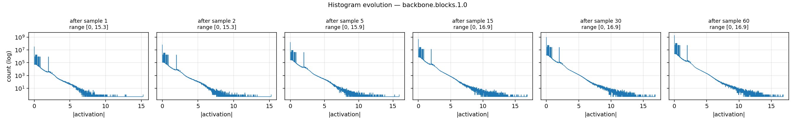
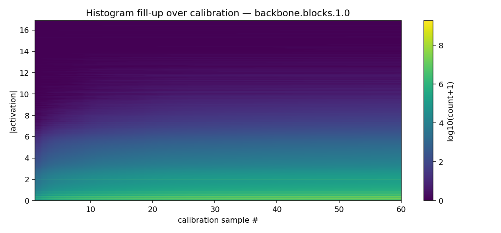
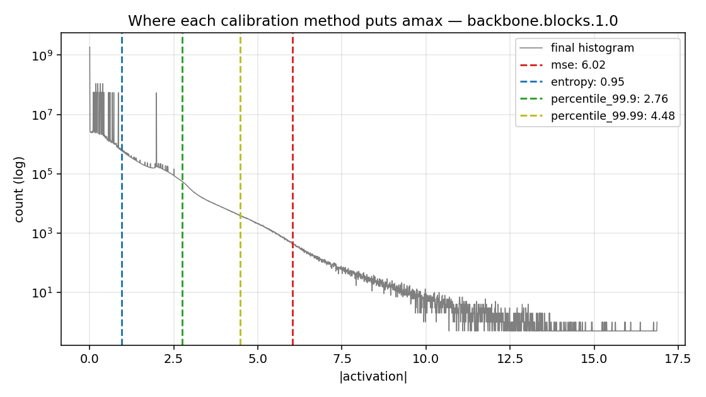
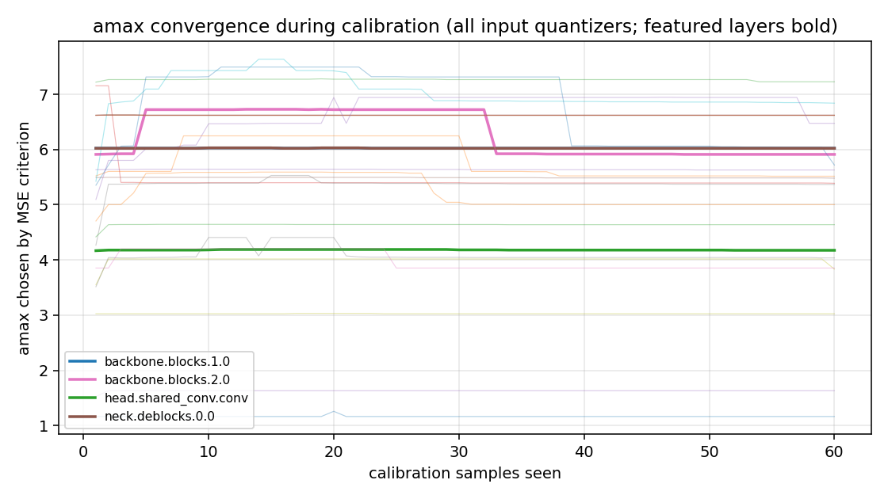
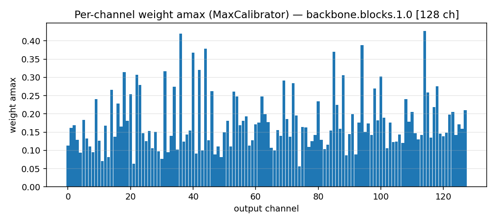
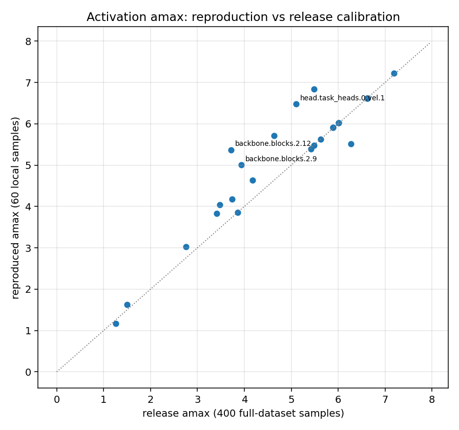

# 02 — PTQ Calibration: How a Histogram Turns Into an amax, Step by Step

*English version — [中文版 / Chinese](02_ptq_calibration_histogram.md)*

> Prerequisite: [01 — Q/DQ Basics](01_qdq_basics.en.md).
> Every plot in this document comes from a real recording: the tutorial's calibration script
> snapshots the internal histogram state of every activation quantizer **after each
> calibration sample's forward pass** (`calib_trace/hist_trace.pkl`).

## 1. Where calibration sits in the framework

The flow of the PTQ producer
(`deployment/projects/centerpoint/quantization/quantize.py run_ptq`):

```
[1] init_model(model_cfg, FP checkpoint)          # load the FP model
[2] build_centerpoint_plan(config).prepare(model) # fuse BN → insert Q/DQ (QuantConv2d etc.)
[3] build_calib_dataloader(cfg)                   # use the val split as calibration data
[4] CalibrationManager.calibrate(...)             # ← the subject of this document
[5] disable keep_fp16 subtrees → save checkpoint + .calib
```

Inside `CalibrationManager.calibrate()`, three steps
(`deployment/quantization/core/calibration.py`):

```python
self.set_quantizer_fast()      # HistogramCalibrator._torch_hist = True (GPU histogram)
self.collect_stats(...)        # per batch: model.test_step(batch); quantizers only "watch", never quantize
self.compute_amax("mse")       # pick amax out of the histogram, write it into quantizer._amax
```

The key state machine: during the collect phase every `TensorQuantizer` is in
`disable_quant() + enable_calib()` — **the model forward is pure FP behavior**, the quantizers
are bystanders accumulating the tensors flowing through them into histograms. Once collection
finishes, `enable_quant() + disable_calib()` switches back to fake-quant mode.

Note that this is a **one-shot, parallel** observation: all 56 quantizers accumulate their own
histograms during the same FP forward pass — it is not a relay of "quantize the previous layer,
then calibrate the next". For why that suffices, see
[01 — Q/DQ Basics](01_qdq_basics.en.md) §3.

## 2. HistogramCalibrator: what happens when each sample arrives

Every activation quantizer maintains a **2048-bin histogram of |x|** internally:

1. Take the absolute value of the tensor flowing through.
2. If `max|x|` exceeds the histogram's current range → **grow the bin edges** (keeping the bin
   width, adding bins) and merge the old counts into the new grid.
3. `histc` this batch of values into the counts.

So the histogram has two degrees of freedom that evolve with the data: the **range (the upper
edge)** and the **shape of the counts**. The two plots below are the actual recording (the
input of the backbone's first quantized conv):



- The first few samples already pin down the "body" of the distribution (long-tailed, decaying
  almost linearly on a log scale).
- After that, the data mainly does two things: (a) counts grow proportionally taller;
  (b) occasionally one sample carries a larger outlier and drags the range a bit to the right.

Stacking the 60 snapshots into a heatmap (x axis = calibration sample index, y axis =
|activation|, color = log count):



## 3. From histogram to amax: the MSE criterion

Once calibration finishes, `compute_amax("mse")` runs one exhaustive search per histogram:

```
for each candidate amax (sweeping from bin 128 to the last bin):
    fake-quantize the histogram's bin centers to 127 levels using this amax
    compute the quantization error MSE = Σ count(bin) * (center - dequant(center))²
pick the candidate with the smallest MSE as amax
```

Intuition: minimize the sum of clipping error (chopping off the tail) and rounding error
(scale too coarse). For a long-tailed distribution the optimum is almost always "chop off a
bit of the tail" — which is why **MSE amax < max|x|** is the norm.

Where each of the four built-in methods lands on the same (final) histogram:



| Method | One line | Character |
|---|---|---|
| `max` | amax = the largest observed value | no clipping, but an outlier destroys the resolution outright |
| `percentile` (99.9/99.99) | chop off a fixed fraction of the tail | simple and blunt; insensitive to "how heavy the tail is" |
| `entropy` | minimize the KL divergence between the pre- and post-quantization distributions | the classic method of TensorRT's implicit mode |
| `mse` | minimize the weighted quantization error | **the one we use** (matches CUDA-CenterPoint's behavior) |

## 4. Convergence of amax with the number of calibration samples

The trajectory of "if we stopped right now, what amax would MSE pick" after each sample:



You can see:

- Most layers are essentially converged within the **first 10–20 samples** — direct evidence
  for "calibration only needs a few hundred samples".
- Individual layers show a stair-step jump when one sample carries an outlier, after which MSE
  pulls it back down again (MSE is insensitive to tail counts unless the tail accumulates
  enough weight).
- The release recipe uses 400 samples and we use 60 locally; the tail of the curve is already
  flat → the sample-count difference has limited impact on amax (§6 below quantifies it:
  median difference 0.4%).

## 5. Weight quantizers: the other half, which needs no calibration data

Weights are constants, so `MaxCalibrator` simply takes `max|w|` per output channel
(per-channel, axis=0); it is settled on the first batch and never changes:



This also explains one of the tutorial's verification results: after re-running calibration,
the **weight amax is bit-identical to the release checkpoint** (same weights → same
per-channel max), and the differences appear only in the activation amax (different
calibration dataset).

## 6. Reproducibility sanity check of the calibration

The release checkpoint (400 samples from the full val set) vs. this tutorial's re-run
(60 local samples):



Quantitative results ([calib_trace/amax_comparison.md](../calib_trace/amax_comparison.md)):

- **weight amax: all 26 per-channel quantizers are bit-identical to the release
  (rel diff = 0)** — same weights + MaxCalibrator being a deterministic operation. This is the
  gold-standard verification of "pipeline correctness".
- **activation amax: median difference 0.4%, max 44.6%** (`blocks.2.12`; deeper stages are
  more sensitive to scene content). For blocks.1.0 as an example: release 6.0146 vs.
  reproduction 6.0209.
- Matching to within 0.4% while using **different calibration data**, together with the
  convergence curves above, builds the right intuition: **calibration is a statistical problem,
  not an exact-reproduction problem** — as long as the data is roughly the same distribution
  and the sample count is past the convergence point, amax is stable.

> By the way: on our first run the activation amax was systematically 3–10× too large. Tracing
> it down, the cause was not the data but a bug in the checkpoint load order (BN-fused weights
> were loaded into an unfused model, so all the conv biases were dropped). See
> [03 — pipeline walkthrough](03_pipeline_walkthrough.en.md) §2 for the debugging story.
> **The weight amax was already bit-identical at that point** — which is exactly what makes it
> valuable as a sanity check: weights right, activations wrong → the problem is in "the data
> flowing through the network", not in the quantization machinery itself.

→ Next: [03 — Full pipeline walkthrough](03_pipeline_walkthrough.en.md)
