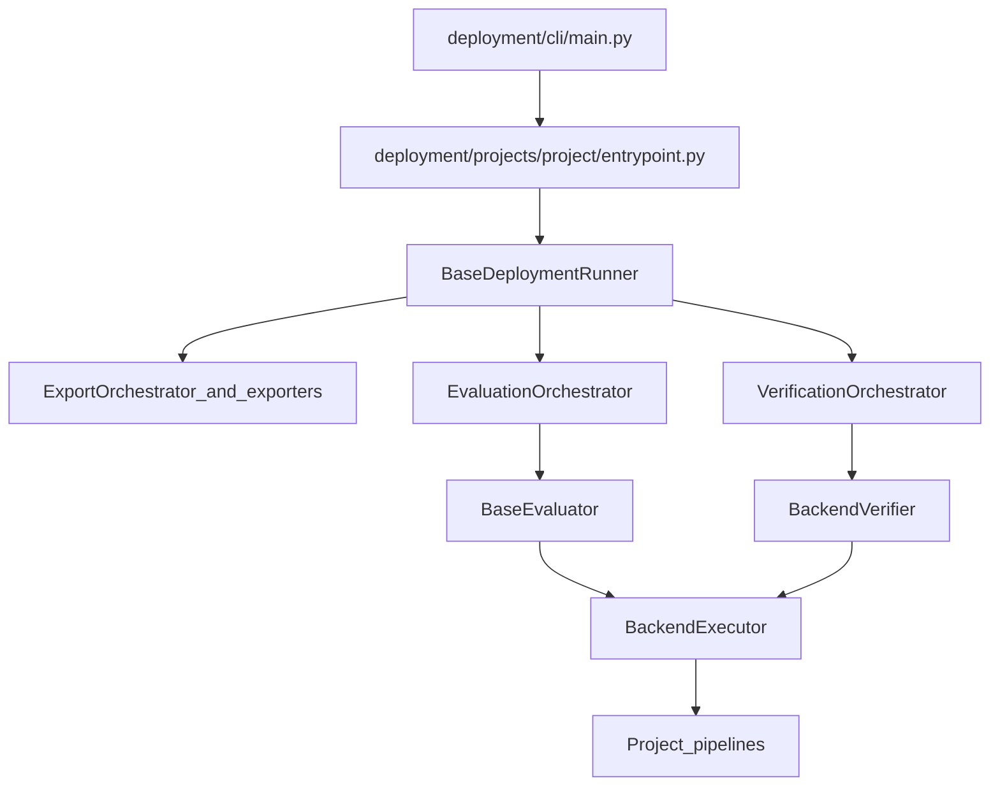

# Deployment architecture

How the framework is wired and what each part is allowed to own. Use this page when you need the mental model of `deployment/` or when you plan to extend it.

For commands and run behavior, use [runbook.md](./runbook.md). For deploy config fields and examples, use [configuration.md](./configuration.md).

## Three layers

1. Entry layer: CLI plus project entrypoints.
2. Runtime layer: runner plus orchestrators and artifact resolution.
3. Execution layer: exporters, inference pipelines, evaluators, and metrics.

## High-level flow



## Layer responsibilities

### Entry layer

- `deployment/cli/main.py` discovers registered project bundles and dispatches to a `ProjectAdapter`.
- Each project `entrypoint.py` loads configs, builds the data loader and evaluator, then creates the project runner.
- Project-specific flags belong in the project bundle, not in the shared CLI.

### Runtime layer

- `deployment/runtime/runner.py` owns the shared sequence: load, export, verify, evaluate.
- `ExportOrchestrator`, `VerificationOrchestrator`, and `EvaluationOrchestrator` keep the runner thin.
- `ArtifactManager` records ONNX and TensorRT artifacts so later stages resolve them consistently.

### Execution layer

- `deployment/exporters/` owns ONNX and TensorRT export mechanics.
- `deployment/pipelines/` owns shared inference pipeline abstractions and GPU resource helpers.
- Project `pipelines/` implement backend-specific inference.
- Evaluators own metrics and result reporting; `BackendVerifier` owns reference-vs-test verification; both share a `BackendExecutor` for pipeline creation, input preparation, and device handling.

## Package map

| Path | Responsibility |
| --- | --- |
| `deployment/cli/` | Unified CLI and shared argument helpers |
| `deployment/configs/` | Typed deployment config and schema |
| `deployment/core/` | Shared contexts, base evaluator, backend executor, backend verifier and output-comparison helpers, data-loader base, backend/device types, and metrics interfaces |
| `deployment/exporters/` | Shared ONNX and TensorRT exporters plus export pipeline bases |
| `deployment/pipelines/` | Shared inference pipeline base and GPU resource helpers |
| `deployment/runtime/` | Base runner, orchestrators, and artifact management |
| `deployment/projects/<project>/` | Project-specific entrypoint, runner, config, IO, eval, pipelines, and optional export logic |

## Extension contract

This section replaces the old standalone core contract page.

### Runner responsibilities

- `BaseDeploymentRunner` owns the end-to-end deployment flow.
- Project runners inject project-specific loaders, evaluators, wrappers, and optional export pipelines.
- Runners must not own task-specific preprocessing, postprocessing, or metrics logic.

### Evaluator, executor, and verifier responsibilities

- `BaseEvaluator` is the shared base for task evaluators; it runs the evaluation loop, normalizes outputs, computes metrics, and reports results.
- `BackendExecutor` is the shared collaborator that creates backend pipelines directly in its `create_pipeline` hook (one branch per backend), prepares inputs, manages device placement, and names raw outputs (`get_output_names`) for verification.
- `BackendVerifier` runs reference-vs-test comparison using a `BackendExecutor` and an `OutputComparator`; the evaluator no longer owns verification.
- Evaluators should log summaries through `logging`, not `print`.

### Pipeline responsibilities

- `BaseInferencePipeline` owns `preprocess -> run_model -> postprocess`.
- Pipelines execute inference only.
- Pipelines must not load artifacts on their own and must not compute metrics.

### Metrics responsibilities

- Metrics interfaces convert predictions and ground truths into task metrics.
- Metrics code should not depend on runners, exporters, or pipelines directly.

## Allowed dependencies

| Dependency | Allowed |
| --- | --- |
| Runner -> Evaluator / Verifier | Yes |
| Evaluator / Verifier -> BackendExecutor | Yes |
| Evaluator -> Metrics | Yes |
| BackendExecutor -> Pipelines | Yes |
| Pipelines -> Metrics | No |
| Metrics -> Runner / Pipelines | No |

## Project shape

Each project bundle should follow this layout:

```text
deployment/projects/<project>/
├── __init__.py
├── entrypoint.py
├── runner.py
├── config/
├── io/
├── eval/
├── pipelines/
└── export/   # optional
```

CenterPoint is the current reference implementation of this structure.
