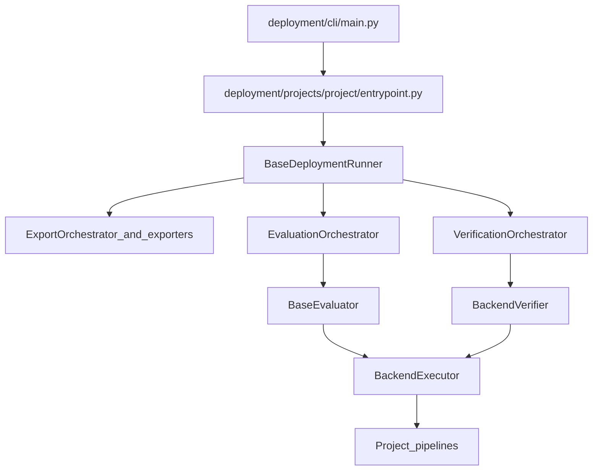

# Deployment architecture

How the framework is wired and what each part is allowed to own. Use this page when you need the mental model of `deployment/` or when you plan to extend it.

For commands and run behavior, use [runbook.md](./runbook.md). For deploy config fields and examples, use [configuration.md](./configuration.md).

## Three layers

1. Entry layer: CLI plus project entrypoints.
2. Runtime layer: runner plus orchestrators and artifact resolution.
3. Execution layer: export, inference, evaluation, and metrics.

## High-level flow

## Layer responsibilities

### Entry layer

- `deployment/cli/main.py` discovers registered project bundles and dispatches to a `ProjectAdapter`.
- Each project `entrypoint.py` loads configs, builds the data loader and evaluator, then creates the project runner.
- Project-specific flags belong in the project bundle, not in the shared CLI.

### Runtime layer

- `deployment/runtime/runner.py` owns the shared sequence: load, export, verify, evaluate.
- `ExportOrchestrator`, `VerificationOrchestrator`, and `EvaluationOrchestrator` keep the runner thin.
- `ArtifactManager` records ONNX and TensorRT artifacts so later stages resolve them consistently.

### Execution layer

- `deployment/export/` owns ONNX and TensorRT export mechanics (`exporters/` low-level exporters, `pipelines/` orchestration bases).
- `deployment/inference/` owns shared inference pipeline abstractions and GPU resource helpers.
- Project `inference/` implement backend-specific inference.
- Evaluators own metrics and result reporting; `BackendVerifier` owns reference-vs-test verification; both share a `BackendExecutor` for pipeline creation, input preparation, and device handling.

## Package map

| Path | Responsibility |
| --- | --- |
| `deployment/cli/` | Unified CLI and shared argument helpers |
| `deployment/config/` | Typed deployment config and schema |
| `deployment/io/` | Data-loader base and sample types |
| `deployment/export/` | ONNX/TensorRT exporters (`exporters/`), export pipeline bases (`pipelines/`), and the `ExportContext` base |
| `deployment/inference/` | Shared inference pipeline base and GPU resource helpers |
| `deployment/evaluation/` | Base evaluator, backend executor, backend verifier, and output-comparison helpers |
| `deployment/metrics/` | Task metrics interfaces (3D/2D detection, classification) |
| `deployment/runtime/` | Base runner, orchestrators, and artifact management |
| `deployment/primitives/` | Cross-cutting leaf types used by every stage: `device` (`DeviceSpec`) and `artifacts` (path resolution) — not a pipeline stage |
| `deployment/projects/<project>/` | Project-specific entrypoint, runner, config, io, export, inference, evaluation, and optional contexts logic (see the project layout contract below) |

## Extension contract

This section replaces the old standalone core contract page.

### Runner responsibilities

- `BaseDeploymentRunner` owns the end-to-end deployment flow.
- Project runners inject project-specific loaders, evaluators, wrappers, and optional export pipelines.
- Runners must not own task-specific preprocessing, postprocessing, or metrics logic.

### Evaluator, executor, and verifier responsibilities

- `BaseEvaluator` is the shared base for task evaluators; it runs the evaluation loop, normalizes outputs, computes metrics, and reports results.
- `BackendExecutor` is the shared collaborator that creates backend pipelines directly in its `create_pipeline` hook (one branch per backend), prepares inputs, manages device placement, and names raw outputs (`get_output_names`) for verification.
- `BackendVerifier` runs reference-vs-test comparison using a `BackendExecutor` and an `OutputComparator`; the evaluator no longer owns verification.
- Evaluators should log summaries through `logging`, not `print`.

### Pipeline responsibilities

- `BaseInferencePipeline` owns `preprocess -> run_model -> postprocess`.
- Pipelines execute inference only.
- Pipelines must not load artifacts on their own and must not compute metrics.

### Metrics responsibilities

- Metrics interfaces convert predictions and ground truths into task metrics.
- Metrics code should not depend on runners, exporters, or pipelines directly.

## Allowed dependencies

| Dependency | Allowed |
| --- | --- |
| Runner -> Evaluator / Verifier | Yes |
| Evaluator / Verifier -> BackendExecutor | Yes |
| Evaluator -> Metrics | Yes |
| BackendExecutor -> Pipelines | Yes |
| Pipelines -> Metrics | No |
| Metrics -> Runner / Pipelines | No |

## Project layout contract

This table is the single source of truth for the project bundle layout. Each
project subdirectory **mirrors the framework directory of the same name** that
defines its base class, so the directory name tells you which contract you must
implement. When you author a new project, walk this table top to bottom — every
`Required` row must exist.

| Project path (`projects/<project>/`) | Mirrors framework module | What to implement | Required |
| --- | --- | --- | --- |
| `__init__.py` | [`projects/registry.py`](../projects/registry.py) | Register a `ProjectAdapter` (`name`, `add_args`, `run`) | Required |
| `entrypoint.py` | [`cli/`](../cli) + `projects/registry.py` | A `run(args)` that builds config, loader, evaluator, runner | Required |
| `cli.py` | [`cli/args.py`](../cli/args.py) | `add_args(parser)` for project flags (may be a no-op) | Required |
| `config/` | [`config/`](../config) | Deploy config consumed as `BaseDeploymentConfig` | Required |
| `io/` | [`io/`](../io) | `BaseDataLoader` + `SampleData` subclasses | Required |
| `inference/` | [`inference/`](../inference) | `BaseInferencePipeline` per backend (+ `GPUResourceMixin` for TensorRT) | Required |
| `evaluation/` | [`evaluation/`](../evaluation) | `BaseEvaluator` + `BackendExecutor` subclasses | Required |
| `runner.py` | [`runtime/runner.py`](../runtime/runner.py) | Thin `BaseDeploymentRunner` subclass | Required |
| `export/` | [`export/`](../export) | `ModelComponentBuilder` + `SampleExtractor` subclasses (in `export/pipelines/`); plus `export/onnx_models/` for export-time ONNX graph definitions | Optional |
| `contexts.py` | [`export/contexts.py`](../export/contexts.py) | `ExportContext` subclass — only if you need extra context fields | Optional |

Metrics are intentionally **not** a project directory. Metrics configs,
interfaces, and the extractors that build a config from a model config are
task-level, not architecture-level, so they live once in
[`metrics/`](../metrics) and are shared across every project of that
task. For example, all 3D detection projects reuse
`metrics/detection_3d_metrics.py` (`Detection3DMetricsConfig` and
`extract_t4metric_v2_config`); the project only *selects* and builds the config
in its `entrypoint.py`. Add a new `metrics/<task>_metrics.py` only when you
introduce a genuinely new task, not a new model.

Every stage directory mirrors its framework counterpart by the **same name**
(`config`, `io`, `export`, `inference`, `evaluation`) — no exceptions. The only
non-mirrored items are the wiring single-files: `entrypoint.py`, `cli.py`,
`runner.py`, and `contexts.py`, which glue the project to `cli/`,
`runtime/runner.py`, and `export/contexts.py`.

### Pipeline naming

There are two distinct pipeline families; the file name always encodes the
**role** so the two never get confused, and each file name matches its class:

- **Inference** (`preprocess → run → postprocess`): under `inference/`,
  files are `*_inference_pipeline.py` (`base_inference_pipeline.py`,
  `onnx_inference_pipeline.py`, …) holding `*InferencePipeline` classes.
- **Export** (model → ONNX/TensorRT artifact): under `export/pipelines/`,
  files are `*_export_pipeline.py` (`onnx_export_pipeline.py`,
  `tensorrt_export_pipeline.py`) holding `*ExportPipeline` classes.

So `onnx_export_pipeline.py` vs `onnx_inference_pipeline.py` are unambiguous at a glance.

CenterPoint is the current reference implementation of this layout.
