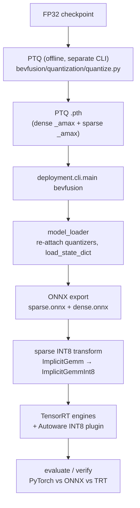

# BEVFusion Deployment & Quantization — Architecture Guide

> Orientation doc for engineers and agents working on BEVFusion deployment. It explains
> **how the BEVFusion project bundle is wired** and **how the shared quantization framework
> plugs into it** (PTQ → INT8 sparse conv → ONNX → TensorRT). Deep-dive notes (numbered,
> newest last) live in [`docs/`](docs/README.md); this file is the map, not the manual.

For the framework-wide mental model, read [`deployment/docs/architecture.md`](../../docs/architecture.md)
first — BEVFusion is one *project bundle* that implements the stage contract described there.

---

## 1. Two things this doc covers

| Piece | Where it lives | What it owns |
| --- | --- | --- |
| **Shared quantization framework** | [`deployment/quantization/`](../../quantization/) | Model-agnostic PTQ/QAT on NVIDIA `pytorch-quantization`: Q/DQ module replacement, BN fusion, calibration, sensitivity. Used by **both** CenterPoint and BEVFusion. |
| **BEVFusion project bundle** | [`deployment/projects/bevfusion/`](.) | BEVFusion-specific export/inference/eval, the **sparse-encoder INT8** path (spconv `ImplicitGemmInt8`), and the split (sparse+dense) topology. |

The dividing line matters: the **dense** tower (backbone/neck/head) is quantized by the
*shared* framework (standard `QuantConv2d` Q/DQ, TensorRT-native INT8). The **sparse** tower
(`pts_middle_encoder`, spconv) uses framework spconv-INT8 primitives
([`quantization/sparse/`](../../quantization/sparse/)) composed by BEVFusion's `SpconvInt8Scheme`,
because spconv needs a custom TensorRT plugin (`ImplicitGemmInt8`), not native TRT INT8. The two paths have different
internals, but both now sit behind **one uniform interface** — see
[§ Quantization scheme architecture](#quantization-scheme-architecture), which is the seam every
deployment stage uses instead of touching quantization internals directly.

---

## 2. End-to-end flow



Two **distinct** entry points — do not confuse them:

- **PTQ (offline, produces a checkpoint):**
  `python -m deployment.projects.bevfusion.quantization.quantize ptq --config ... --checkpoint ... --deploy-cfg ... --output ptq.pth`
- **Deploy (consumes the PTQ checkpoint, exports + evaluates):**
  `python -m deployment.cli.main bevfusion <deploy_cfg.py> <model_cfg.py> --module main_body`

---

## 3. Shared quantization framework (`deployment/quantization/`)

Public API is re-exported from [`__init__.py`](../../quantization/__init__.py). The PTQ workflow
([`ptq.py:quantize_ptq`](../../quantization/ptq.py)) is 5 steps:

1. **Fuse BN** → [`fusion/bn_fusion.py:fuse_model_bn`](../../quantization/fusion/bn_fusion.py) folds
   `Conv→BN` into the conv weights (removes a scale transform between Q/DQ boundaries; must run in `eval()`).
2. **Insert Q/DQ** → [`replace.py:quant_model`](../../quantization/replace.py) recursively swaps
   `Conv2d/ConvTranspose2d/Linear` for `QuantConv2d/QuantConvTranspose2d/QuantLinear`
   ([`modules/`](../../quantization/modules/)). `transfer_to_quantization` copies attributes via
   `__new__` to avoid hook conflicts. A `skip_names` list gives per-layer opt-out.
3. **(Optional) residual quantizers** → `attach_quant_add` inserts a shared quantizer on the
   *identity* branch only (Conv path stays FP so TRT can fuse Conv+Add).
4. **Calibrate** → [`calibration/calibrator.py:CalibrationManager.calibrate`](../../quantization/calibration/calibrator.py):
   disable fake-quant → collect histograms → `load_calib_amax(method=...)` (`mse`/`entropy`/`percentile`/`max`) → re-enable quant. Supports an amax cache.
5. **Disable sensitive layers** → names from [`sensitivity.py:build_sensitivity_profile`](../../quantization/sensitivity.py).

TensorRT-friendly design choices baked in: per-**channel** conv weights but per-**tensor**
`ConvTranspose2d` weights (TRT INT8 deconv is fragile per-channel); `QuantAdd` shares one
quantizer across both inputs; ONNX symbolic registered in
[`onnx_symbolic.py`](../../quantization/onnx_symbolic.py). QAT is available via
[`hooks/qat_hook.py:QATHook`](../../quantization/hooks/qat_hook.py) (MMEngine custom hook).

> The framework holds **only generic** quantization code. Model-specific producers live in each
> project: [`quantize.py`](quantization/quantize.py) here and
> [`../centerpoint/quantization/quantize.py`](../centerpoint/quantization/quantize.py). BEVFusion's
> PTQ handles dense (pytorch_quantization) **and** sparse (spconv INT8) in one run; flags
> `--sparse-int8-only` / `--skip-spconv-int8` isolate them. Run:
> `python -m deployment.projects.bevfusion.quantization.quantize ptq …`.

---

## Quantization scheme architecture

**This is the current design — read this before changing anything quantization-related.** It
replaced the old model where quantization was hand-inlined into every stage (loader/export/runner)
and the PTQ producer re-created the quantized module tree "by convention" (a comment saying it must
match the loader).

### The one idea

A **`QuantizationScheme`** is a strategy object whose lifecycle maps 1:1 onto the deployment
stages. Dense and sparse implement the *same* interface; their internals stay different (native
TRT INT8 vs. a custom plugin + graph rewrite), but the **seam** is uniform:

| Lifecycle hook | When | Dense (`DenseQDQScheme`) | Sparse (`SpconvInt8Scheme`) |
| --- | --- | --- | --- |
| `prepare(model)` | structural (PTQ **and** deploy) | fuse BN + `Conv2d→QuantConv2d` | fuse SparseConv-BN (+ NVIDIA `TensorQuantizer` if `int8`) |
| `calibrate(model, …)` | PTQ only | `CalibrationManager` | `calibrate_spconv_nvidia` |
| `before_onnx_export(model)` | pre-export | enable `use_fb_fake_quant` | — |
| `after_onnx_export(paths)` | post-export | — | `ImplicitGemm → ImplicitGemmInt8` rewrite |
| `tensorrt_plugins()` | TRT build | `[]` | Autoware INT8 plugin `.so` |
| `manifest()` | save | serializable recipe | serializable recipe |

A **`QuantizationPlan`** composes schemes for a whole model and fans each hook out in order. A
project declares *which* schemes apply (composition); schemes own *how* (algorithm). **Stage code
holds a plan and calls lifecycle methods — it never sees quantization internals.**

Directory split follows NVIDIA's Lidar_AI_Solution convention — **generic quant toolkit is
shared; each model owns its quantization composition + producer**:

```
deployment/quantization/                     # GENERIC toolkit only (no model names)
├── schemes/base.py        # QuantizationScheme (ABC), QuantizationPlan, SchemeManifest
├── schemes/dense_qdq.py   # DenseQDQScheme — reusable by any Conv2d tower
├── sparse/spconv_int8.py  # spconv INT8 primitives (NVIDIA TensorQuantizer on SparseConvolution)
├── sparse/spconv_add_patch.py, sparse/naming.py   # spconv add-patch + stem-ordering helpers
├── modules/  calibration/  fusion/  hooks/  replace.py  sensitivity.py  ptq.py  utils.py

deployment/projects/bevfusion/quantization/  # BEVFusion's quantization
├── quantize.py     # offline PTQ producer CLI  (python -m ...bevfusion.quantization.quantize ptq)
├── schemes.py      # SpconvInt8Scheme — composes framework sparse primitives + ONNX rewrite + plugins
└── plan.py         # build_bevfusion_plan(quant_cfg) → composes dense + sparse schemes

deployment/projects/centerpoint/quantization/  # CenterPoint's quantization
├── quantize.py     # ptq/qat/sensitivity CLI
└── simple_*.py     # VoVNet OSA/eSE submodule QDQ test tooling
```

### Why this kills the old coupling

`build_bevfusion_plan` is the **single** place that reads the deploy `quantization` dict and
composes schemes. Both the deploy loader ([`io/model_loader.py`](io/model_loader.py)) and the PTQ
producer ([`quantization/quantize.py`](quantization/quantize.py)) call it, so
`prepare` builds an **identical** module tree on both sides — the PTQ `state_dict` and the deploy
`load_state_dict` line up *by construction*, not by keeping two code paths in sync.

The loader now only orchestrates *loading* (state_dict prep, weight-layout permutation, device
placement, inference-mode toggles); the structural quantization is one `plan.prepare(model)` call.

### Dependency rule (enforce this)

Deployment stages (loader / export / inference / runner) touch quantization **only through the
scheme/plan interface**. They must **not** import `pytorch_quantization` / `TensorQuantizer` /
spconv quant utils directly, and any monkeypatch (e.g. the spconv forward swap in
[`sparse/spconv_int8.py`](../../quantization/sparse/spconv_int8.py)) belongs inside a scheme's
`prepare`, never in stage code.

### Status (verified in the `awml-bevfusion` container)

- ✅ Deploy/load path fully migrated. Eval of
  `deploy_config_split_sparse_fp16_dense_int8_2_8.py` reproduces the pre-refactor baseline
  **exactly** (34 quantizers loaded; dense BN fused 12/2/9; mAP 0.3228 Center-BEV / 0.3931 Plane).
- ✅ PTQ producer dense path migrated to the shared plan (`quantize.run_ptq` steps 2–3). Dead code
  removed: `dense_qdq.py`, `_fuse_dense_bn`, `_insert_dense_qdq`, and the loader's
  `_apply_dense_quantization` / `_fuse_dense_bn` / `_fuse_spconv_bn` / `_prepare_encoder_for_nvidia_int8`.
- ✅ Directory reorg (Lidar_AI_Solution-style): model-specific producers moved out of the framework
  into each project as `quantize.py` (`python -m deployment.projects.bevfusion.quantization.quantize`);
  generic spconv-INT8 primitives promoted to framework `deployment/quantization/sparse/`;
  CenterPoint `simple_*` VoVNet test tooling moved to `projects/centerpoint/quantization/`.
  Re-verified: deploy eval reproduces baseline; PTQ smoke runs via the new module path.

### Continuation guide (next steps for future agents)

1. **Sparse INT8 round-trip:** validate `deploy_config_split_sparse_int8_dense_int8.py` end-to-end
   (PTQ with `spconv_int8=True` → export → TRT eval). The sparse scheme's `prepare`/`calibrate`
   are wired; confirm the checkpoint `_amax` keys still match after the plan change.
2. **Migrate the export pipeline** to call `plan.after_onnx_export(onnx_paths, context=…)` and
   `plan.tensorrt_plugins()` instead of the standalone `_postprocess_sparse_onnx_int8` in
   [`onnx_export_pipeline.py`](export/onnx_export_pipeline.py). `SpconvInt8Scheme.after_onnx_export`
   already reuses the same transform primitives, so this is a wiring change: build the plan once in
   the runner and pass it to both the loader and the export pipeline.
3. **Self-describing checkpoints:** save `plan.manifest()` into the PTQ `.pth` and rebuild the plan
   from it on load (`SchemeManifest.from_dict`), so deploy no longer needs the `quantization` dict
   flags to match the PTQ run.
4. **Consolidate config:** collapse the scattered top-level keys (`spconv_int8_fp16_layers`,
   `fuse_spconv_bn`, `spconv_do_sort`, `spconv_fuse_implicit_gemm_relu`) into the `quantization`
   section that `build_bevfusion_plan` reads. Keep one parser, one path.

**Always re-verify with the container** after a change:

```bash
docker exec awml-bevfusion bash -lc 'cd /workspace && python -m deployment.cli.main bevfusion \
  deployment/projects/bevfusion/config/deploy_config_split_sparse_fp16_dense_int8_2_8.py \
  projects/BEVFusion/configs/t4dataset/BEVFusion-L/bevfusion_lidar_voxel_second_secfpn_30e_8xb16_j6gen2_base_120m_t4metric_v2.py'
# expect: "34 quantizers have calibrated amax", mAP 0.3228 (Center BEV) / 0.3931 (Plane)
```

---

## 4. BEVFusion project bundle (`deployment/projects/bevfusion/`)

Mirrors the framework stage contract. Wiring: [`entrypoint.py:run`](entrypoint.py) builds config +
data loader + executor + evaluator, then [`runner.py:BEVFusionDeploymentRunner`](runner.py)
(a thin `BaseDeploymentRunner`) injects BEVFusion's ONNX/TensorRT export pipelines.

| Stage | Directory | Key modules |
| --- | --- | --- |
| Config | [`config/`](config/) | `deploy_config_split_int8_base.py` (shared base) + variants (§6) |
| IO | [`io/`](io/) | [`model_loader.py`](io/model_loader.py) (re-attach quantizers, load PTQ), `data_loader.py`, `coors_contract.py` (voxel `[x,y,z]`→graph `[z,y,x]`), `component_utils.py` (split vs merged) |
| Export | [`export/`](export/) | [`onnx_export_pipeline.py`](export/onnx_export_pipeline.py) (sparse/dense/main_body wrappers, TopK fix), [`sparse_int8_onnx_transform.py`](export/sparse_int8_onnx_transform.py) (INT8 node rewrite), `tensorrt_export_pipeline.py` |
| Quantization | [`quantization/`](quantization/) | [`quantize.py`](quantization/quantize.py) (PTQ producer CLI), [`plan.py`](quantization/plan.py) (`build_bevfusion_plan`), [`schemes.py`](quantization/schemes.py) (`SpconvInt8Scheme`). Generic spconv-INT8 primitives + dense scheme live in the framework ([`quantization/sparse/`](../../quantization/sparse/), `DenseQDQScheme`). See [§ Quantization scheme architecture](#quantization-scheme-architecture). |
| Inference | [`inference/`](inference/) | `pytorch_/onnx_/tensorrt_inference_pipeline.py` (all `preprocess→run→postprocess`) |
| Evaluation | [`evaluation/`](evaluation/) | `executor.py` (pipeline construction + output routing), `evaluator.py` (3D metrics + latency breakdown) |

### Sparse vs dense split

| | Sparse encoder (`pts_middle_encoder`) | Dense backbone/neck/head |
| --- | --- | --- |
| ONNX I/O | `voxels,coors,num_points → lidar_bev` | `lidar_bev → bbox_pred,score,label_pred` |
| Quantizer | NVIDIA `TensorQuantizer` on each `SparseConvolution` | shared framework `QuantConv2d` Q/DQ |
| ONNX op | `autoware::ImplicitGemm[Int8]` (custom) | standard `Conv2d/ReLU/Add` |
| INT8 on TRT | **custom plugin** `ImplicitGemmInt8` | TRT-native INT8 |
| Accuracy knob | `spconv_int8_fp16_layers` (node-name substrings) | `sensitive_layers` (layer names) |

---

## 5. The sparse INT8 path (the hard part)

This is where most of the docs and debugging effort went. Read
[`docs/12_int8_sparse_pipeline_ptq_onnx_trt.md`](docs/12_int8_sparse_pipeline_ptq_onnx_trt.md) and
[`docs/README_INT8_WHERE_AND_HOW.md`](docs/README_INT8_WHERE_AND_HOW.md) for the full story.

1. **PTQ** calibrates each `SparseConvolution` with `_input_quantizer._amax` / `_weight_quantizer._amax`
   (per-output-channel weights, histogram+MSE activations) via
   [`quantization/sparse/spconv_int8.py:apply_nvidia_spconv_int8`](../../quantization/sparse/spconv_int8.py) → saved into the `.pth`.
2. **Deploy load** re-attaches the same quantizer structure so `load_state_dict` restores scales
   ([`io/model_loader.py`](io/model_loader.py)). BN is already folded in the checkpoint (`fuse_spconv_bn=True`).
3. **ONNX export** emits *float* `autoware::ImplicitGemm` nodes (the sparse graph usually has **no** Q/DQ).
4. **INT8 transform** ([`sparse_int8_onnx_transform.py`](export/sparse_int8_onnx_transform.py)) rewrites
   `ImplicitGemm` (5 inputs) → `ImplicitGemmInt8` (7 inputs: `+channel_scale +bias_scaled`), deriving
   scales from the checkpoint `_amax`. Runs automatically during split export when `quantization.spconv_int8=True`.
   - `spconv_int8_fp16_layers`: **case-insensitive substrings matched only against `node.name`** keep
     selected layers as FP16 `ImplicitGemm` (accuracy recovery). Matching inputs/outputs would silently
     FP16-ify downstream layers — don't change this.
   - `spconv_fuse_implicit_gemm_relu=True` fuses trailing `Relu`/`Add(const)+Relu` into the node.
   - `spconv_do_sort=False` for INT8 (skip pair-mask argsort; matches New3D `do_sort = !int8_inference_`);
     leave unset (`True`) for FP16 engines.
5. **TensorRT** builds one engine per component and loads
   `/opt/plugins/libautoware_tensorrt_plugins.so` (the INT8 spconv now lives inside the single Autoware
   plugin as `ImplicitGemm precision=1`; the standalone `libimplicit_gemm_int8_plugin.so` is no longer needed).

> ⚠️ Known epilogue bug: cumm's Turing `s8s8f16` `Int8Inference` epilogue historically **dropped the
> `output_scale` (alpha) multiply**, blowing up `lidar_bev` by ~`1/output_scale` and driving TRT mAP→0
> while PyTorch stayed correct. Fixed plugin-side. See
> [`cpp/int8_plugin/README.md`](cpp/int8_plugin/README.md).

---

## 6. Config variants (how to pick a mode)

All configs are MMEngine files; variants inherit
[`deploy_config_split_int8_base.py`](config/deploy_config_split_int8_base.py) via `_base_` and override
only `checkpoint_path`, `quantization`, `export`, `spconv_int8_fp16_layers`, `evaluation`.

| Config | Topology | Precision |
| --- | --- | --- |
| `deploy_config.py` | single `main_body` | FP32/FP16 |
| `deploy_config_split_fp16_opt_*.py` | split sparse+dense | FP16 baseline |
| `deploy_config_split_sparse_fp16_dense_int8_2_8.py` | split | sparse FP16 + dense INT8 |
| `deploy_config_split_int8_all.py` | split | sparse INT8 only (dense FP) |
| `deploy_config_split_sparse_int8_dense_int8.py` | split | sparse INT8 + dense INT8 |
| `deploy_config_int8.py` | single | full INT8 |

Key `quantization` fields: `enabled`, `ptq_checkpoint` (checkpoint came from PTQ CLI), `fuse_bn`,
`quant_backbone/neck/head`, `spconv_int8`, `quant_add`, `sensitive_layers`. When quantizing **sparse
only**, dense flags **must** be `False` to match the `--sparse-int8-only` PTQ checkpoint.

**Isolation tip** (from the split-int8 config header): keep the same CLI/config/work_dir, just point
`checkpoint_path` at the FP32 `.pth` and set `quantization=dict(enabled=False)`. If mAP is fine, the
split/voxel/eval pipeline is healthy and the regression is in PTQ or quantizer loading.

---

## 7. Where to go next

- Run it today, commands, Docker, error codes → [`docs/3_int8_implementation.md`](docs/3_int8_implementation.md)
- Full sparse INT8 pipeline internals → [`docs/12_int8_sparse_pipeline_ptq_onnx_trt.md`](docs/12_int8_sparse_pipeline_ptq_onnx_trt.md)
- INT8: where is it real vs FP16 → [`docs/README_INT8_WHERE_AND_HOW.md`](docs/README_INT8_WHERE_AND_HOW.md)
- End-to-end PTQ→ONNX→TRT (vs spconv / CUDA-BEVFusion) → [`docs/README_PTQ_INT8_SPCONV_DEPLOYMENT.md`](docs/README_PTQ_INT8_SPCONV_DEPLOYMENT.md)
- TRT-has-predictions-but-mAP=0 debugging → [`docs/14_trt_split_map_zero_debug.md`](docs/14_trt_split_map_zero_debug.md)
- Full numbered doc index → [`docs/README.md`](docs/README.md)
- Shared framework internals → [`deployment/docs/architecture.md`](../../docs/architecture.md), [`deployment/quantization/README_PTQ_ACCURACY_VOV99.md`](../../quantization/README_PTQ_ACCURACY_VOV99.md)

> **Environment note:** PTQ and quantized-checkpoint loading require NVIDIA `pytorch-quantization`
> (install inside Docker: `pip install --index-url https://pypi.nvidia.com --extra-index-url https://pypi.org/simple pytorch-quantization==2.1.3`).
> The TensorRT INT8 spconv plugin `.so` must be built and present at the path in `tensorrt_config.plugin_libraries`.
