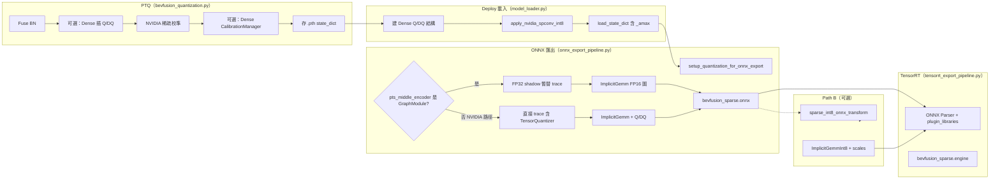

# INT8 稀疏卷積：PTQ → ONNX → TensorRT 內部流程

本文說明 AWML BEVFusion 部署裡，**稀疏塔（`pts_middle_encoder`）** 從校準到 TRT 的完整管線：各步驟做什麼、產物是什麼、以及「INT8 sparse conv」在 PyTorch、ONNX、TRT 三層分別代表什麼。

---

## 1. 總覽圖



---

## 2. 階段一：PTQ（`deployment/quantization/bevfusion_quantization.py ptq`）

### 2.1 目的

在 **不重新訓練** 的前提下，用校準資料估計量化參數，產出含 `state_dict` 的 `.pth`。

### 2.2 內部步驟（與腳本列印一致）

| 步驟 | 內容 |
|------|------|
| **[1/6] 載入模型** | MMEngine config + FP32 checkpoint → `BEVFusion`（含 `pts_middle_encoder`） |
| **[2/6] Fuse BN** | 稠密端與稀疏端 BN 盡量 fuse 進 Conv，利於後續量化 |
| **[3/6] Dense Q/DQ** | 若 deploy 裡 `quant_backbone` / `neck` / `head` 任一為 True，對對應模組插入 `pytorch_quantization` 的 Q/DQ；`--sparse-int8-only` 時整段跳過 |
| **[4/6] Dataloader** | 用驗證集（可改 batch、shuffle、seed） |
| **[4b/6] Spconv INT8 校準** | 見下節 — **稀疏 INT8 的核心發生在這裡** |
| **[5/6] Dense 校準** | 若有 dense Q/DQ，用 `CalibrationManager` 跑 forward 收集統計並 `compute_amax`；**順序上在稀疏校準之後**，避免「稀疏仍 FP32時校準 dense」導致 BEV 分佈錯配、mAP 崩潰 |
| **[6/6] 存檔** | `torch.save({"state_dict": save_sd}, output_path)`；可另存 `.calib` cache |

### 2.3 稀疏塔在 PTQ 裡怎麼變成「INT8 就緒」

腳本 **不再走舊版純 FX `prepare_fx` 整塔替換** 作為主路徑；`_calibrate_spconv` 實作為 **NVIDIA / CUDA-BEVFusion 風格**：

1. **`apply_nvidia_spconv_int8(sparse_encoder)`**  
   在每個 `SparseConvolution`（可排除 `conv_out`）上掛 `_input_quantizer`、`_weight_quantizer`（`pytorch_quantization` 的 `TensorQuantizer`）。
2. **`calibrate_spconv_nvidia`**  
   用 voxel 特徵跑稀疏 encoder forward，收集 **histogram**，再以 **MSE** 等方法 `compute_amax`，寫入各 quantizer 的 **`_amax`** buffer。
3. 存進 checkpoint 的鍵形如：  
   `pts_middle_encoder...._input_quantizer._amax`、`_weight_quantizer._amax`。

**語意**：此時在 PyTorch 裡是 **fake quantization**（中間仍用浮點演算模擬 INT8 動態範圍），但 `_amax` 已固定，之後 deploy 載入即可重現同一量化尺度。

---

## 3. 階段二：Deploy 載入（`deployment/projects/bevfusion/io/model_loader.py`）

當 `quantization.ptq_checkpoint=True` 且 `spconv_int8=True`：

1. 與 PTQ 相同順序：**先** fuse、**再** 插入 dense Q/DQ（若設定開啟）。
2. **`_prepare_encoder_for_nvidia_int8(model)`**  
   再次 `apply_nvidia_spconv_int8`，讓模組樹上出現與 checkpoint **對齊**的 quantizer 子模組。
3. **`load_state_dict`**  
   把權重與 **`_amax`** 載回；稀疏卷積的「INT8 刻度」由此還原。

`runner.load_pytorch_model` 裡若偵測到已是 `GraphModule` 或已有 NVIDIA quantizer，會 **跳過** runner 內建的另一套 `prepare_fx + calibrate`（避免重複）。

---

## 4. 階段三：匯出 ONNX（`deployment/projects/bevfusion/export/onnx_export_pipeline.py`）

### 4.1 共通前處理

- **`setup_quantization_for_onnx_export()`**  
  讓 `TensorQuantizer` 在 `torch.onnx.export` 時輸出 **`QuantizeLinear` / `DequantizeLinear`**（而非 Mul/Round/Clip 碎算子）。

### 4.2 Split 路線（`deploy_config_split*.py`）

1. **`_export_to_onnx(..., wrapper="sparse")`**  
   輸出 **`bevfusion_sparse.onnx`**：`voxels` / `coors` / `num_points` → `lidar_bev`（或設定中的 output 名稱）。  
   圖內稀疏卷積為 **`autoware::ImplicitGemm`**（custom op，由 spconv 的 ONNX symbolic 註冊）。
2. 用同一組 voxel 跑一次 sparse wrapper 得到 `lidar_bev`，再 **`_export_dense_to_onnx`** → **`bevfusion_dense.onnx`**。

### 4.3 FP32 shadow（僅在「找得到 FX GraphModule」時）

若 `pts_middle_encoder` 底下存在 **`torch.fx.GraphModule`**，且能解析 `SPARSE_ENCODER_SHADOW_ATTRS`（或從 `model.cfg` 補齊），匯出前會 **暫時**把 encoder 換成 **`build_float_sparse_encoder_shadow`** 產生的純 FP32 `BEVFusionSparseEncoder`，trace 完再還原。

- **結果**：稀疏 ONNX 裡 **沒有** 包在 `ImplicitGemm` 外的 Q/DQ，權重／特徵以 FP16/FP32 浮點子圖呈現。

### 4.4 NVIDIA PTQ 路徑與 scheme A shadow（已實作）

校準後的 encoder 常是 **帶 `TensorQuantizer` 的 `BEVFusionSparseEncoder`**（非外層 `GraphModule`）。**方案 A** 已在 `sparse_encoder_float_shadow.resolve_sparse_onnx_shadow` 實作：偵測 `encoder_has_nvidia_tensor_quantizers` 且具 shadow 屬性（或 `model.cfg.model.pts_middle_encoder` 可補齊）時，匯出前仍會 **`build_float_sparse_encoder_shadow`**，從現 encoder 的 `state_dict` 拷貝浮點權重，**稀疏 ONNX 不含 Q/DQ**。

若 log 出現 `Sparse tower (NVIDIA TensorQuantizer path, scheme A): ...` 即為此路徑。若屬性與 cfg 皆無法補齊 shadow，會 warning 並退回無 shadow（與舊行為相同，ONNX 可能含 Q/DQ）。

---

## 5. 「INT8 sparse conv」到底在哪一層成立？

| 層級 | 沒有 Path B 時 | Path B（`ImplicitGemmInt8` plugin）時 |
|------|----------------|----------------------------------------|
| **PyTorch** | `TensorQuantizer` + `_amax` → forward 內 fake quant，數值對齊 INT8 動態範圍 | 同上（與 TRT 分開） |
| **ONNX** | `ImplicitGemm` + 可選 Q/DQ；本質是 **浮點 custom op + 量化輔助節點** | `ImplicitGemmInt8` + `channel_scale` / `bias_scaled` / attributes；仍多為 FP16 tensor 邊 |
| **TensorRT** | Parser 把 `ImplicitGemm` 對到 **Autoware FP16 plugin**（cumm FP16 kernel）；Q/DQ 可能變成獨立層 | Parser 對到 **INT8 plugin**：內部 CUDA 量化 + **cumm `implicit_gemm` INT8** |

也就是說：**真正在 TRT 裡跑 INT8 GEMM kernel 的是 Path B**；純 FP16 ONNX + 預設 plugin 路線是 **FP16 sparse conv**，與 PyTorch 端 INT8 校準是 **分離的兩套語意**（見 `10_int8_trt_gap_analysis.md`）。

---

## 6. 階段四（可選）：`sparse_int8_onnx_transform`

- **輸入**：FP16 稀疏 ONNX + PTQ `.pth`（含 `_amax`）。  
- **作為**：把匹配的 `autoware::ImplicitGemm` 改成 **`autoware::ImplicitGemmInt8`**，並寫入 `input_scale` / `output_scale` / `channel_scale` / `bias_scaled`（公式見 `11_int8_pathb_autoware_plugin.md`）。  
- **輸出**：給 **`libimplicit_gemm_int8_plugin.so`** 用的 ONNX。

若稀疏 ONNX 帶 Q/DQ，transform **仍通常能匹配**；plugin 收的是 DQ 後的 FP16，再內部量化（與 `_amax` 一致時冗餘但數值可一致）。

---

## 7. 階段五：TensorRT 匯出（`BEVFusionTensorRTExportPipeline`）

1. **`ExportOrchestrator`** 依 `export.mode` 決定是否先匯 ONNX、再匯 TRT（`onnx` / `trt` / `both` / `none`）。  
2. Split 時：`onnx_path` 目錄下每個宣告在 `components.*.onnx_file` 的 `.onnx`，各建一顆 **`components.*.engine_file`**。  
3. **`TensorRTExporter`**（依 `component_name`）讀 ONNX、`tensorrt_config`（含 **`plugin_libraries`**：`libautoware_tensorrt_plugins.so` + 可選 `libimplicit_gemm_int8_plugin.so`）、precision policy（常見 `fp16`），呼叫 TensorRT API build engine。  
4. **自訂 op**：`ImplicitGemm` / `ImplicitGemmInt8` 須在 parse 前已透過 `plugin_libraries` 註冊對應 creator。

---

## 8. 建議指令鏈（Split + PTQ + Path B）

```bash
# PTQ（僅稀疏 INT8 範例）
python deployment/quantization/bevfusion_quantization.py ptq \
  --config <mmconfig_fx.py> --checkpoint <fp32.pth> \
  --deploy-cfg deployment/projects/bevfusion/config/deploy_config_split_int8.py \
  --sparse-int8-only --calibrate-samples 256 \
  --output work_dirs/bevfusion/bevfusion_epoch_30_ptq_sparse_only.pth

# ONNX（export.mode 依需求：both 或 onnx）
python -m deployment.cli.main bevfusion \
  deployment/projects/bevfusion/config/deploy_config_split_int8.py \
  <mmconfig_fx.py>

# Path B：ONNX 後處理（路徑依實際 work_dir）
python -m deployment.projects.bevfusion.export.sparse_int8_onnx_transform \
  --onnx <dir>/bevfusion_sparse.onnx \
  --checkpoint work_dirs/bevfusion/bevfusion_epoch_30_ptq_sparse_only.pth \
  --output <dir>/bevfusion_sparse.onnx

# TRT（僅建 engine、不覆寫 ONNX 時設 export.mode = trt）
python -m deployment.cli.main bevfusion \
  deployment/projects/bevfusion/config/deploy_config_split_int8.py \
  <mmconfig_fx.py>
```

---

## 9. 相關文件

| 文件 | 內容 |
|------|------|
| `9_nvidia_spconv_int8_fix.md` | NVIDIA TensorQuantizer、histogram、eval 修復 |
| `10_int8_trt_gap_analysis.md` | 為何 FP16 TRT 與 PyTorch INT8 不等價、Path A |
| `11_int8_pathb_autoware_plugin.md` | Path B plugin、transform、Q/DQ 與 shadow 細節 |
| `deploy_config_split_int8.py` | split 元件、`plugin_libraries`、`export` |
