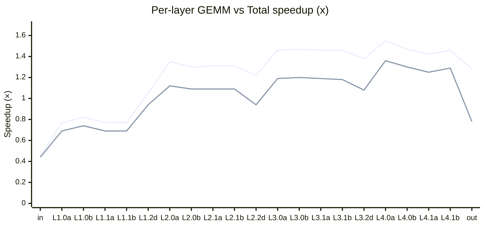
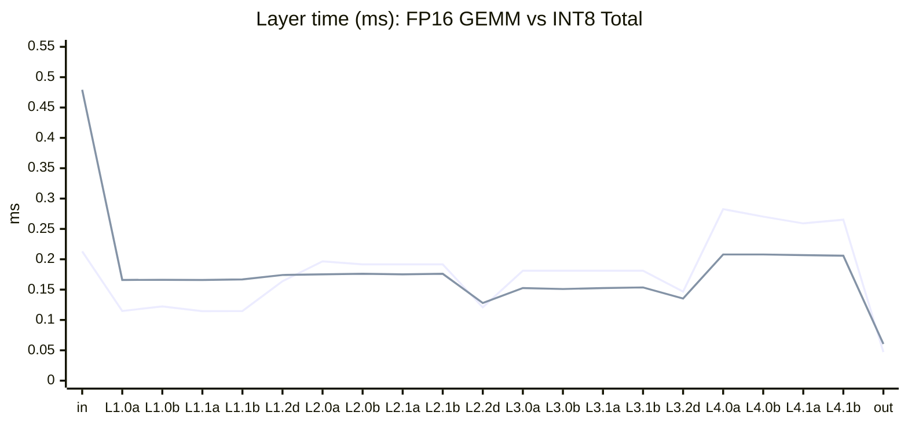

# AWML 稀疏塔：層級 FP16 vs INT8 時間與 speedup

時戳單位為 **ms**（與 TensorRT `IProfiler` per-layer mean 一致）。**GEMM Speedup** / **Total Speedup** 為 FP16 時間 ÷ INT8 對應時間；數值 **>1** 表示 INT8 該段較快，**<1** 表示較慢。

---

## 1. 層級對照表

| Layer | FP16 GEMM | FP16→INT8 | INT8 GEMM | INT8 Total | Δ Total vs FP16 | GEMM Speedup | Total Speedup |
|-------|-----------:|-----------:|----------:|-----------:|------------------:|-------------:|--------------:|
| conv_input | 0.2130 | 0.0082 | 0.4710 | 0.4792 | +0.2662 | 0.45x | 0.44x |
| L1.0 conv1 | 0.1147 | 0.0174 | 0.1485 | 0.1659 | +0.0512 | 0.77x | 0.69x |
| L1.0 conv2 | 0.1224 | 0.0174 | 0.1488 | 0.1662 | +0.0438 | 0.82x | 0.74x |
| L1.1 conv1 | 0.1145 | 0.0173 | 0.1485 | 0.1658 | +0.0513 | 0.77x | 0.69x |
| L1.1 conv2 | 0.1147 | 0.0174 | 0.1495 | 0.1669 | +0.0522 | 0.77x | 0.69x |
| L1.2 downsample | 0.1638 | 0.0174 | 0.1567 | 0.1741 | +0.0102 | 1.05x | 0.94x |
| L2.0 conv1 | 0.1966 | 0.0297 | 0.1454 | 0.1751 | -0.0215 | 1.35x | 1.12x |
| L2.0 conv2 | 0.1915 | 0.0287 | 0.1475 | 0.1761 | -0.0154 | 1.30x | 1.09x |
| L2.1 conv1 | 0.1915 | 0.0287 | 0.1464 | 0.1751 | -0.0164 | 1.31x | 1.09x |
| L2.1 conv2 | 0.1915 | 0.0297 | 0.1464 | 0.1761 | -0.0154 | 1.31x | 1.09x |
| L2.2 downsample | 0.1208 | 0.0287 | 0.0993 | 0.1280 | +0.0072 | 1.22x | 0.94x |
| L3.0 conv1 | 0.1812 | 0.0287 | 0.1239 | 0.1526 | -0.0287 | 1.46x | 1.19x |
| L3.0 conv2 | 0.1812 | 0.0279 | 0.1231 | 0.1510 | -0.0303 | 1.47x | 1.20x |
| L3.1 conv1 | 0.1812 | 0.0287 | 0.1239 | 0.1526 | -0.0287 | 1.46x | 1.19x |
| L3.1 conv2 | 0.1812 | 0.0297 | 0.1239 | 0.1536 | -0.0277 | 1.46x | 1.18x |
| L3.2 downsample | 0.1467 | 0.0288 | 0.1065 | 0.1353 | -0.0114 | 1.38x | 1.08x |
| L4.0 conv1 | 0.2826 | 0.0256 | 0.1823 | 0.2079 | -0.0747 | 1.55x | 1.36x |
| L4.0 conv2 | 0.2703 | 0.0246 | 0.1833 | 0.2079 | -0.0624 | 1.47x | 1.30x |
| L4.1 conv1 | 0.2591 | 0.0246 | 0.1823 | 0.2068 | -0.0522 | 1.42x | 1.25x |
| L4.1 conv2 | 0.2652 | 0.0246 | 0.1813 | 0.2059 | -0.0593 | 1.46x | 1.29x |
| conv_out | 0.0471 | 0.0235 | 0.0369 | 0.0604 | +0.0132 | 1.28x | 0.78x |

---

## 2. 圖表：每層 Speedup（數值 = FP16/INT8）

橫軸為縮寫層名：`in`=conv_input，`Lxy·a/b`=該 stage 第 1/2 個 conv，`d`=downsample，`out`=conv_out。

> **圖例**：上折線 = GEMM Speedup，下折線 = Total Speedup。虛擬參考線 **y = 1.0**（INT8 與 FP16 同速）— 在支援的 Mermaid 版本可自行對照；多數層 Total 在 L2 以下 **>1**（INT8 總時間較短），input / 前段 L1 與 **conv_out** 則 **<1**。

---

## 3. 圖表：FP16 GEMM 與 INT8 Total（ms）

---

## 4. 相關文件

- `docs/18_SPARSE_PROFILE_INT8_VS_FP16_COMPARISON.md`：端到端與 bucket 級比對
