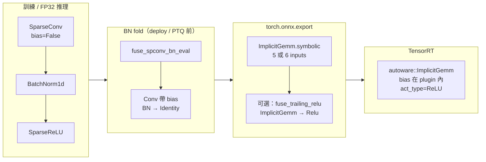
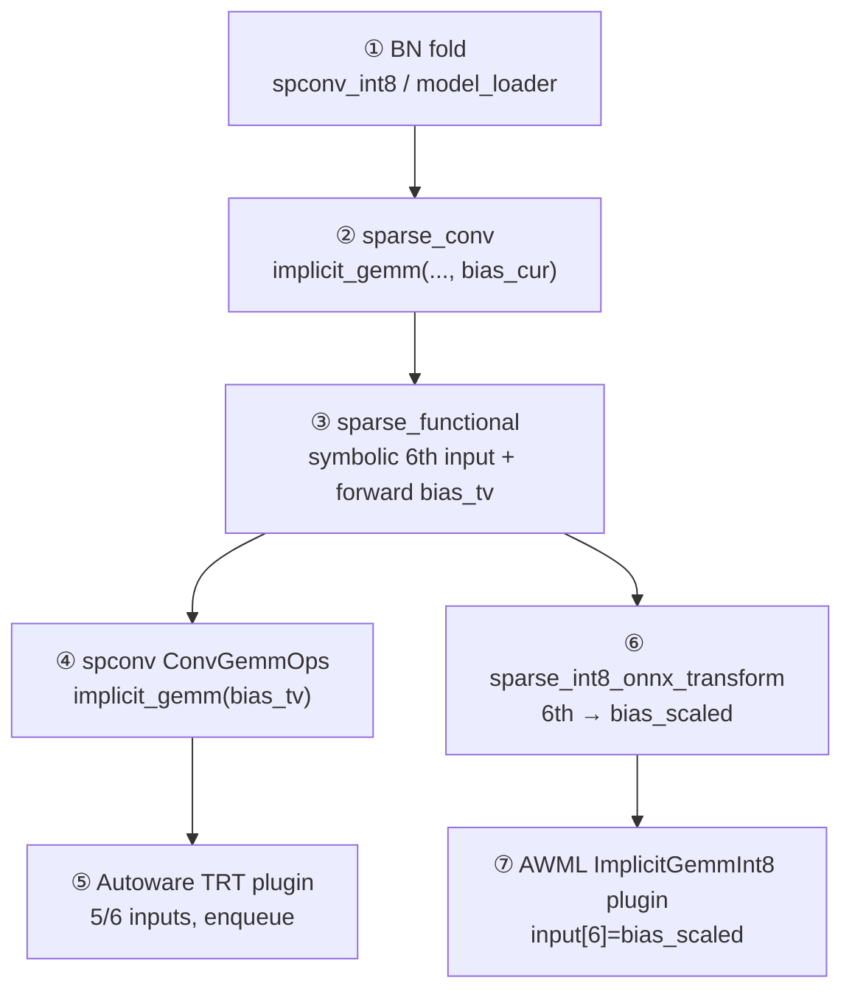

# 24：BN Fold 後 Bias 內嵌 ImplicitGemm，並簡化 ReLU Fuse 路徑

本文件記錄 AWML 在 **BEVFusion sparse encoder** 部署管線中的一組連動改動：

1. **BatchNorm fold** 後，per-channel bias 不再以獨立 ONNX `Add` 出現在主路徑上。
2. **匯出 ONNX** 時，fold 後的 bias 直接作為 `autoware::ImplicitGemm` 的 **第 6 個 input**。
3. **ONNX post-fuse** 只處理 `ImplicitGemm → Relu`（不再判斷 `ImplicitGemm → Add(const) → Relu` fallback）。

相關背景可併讀：

- `21_README_IMPLICITGEMM_FP_TRT_PLUGIN_ISSUES.md` — FP `ImplicitGemm` 5/6 input、plugin `act_type`
- `23_README_OPTIMIZATION_SUMMARY_MAPPING_FEATURE_SORT_FUSION_INT8.md` — §2.3 Fuse ReLU、§2.4 Fuse BN（本文件是該兩節在 sparse 主路徑上的具體落地）
- `22_README_ONNX_SPCONV_TRT_PLUGIN_AND_INFERENCE.md` — ONNX / TRT plugin 契約

---

## 1. 問題與目標

### 1.1 訓練時語意

`BEVFusionSparseEncoder` 中典型 block 為：

```text
SubMConv3d (bias=False) → BatchNorm1d → SparseReLU
```

數學上（eval）：

\[
y = \mathrm{ReLU}(\mathrm{BN}(\mathrm{Conv}(x)))
\]

### 1.2 舊部署路徑的問題

在舊的匯出設計裡，流程常被拆成：

```text
ImplicitGemm (純 GEMM)
  → Add(常數 bias)    ← fold 後的 BN 常數項
  → Relu
```

這會帶來：

| 問題 | 說明 |
|------|------|
| 圖較碎 | TensorRT 不易把 `ImplicitGemm` 與標準 `Add`/`Relu` 合成單一 kernel |
| Fuse 規則複雜 | 需同時處理 `gemm+relu` 與 `gemm+add+relu` 兩套模式 |
| 語意重複 | BN fold 後 bias 已是常數，卻仍在圖上以 `Add` 再表達一次 |

### 1.3 新目標（單一 invariant）

建立一條一致的規範：

| 階段 | 預期圖形 |
|------|----------|
| PyTorch（BN fold 後） | `Conv/GEMM` 帶 `bias` 參數，無獨立 BN 模組 |
| ONNX export | `ImplicitGemm` **5 或 6 input**（第 6 路 = fold 後 bias；無 bias 時為 5） |
| ONNX post-fuse | 僅 fuse **`ImplicitGemm → Relu`** → `act_type=kReLU` |
| 不處理 | `ImplicitGemm → Add(const) → Relu`（主路徑不再產生此模式） |

**Residual `Add`（兩路動態 feature）** 仍可能存在，且不屬於本文件的 fuse 範圍。

---

## 2. 端到端流程總覽



---

## 3. 階段 A：Sparse BN Fold（PyTorch）

### 3.1 何時執行

| 入口 | 函式 | 檔案 |
|------|------|------|
| PTQ / deploy 載入 | `_fuse_spconv_bn(model)` | `deployment/projects/bevfusion/io/model_loader.py` |
| 實作 | `_fuse_spconv_bn_in_encoder` | `deployment/projects/bevfusion/quantization/spconv_int8.py` |
| spconv 工具 | `fuse_spconv_bn_eval` | `spconv/pytorch/quantization/utils.py` |
| FP32 shadow 重建（若使用） | 同上 | `deployment/projects/bevfusion/export/sparse_encoder_float_shadow.py` |

Deploy config 常見開關：

- `fuse_spconv_bn = True`（例如 `deploy_config_split_sparse_fp16_dense_int8.py`）
- `quantization.fuse_bn = True`（PTQ 路徑）

### 3.2 數學（eval 時 BN 併入 Conv）

對 channel \(c\)：

\[
\mathrm{BN}(y)_c = \gamma_c \cdot \frac{y_c - \mu_c}{\sqrt{\sigma_c^2 + \epsilon}} + \beta_c
\]

令 \(s_c = \gamma_c / \sqrt{\sigma_c^2 + \epsilon}\)，則對 \(y = Wx + b_{\mathrm{conv}}\)：

\[
\mathrm{BN}(y)_c = s_c \cdot y_c + t_c,\quad t_c = \beta_c - s_c \mu_c
\]

合併後得到新的 **`W'`** 與 **`b'`**，單一線性層 \(y' = W'x + b'\) 即可等價表示 **Conv + BN**（ReLU 仍在外層）。

### 3.3 程式行為

- 掃描 `SparseConvolution` 後接 `BatchNorm1d` 的相鄰 pair。
- 寫回 `fused_conv.weight` / `fused_conv.bias`。
- 原 BN 模組改為 `nn.Identity()`（保留模組槽位，避免 state_dict key 大規模錯位）。

**重點**：fold 發生在 **模組層**，不是 ONNX 層。fold 完成後，`self.bias` 已是 `[C_out]` 的 `Parameter`。

---

## 4. 階段 B：匯出時 Bias 進 `ImplicitGemm`（不再外部 `Add`）

### 4.1 舊行為（已移除）

`projects/SparseConvolution/sparse_conv.py` 在 `implicit_gemm` 之後曾有：

```python
# 舊邏輯（已刪除）
if bias_cur is not None:
    out_features = out_features + bias_cur
```

`torch.onnx.export` 因此常畫出：

```text
autoware::ImplicitGemm → Add(const bias) → Relu
```

### 4.2 新行為

1. **`sparse_conv._conv_forward`** 呼叫 `Fsp_custom.implicit_gemm(..., bias_cur, ...)`，其中 `bias_cur = bias_for_infer`（fold 後的 `self.bias`）。
2. **`ImplicitGemm.symbolic`**：若 `bias is not None`，把 `bias` 追加為 **第 6 個 ONNX input**。

```python
# projects/SparseConvolution/sparse_functional.py（摘要）
gemm_inputs = [features, filters, pair_fwd, pair_mask_fwd_splits, mask_argsort_fwd_splits]
if bias is not None:
    gemm_inputs.append(bias)  # 第 6 路：fold 後 per-channel bias

output = g.op("autoware::ImplicitGemm", *gemm_inputs, act_type_i=..., ...)
```

3. **`ImplicitGemm.forward`**（CUDA 推理）將 `bias` 傳入 `ConvGemmOps.implicit_gemm` 的 `bias_tv`。

### 4.3 ONNX 節點契約

| 輸入數 | 含義 |
|--------|------|
| **5** | 無 per-channel bias（或全零且未掛載第 6 路） |
| **6** | 第 6 路為 `[C_out]` 常數 bias（來自 BN fold） |

Autoware plugin 在 `enqueue` 內消費第 6 路 bias，並與 activation dtype 對齊（見 `21` 與 `implicit_gemm_plugin.cpp`）。

### 4.4 與「無 bias 的 conv」的差異

| 情況 | PyTorch | ONNX |
|------|---------|------|
| 訓練時 `bias=False` 且 **未** fold | 無 `self.bias` | 5-input `ImplicitGemm` |
| fold 後（典型 deploy） | 有 `self.bias` | 6-input `ImplicitGemm` |
| `order=("conv",)` 僅 conv、無 BN | 可能仍無 bias | 5-input |

### 4.5 Training / Deploy 與「有沒有 bias」的釐清

容易誤解成「training 與 deploy 的 ImplicitGemm 都沒有 bias」；實際上是 **bias 存在的位置與 ONNX 畫法** 不同：

| 階段 | `SparseConvolution` 參數 | 數學上的 affine | ONNX `ImplicitGemm` |
|------|---------------------------|-----------------|---------------------|
| **Training** | `bias=False`（見 `sparse_convmodule.py`） | 由 **BN** 的 γ、β 提供 | （訓練通常不 export） |
| **Deploy（BN fold 後）** | 有 `self.bias`（`[C_out]`） | 已併入 **conv bias** | **6-input**（第 6 路）或 5-input |
| **舊 Deploy export** | 同上，有 `bias_cur` | 有 bias | **5-input** + 圖上 **`Add(const)`** |
| **新 Deploy export** | 同上 | 有 bias | **6-input**，bias 在 plugin 內 |

**結論**：

- Training：**conv 參數上** 多半沒 bias，但 **不是「沒有偏置」**（BN 負責）。
- Deploy fold 後：**有** `conv.bias`。
- 舊路徑：不是沒 bias，而是 **bias 沒進 ONNX 第 6 input**，用 **`Add`** 補。
- 新路徑：fold 後 bias **直接當第 6 input**。
- **spconv `ConvGemmOps.implicit_gemm` 本來就支援 `bias_tv`**；AWML 改的是 **接上 fold 後的 bias** 與 **export symbolic**，Autoware TRT plugin 改的是 **5/6 input 契約**。

### 4.6 Deploy 底層分層對照（bias 在哪一層接上）

讓 `ImplicitGemm` 在 deploy 端到端支援 bias，是 **多層疊加**；缺任一層都會出現「PyTorch 有 bias、ONNX/TRT 卻丟失或變成 `Add`」。



| 層級 | 倉庫 / 路徑 | 職責 | 若缺失的症狀 |
|------|-------------|------|----------------|
| **① BN fold** | `deployment/projects/bevfusion/quantization/spconv_int8.py` → `_fuse_spconv_bn_in_encoder`<br>`deployment/projects/bevfusion/io/model_loader.py` → `_fuse_spconv_bn`<br>`spconv/pytorch/quantization/utils.py` → `fuse_spconv_bn_eval` | 產生 `SparseConvolution.bias` | `bias_cur` 為 `None`，export 多為 **5-input** |
| **② PyTorch 呼叫** | `projects/SparseConvolution/sparse_conv.py` | `implicit_gemm(..., bias_cur)`；**已移除** GEMM 後 `out_features + bias_cur` | ONNX 出現 **`ImplicitGemm → Add`** |
| **③ ONNX export** | `projects/SparseConvolution/sparse_functional.py` | `symbolic`：`bias is not None` 時 append 第 6 input；`forward`：`bias_tv` → `ConvGemmOps.implicit_gemm` | 圖上無第 6 路；僅 PyTorch 路徑有 bias |
| **④ spconv CUDA** | `spconv` 內 `ConvGemmOps.implicit_gemm` | Kernel 內加 bias（**通常不需改 AWML**） | — |
| **⑤ FP TRT plugin** | `autoware.universe/perception/autoware_tensorrt_plugins/`<br>`implicit_gemm_plugin.hpp` / `implicit_gemm_plugin.cpp` | `configurePlugin` / `supportsFormatCombination` 接受 **5 或 6** input；`build_bias_tensor_matching_activation`；`enqueue` 傳 `bias_tv` | 6-input ONNX **建 engine 失敗**（見 doc **21**） |
| **⑥ sparse INT8 INT8 transform** | `deployment/projects/bevfusion/export/sparse_int8_onnx_transform.py` | FP `ImplicitGemm` 若有 **6 input**，將第 6 路常數 **併入 `bias_scaled`**（`bs_arr + ex / output_scale`） | INT8 與 FP16 fuse 後 **靜默錯精度** |
| **⑦ INT8 TRT plugin** | `deployment/projects/bevfusion/cpp/int8_plugin/implicit_gemm_int8_plugin.hpp` | 固定 **7 input**；index **6** = `bias_scaled`（≠ FP 第 6 路 tensor 名，語意為量化後 bias） | INT8 engine 缺 bias 項 |

**AWML 本次 conversation 直接改動的核心檔**（相對於更早的 doc 21 plugin 工作）：

- `projects/SparseConvolution/sparse_conv.py`
- `projects/SparseConvolution/sparse_functional.py`

**需與 AWML 配套、但位於其他 repo 的底層**：

- `autoware.universe/.../implicit_gemm_plugin.cpp`（FP deploy 執行期）
- `deployment/.../sparse_int8_onnx_transform.py`（sparse INT8 6th input → `bias_scaled`）

#### ④ `sparse_conv.py`：bias 送進 GEMM

```352:375:projects/SparseConvolution/sparse_conv.py
                    out_features = Fsp_custom.implicit_gemm(
                        features,
                        weight_cur,
                        ...
                        bias_cur,
                        act_alpha,
                        act_beta,
                        act_type,
                        ...
                    )
```

`bias_cur = bias_for_infer`（fold 後的 `self.bias`）。**不再**在 return 前對 infer 路徑做 `out_features + bias_cur`（訓練用 `bias_for_training` 的加法仍保留在別處）。

#### ⑤ `sparse_functional.py`：symbolic + forward

**ONNX（第 6 input）：**

```427:434:projects/SparseConvolution/sparse_functional.py
        gemm_inputs = [features, filters, pair_fwd, pair_mask_fwd_splits, mask_argsort_fwd_splits]
        if bias is not None:
            gemm_inputs.append(bias)
        output = g.op("autoware::ImplicitGemm", *gemm_inputs, ...)
```

**CUDA forward：**

```509:545:projects/SparseConvolution/sparse_functional.py
        if bias is not None:
            bias_tv = torch_tensor_to_tv(bias)
        _, _ = ConvGemmOps.implicit_gemm(..., bias_tv, ...)
```

> **注意**：同檔案中 **`IndiceConv`（native algo）** 的 `forward` 仍有 `assert bias is None`；僅 **`ImplicitGemm` Function** 走 deploy 的 bias 路徑。BEVFusion deploy 使用 **ImplicitGemm** 演算法。

#### ⑥ Autoware FP `ImplicitGemm` TRT plugin（5 / 6 input）

標頭定義可選第 6 路（index 5）：

```122:130:autoware.universe/perception/autoware_tensorrt_plugins/include/autoware/tensorrt_plugins/implicit_gemm_plugin.hpp
  /// Optional 6th input: 1D bias ``[C_out]`` (FLOAT/ HALF, same as activations). ONNX fusion only.
  static constexpr std::int32_t INOUT_OPTIONAL_BIAS_INDEX{5};
  /// Set in ``configurePlugin`` / ``onShapeChange``: 5 = no bias tensor, 6 = bias at input index 5.
  std::int32_t num_plugin_inputs_{5};
```

`implicit_gemm_plugin.cpp` 要點：

- `configurePlugin` / `supportsFormatCombination`：`num_inputs == 5 || num_inputs == 6`（不可寫死 5）。
- `build_bias_tensor_matching_activation`：FP16 輸出時 bias 若為 FP32 initializer，需轉成與 activation 一致 dtype。
- `enqueue`：`num_plugin_inputs_ >= 6` 時讀 `inputs[INOUT_OPTIONAL_BIAS_INDEX]` 並傳入 spconv。

詳見 **`21_README_IMPLICITGEMM_FP_TRT_PLUGIN_ISSUES.md`**。

#### ⑦ sparse INT8：FP 第 6 路 → INT8 `bias_scaled`

INT8 節點為 **5 個稀疏 tensor + `channel_scale` + `bias_scaled`**，不直接掛 FP 的第 6 路。transform 時合併：

```1032:1056:deployment/projects/bevfusion/export/sparse_int8_onnx_transform.py
        if len(node.input) == 6:
            extra = _try_get_constant_numpy(graph, extra_name, init_map)
            ...
            bs_arr = bs_arr + (ex / out_sc)
```

`ImplicitGemmInt8` plugin 契約見 `deployment/projects/bevfusion/cpp/int8_plugin/implicit_gemm_int8_plugin.hpp`（`IN_BIAS_SCALED = 6`）。

---

## 5. 階段 C：簡化 ReLU Fuse（移除 `gemm+add+relu`）

### 5.1 動機

主路徑已不再產生「fold bias 的 `Add`」時，ONNX post-process **不必**再維護：

- `fuse_autoware_implicit_gemm_fp16_add_relu`（`ImplicitGemm → Add(const) → Relu`）
- `fuse_autoware_implicit_gemm_int8_add_relu`（`ImplicitGemmInt8 → Add(const) → Relu`）

### 5.2 保留的單一路徑

僅保留：

```python
fuse_autoware_implicit_gemm_trailing_relu(model)
```

條件（摘要）：

- 存在 **`Relu`**，且其輸入 **唯一** 來自某 `ImplicitGemm` / `ImplicitGemmInt8` 輸出。
- 將該 GEMM 節點的 **`act_type` 設為 `1`（ReLU）**。
- 刪除冗餘 **`Relu`** 節點，tensor 名稱改接。

### 5.3 呼叫點

| 階段 | 檔案 | 行為 |
|------|------|------|
| FP sparse ONNX postprocess | `export/onnx_export_pipeline.py` → `_postprocess_sparse_onnx_fp` | 僅 `fuse_autoware_implicit_gemm_trailing_relu` |
| sparse INT8 INT8 transform | `export/sparse_int8_onnx_transform.py` → `transform_onnx_int8` | FP 圖轉 INT8 **前** 僅 trailing ReLU fuse；**不再** INT8 的 Add+Relu fuse |

Deploy 開關：`spconv_fuse_implicit_gemm_relu = True`（預設常開）。

### 5.4 預期 ONNX 長相（主路徑）

```text
GetIndicePairsImplicitGemm
  → ImplicitGemm [+ optional 6th bias input], act_type=ReLU
  → （下一層或 scatter / residual Add）
```

而 **不是**：

```text
ImplicitGemm → Add(const) → Relu   # 主路徑已不以此為目標
```

---

## 6. 與 FX / Shadow 的關係（釐清）

本改動與下列項目 **正交**：

| 主題 | 本文件 | 說明 |
|------|--------|------|
| **BN fold + bias 進 GEMM** | ✅ 核心 | 改 `sparse_conv` / `sparse_functional` / fuse 腳本 |
| **移除 torch.fx tracing 分支** | 相關但獨立 | `_fx_tracing` / Proxy stub 已從 SparseConvolution 移除 |
| **sparse_encoder_float_shadow** | 可選、與 export mode 有關 | 僅在 `export.mode` 會走 ONNX 時可能暫換 FP32 encoder；與「bias 是否進第 6 input」無關 |

若 `deploy_config` 設 `export.mode="none"`，則 **不會** 執行 ONNX export，也就不會觸發 shadow；但 **PTQ 載入時的 BN fold** 仍會套用。

---

## 7. 修改檔案清單（實作對照）

| 檔案 | 變更摘要 |
|------|----------|
| `projects/SparseConvolution/sparse_conv.py` | `implicit_gemm(..., bias_cur)`；刪除 infer 路徑 `out_features + bias_cur` |
| `projects/SparseConvolution/sparse_functional.py` | `ImplicitGemm.symbolic` 6-input；`forward` 傳 `bias_tv` 進 spconv |
| `deployment/.../quantization/spconv_int8.py` | `_fuse_spconv_bn_in_encoder`（fold 核心，產生 `conv.bias`） |
| `deployment/.../io/model_loader.py` | PTQ / deploy 載入時 `_fuse_spconv_bn` |
| `deployment/.../export/sparse_int8_onnx_transform.py` | 6-input FP `ImplicitGemm` → 合併第 6 路至 `bias_scaled`；移除 Add+Relu fuse 呼叫 |
| `deployment/.../export/onnx_fuse_implicit_gemm_activation.py` | 刪除 Add+Relu fuse；僅 `fuse_autoware_implicit_gemm_trailing_relu` |
| `deployment/.../export/onnx_export_pipeline.py` | postprocess log / 呼叫簡化 |
| `deployment/.../cpp/int8_plugin/implicit_gemm_int8_plugin.hpp` | INT8 路徑 `bias_scaled`（input index 6）；與 FP 第 6 路語意對齊靠 transform |
| `autoware.universe/.../implicit_gemm_plugin.cpp` | FP TRT：**5/6 input**、`enqueue` 消費 bias（**非 AWML 倉**，deploy 必備） |
| `projects/BEVFusion/bevfusion/sparse_encoder.py` | 移除 `basicblock_fx` 等 FX 殘留 |
| `projects/BEVFusion/bevfusion/sparse_block_fx.py` | **已刪除** |

---

## 8. 驗證建議

### 8.1 PyTorch 側

- BN fold 後檢查 `pts_middle_encoder` 中 `SparseConvolution` 是否帶 `bias`。
- 相鄰 BN 應為 `Identity`（或已不在 forward 路徑中）。

### 8.2 ONNX 側（Netron）

對 `bevfusion_sparse.onnx`（或 INT8 transform 前的 FP sparse ONNX）：

1. 找 `autoware::ImplicitGemm`：
   - **有 fold bias 的層**：`inputs` 長度應為 **6**（第 6 個為 `[C_out]` bias）。
   - **無 bias 層**：**5** inputs。
2. 主路徑上 **不應**再大量出現 `ImplicitGemm → Add → Relu`（常數 Add）。
3. 若開啟 `spconv_fuse_implicit_gemm_relu`：尾端 **`Relu` 應被吸收** 為 `act_type=1`，獨立 `Relu` 節點減少。

### 8.3 TensorRT 側

- 建 engine 時確認 **5/6 input** 的 `ImplicitGemm` 均可解析（見 `21`）。
- 數值：fold 後 PyTorch 與 TRT 應一致；若僅 ONNX 仍見 `Add`，代表 export 未走新 `sparse_conv` 路徑或 checkpoint 未 fold。

---

## 9. 常見問題

**Q：BN fold 後一定會有第 6 路 bias 嗎？**  
A：只要該層 conv 經 fold 且產生非零 `bias` 參數，export 時就應為 **6-input**。全零或無 bias 參數時可能仍是 5-input。

**Q：為什麼還看得到 `Add`？**  
A：可能是 **residual block** 的動態相加，或舊 ONNX／未 fold 的 checkpoint。僅 **常數 bias Add** 應從主路徑消失。

**Q：還需要 `onnx_fuse_implicit_gemm_activation` 嗎？**  
A：需要，但現在 **只負責 `ImplicitGemm → Relu`**。不再依賴它修復 fold 後的 bias Add。

**Q：與 doc 23 的「Fuse BatchNorm」有何關係？**  
A：doc 23 描述優化類別；**本文件是 sparse 主路徑的具體實作**：fold 在 PyTorch，bias 在 export 進 plugin，ReLU fuse 規則簡化。

**Q：Training / deploy 的 ImplicitGemm 是不是都沒有 bias？**  
A：否。Training 是 **conv 無 bias、BN 有 affine**；deploy fold 後 **有 `conv.bias`**。舊 export 是 **5-input GEMM + `Add`**；新 export 是 **6-input GEMM**。見 **§4.5**。

**Q：Deploy 底層在哪裡修正讓 ImplicitGemm 可以有 bias？**  
A：見 **§4.6** 七層對照：AWML 核心是 `sparse_conv.py` + `sparse_functional.py`；TRT 執行期靠 **Autoware `implicit_gemm_plugin`**；INT8 靠 **`sparse_int8_onnx_transform`** + **`implicit_gemm_int8_plugin`**。

**Q：只改 AWML、不改 Autoware plugin 可以嗎？**  
A：不行。ONNX 若為 6-input，TRT 外掛必須支援第 6 路並在 `enqueue` 傳入 spconv，否則建 engine 失敗或 bias 被忽略（doc **21**）。

**Q：FP 第 6 input 與 INT8 的 `bias_scaled` 是同一件事嗎？**  
A：語意相關、圖上不同。FP 第 6 路是 **fold 後 per-channel bias**；INT8 的 `bias_scaled` = **bias / output_scale**，且 transform 會把 FP 第 6 路常數 **加進** `bias_scaled` initializer。

---

## 10. 建議閱讀順序

1. 本文件 **24**（BN fold → 6-input GEMM → 簡化 ReLU fuse）
2. **21**（FP/INT8 plugin 契約與 5/6 input）
3. **23**（優化總表）
4. **12** / **11**（sparse INT8 PTQ → ONNX → TRT 全流程）

---

*文件版本：對應 AWML 移除 FX tracing 主路徑、bias 內嵌 `ImplicitGemm`、刪除 `gemm+add+relu` fuse fallback 之後的實作狀態；§4.5–4.6 補充 training/deploy bias 釐清與 deploy 底層分層對照。*
