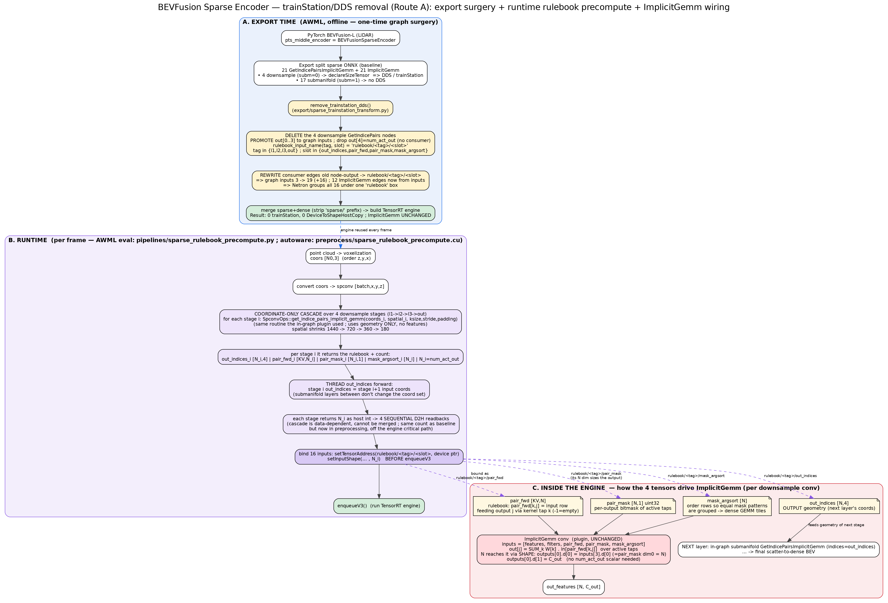

# BEVFusion Sparse Encoder — Data-Dependent-Shape (trainStation) Optimization

> Profiling source: `/home/yihsiangfang/bevfusion_2_7/bevfusion_profile_kambe.nsys-rep`
> Reference optimization (same class of problem, already solved for PTv3):
> - [tier4/AWML#206](https://github.com/tier4/AWML/pull/206) — ONNX export side
> - [autowarefoundation/autoware_universe#12727](https://github.com/autowarefoundation/autoware_universe/pull/12727) — runtime side

## 1. Problem Statement

In the BEVFusion TensorRT engine, the sparse middle encoder (spconv) shows repeated
`[trainStationN]` markers between sparse-conv blocks in the Nsight Systems timeline. These are
TensorRT **execution-segment boundaries** forced by **data-dependent shapes (DDS)**: the number of
active output sites after a downsampling sparse convolution is not known until the GPU has computed
it, so TensorRT must copy that shape back to the host (`DeviceToShapeHostCopy`) before it can
configure and launch the next segment. Each such boundary breaks pipelining and leaves the GPU idle.

## 1.5 Reading the `GetIndicePairsImplicitGemm` outputs in the ONNX graph

In the exported ONNX you will see nodes such as
`/pts_middle_encoder/encoder_layer1/encoder_layer1.2/encoder_layer1.2.0/GetIndicePairsImplicitGemm`
with outputs `_output_0 / _output_1 / _output_2 / _output_3`. These come from spconv's
**index / geometry stage**. spconv deliberately splits a sparse convolution into two ops:

1. **`GetIndicePairsImplicitGemm`** — builds the *rulebook* from voxel **geometry only** (which
   cells are occupied); it does **not** look at feature values.
2. **`ImplicitGemm`** — consumes the rulebook + features and does the actual matrix multiply.

The op emits **5 outputs** (`outputs=5` in `sparse_functional.py`); the forward returns the tuple
`(out_inds, pair_fwd, pair_mask_fwd, mask_argsort_fwd, num_act_out)`:

| Output | Meaning | Shape |
|--------|---------|-------|
| `_output_0` = **out_indices** | Active voxel coordinates `[batch, x, y, z]` after this downsample. The next layer's input coords are exactly this. | `[N, 4]` |
| `_output_1` = **pair_fwd** | The **rulebook** itself: for each kernel offset, the input→output voxel index pairs. `KV` = kernel volume. | `[KV, N]` (KV=27 for 3×3×3; KV=3 for `conv_out` 1×1×3) |
| `_output_2` = **pair_mask** | Per output site, a bitmask of which kernel offsets actually have a matching input. | `[N, 1]` |
| `_output_3` = **mask_argsort** | Argsort of the mask, so the implicit-GEMM kernel reads sites efficiently. | `[N]` |
| `_output_4` = **num_act_out** | The **count** of active output sites N after this downsample (a scalar). | `[]` |

`N` is the number of active voxels after the downsample. **`_output_4` (num_act_out) is the DDS
source**: N is only known after the GPU finishes the unique/sort step, which is why TensorRT inserts
the `DeviceToShapeHostCopy` and the `[trainStation]` segment boundary here. Submanifold layers
(`conv1`/`conv2`) keep the active-site set unchanged, so they produce no shape copy.

The node you are looking at, `encoder_layer1.2` (the 3rd sublayer of `encoder_layer1`, a stride-2
downsample), is one of the **4 DDS layers** in §2.1.

**Why this matters for the optimization (Route A):** because the rulebook depends only on geometry,
it can be precomputed in preprocessing. Export then **deletes** the 4 downsample
`GetIndicePairsImplicitGemm` nodes and promotes their `_output_0..3` to **graph inputs**
(`_output_4`/num_act_out has no consumer and is dropped). The size tensor disappears, all 6
trainStations collapse to 0, and `ImplicitGemm` needs no change (its output shape is already derived
from an input dim). See §7.0 and §8 Slice 1.

> **Graph-input naming.** The 4 promoted tensors per stage are renamed to a clean, hierarchical
> `rulebook/<tag>/<slot>` scheme (`tag` ∈ `l1,l2,l3,out`; `slot` ∈ `out_indices,pair_fwd,pair_mask,
> mask_argsort`), e.g. `rulebook/l1/pair_fwd`. This is purely a readability change: the leading
> `rulebook/` segment makes Netron group all 16 inputs into one collapsible box instead of 16
> dangling `…/GetIndicePairsImplicitGemm_output_N` tensors that look like outputs of a node that is
> no longer in the graph. The name is the contract between the export transform
> (`rulebook_input_name()`) and both runtimes; see §8 "Rulebook graph-input naming".

### 1.5 (中文) 解讀 ONNX 圖裡的 `GetIndicePairsImplicitGemm` 輸出

在匯出的 ONNX 中你會看到類似
`/pts_middle_encoder/encoder_layer1/encoder_layer1.2/encoder_layer1.2.0/GetIndicePairsImplicitGemm`
的節點，輸出為 `_output_0 / _output_1 / _output_2 / _output_3`。它們來自 spconv 的
**索引 / 幾何計算階段**。spconv 故意把稀疏卷積拆成兩個 op：

1. **`GetIndicePairsImplicitGemm`** — 只根據體素的**幾何**（哪些格子有點）算出 *rulebook（規則簿）*，
   **完全不看 feature 數值**。
2. **`ImplicitGemm`** — 拿規則簿 + feature 做真正的矩陣乘法。

此 op 輸出 **5 個 tensor**（`sparse_functional.py` 中 `outputs=5`）；forward 回傳的 tuple 是
`(out_inds, pair_fwd, pair_mask_fwd, mask_argsort_fwd, num_act_out)`：

| 輸出 | 含意 | 形狀 |
|------|------|------|
| `_output_0` = **out_indices** | 這層下採樣後的**活躍體素座標** `[batch, x, y, z]`。下一層的輸入座標就是它。 | `[N, 4]` |
| `_output_1` = **pair_fwd** | **規則簿本體**：對每個 kernel offset，記錄「輸入體素 → 輸出體素」的配對索引。`KV` = kernel 體積。 | `[KV, N]`（3×3×3 時 KV=27；`conv_out` 1×1×3 時 KV=3） |
| `_output_2` = **pair_mask** | 每個輸出位置上，哪些 kernel offset 真的有對應輸入（bitmask）。 | `[N, 1]` |
| `_output_3` = **mask_argsort** | 把 mask 排序後的索引，讓 implicit-GEMM kernel 能有效率地讀取。 | `[N]` |
| `_output_4` = **num_act_out** | 這層下採樣後**活躍體素的數量** N（scalar）。 | `[]` |

`N` 就是該層下採樣後的活躍體素數。**`_output_4`（num_act_out）正是 DDS 的來源**：N 要等 GPU 算完
unique/sort 才知道，所以 TensorRT 必須在此插入 `DeviceToShapeHostCopy` 並切出一個 `[trainStation]`
段界。submanifold 層（`conv1`/`conv2`）不改變活躍體素集合，因此不會產生 shape copy。

你看到的這個節點 `encoder_layer1.2`（`encoder_layer1` 的第 3 個 sublayer，stride-2 下採樣層），正是
§2.1 中 **4 個 DDS 層** 之一。

**這對優化（Route A）為何重要：** 因為規則簿只依賴幾何，可以在 preprocessing 先算好。匯出時就把這 4 個
下採樣的 `GetIndicePairsImplicitGemm` 節點**刪掉**，並把它們的 `_output_0..3` 提升為**圖的輸入**
（`_output_4`/num_act_out 沒有 consumer，直接丟棄）。size tensor 隨之消失、6 個 trainStation 全部歸 0，
而 `ImplicitGemm` 完全不用改（它的輸出 shape 本來就從輸入 dim 推導）。詳見 §7.0 與 §8 Slice 1。

> **Graph-input 命名。** 每個 stage 被提升的 4 個 tensor 會改名成乾淨的階層式 `rulebook/<tag>/<slot>`
> （`tag` ∈ `l1,l2,l3,out`；`slot` ∈ `out_indices,pair_fwd,pair_mask,mask_argsort`），例如
> `rulebook/l1/pair_fwd`。這純粹是可讀性的改動：開頭的 `rulebook/` 讓 Netron 把 16 個 input 收進一個
> 可摺疊的方框，而不是 16 個看似「某個已不存在的節點的輸出」的 `…/GetIndicePairsImplicitGemm_output_N`。
> 這個名字是 export transform（`rulebook_input_name()`）與兩端 runtime 之間的契約；見 §8
> 「Rulebook graph-input naming」。

## 1.6 What the rulebook tensors do, how `act` is precomputed, and how they reach `ImplicitGemm`

This section explains the four rulebook tensors mechanically, and the exact path by which the
precomputed values drive the `ImplicitGemm` conv in the trainStation-free graph.

### 1.6.1 What each tensor is (spconv MaskImplicitGemm convention)

A sparse convolution turns into a **gather + batched matmul**: for every active *output* voxel,
gather the input voxels that fall under each kernel tap, multiply by that tap's weight, and sum.
The four tensors are exactly the bookkeeping that makes this matmul possible **without dense
spatial loops**. Let `N` = number of active output voxels, `KV` = kernel volume (`prod(ksize)`;
27 for a 3×3×3, 3 for `conv_out` 1×1×3), `C_in`/`C_out` = input/output channels.

| Tensor | Shape | Role |
|--------|-------|------|
| **out_indices** | `[N, 4]` int32 | The coordinates `[batch, x, y, z]` of each active output voxel. This is the *output geometry* — the set of occupied cells after the stride-2 downsample. It is **not** consumed by this layer's GEMM; it is the **input coordinate set of the next layer** (and feeds the final scatter to dense BEV). |
| **pair_fwd** | `[KV, N]` int32 | The **rulebook** proper. `pair_fwd[k, j]` = the row index into the **input** feature matrix of the voxel that feeds output voxel `j` through kernel tap `k`, or `-1` if that tap has no input there. This is the gather table: `out[j] = Σ_k W[k] · in[pair_fwd[k, j]]` over the taps where `pair_fwd[k, j] ≠ -1`. |
| **pair_mask** | `[N, 1]` uint32 | Per output voxel, a **bitmask over the `KV` kernel taps**: bit `k` set ⇔ `pair_fwd[k, j] ≠ -1`. It lets the kernel know, per output row, which taps are active so it skips the empty ones. `KV ≤ 32` (27 or 3 here), so one `uint32` holds the whole mask. |
| **mask_argsort** | `[N]` int32 | A permutation of the `N` output voxels that **groups rows with the same mask bit-pattern together**. The implicit-GEMM kernel walks rows in this order so each GEMM tile contains voxels with an identical active-tap set → dense, uniform tiles instead of ragged ones. Pure scheduling/ordering; no geometry of its own. |
| *(num_act_out)* | scalar | `= N`. The active-output count. **Dropped as a graph input** — see §1.6.3 for why the engine doesn't need it explicitly. |

Key property repeated from §3: **all four depend only on voxel coordinates, never on feature
values.** `pair_fwd`/`pair_mask`/`mask_argsort` are derived purely from which input cells are
occupied and the kernel geometry; `out_indices` is just the resulting occupied output cells. That
is what makes precomputation legal.

### 1.6.2 How `act` (the active-voxel count `N`) is precomputed

`act` is the data-dependent quantity (`num_act_out`) that originally forced the
`DeviceToShapeHostCopy` / trainStation. In Route A it is produced in **preprocessing**, before the
engine runs, by a **coordinate-only cascade** over the 4 downsample stages
(`pipelines/sparse_rulebook_precompute.py` for AWML eval; `preprocess/sparse_rulebook_precompute.cu`
for autoware_bevfusion):

1. Start from the voxel coordinates `coors` produced by voxelization (`[N0, 3]`, order `[z, y, x]`),
   convert to spconv's `[batch, x, y, z]`.
2. For each downsample stage `i` (`l1→l2→l3→out`), call the **same** spconv routine the in-graph
   plugin used, `SpconvOps::get_indice_pairs_implicit_gemm(coords_i, spatial_shape_i, ksize, stride,
   padding, …)`. This runs the unique/sort over generated output coordinates and returns the stage's
   `out_indices`, `pair_fwd`, `pair_mask`, `mask_argsort`, **and the count `N_i = num_act_out`**.
3. **Thread `out_indices` forward**: stage `i`'s `out_indices` is the input coordinate set of stage
   `i+1` (the submanifold layers between downsamples don't change the coordinate set, so they are
   skipped in the cascade). The spatial shape shrinks `1440→720→360→180` accordingly.
4. Each stage's `get_indice_pairs_implicit_gemm` returns `N_i` **as a host int**, so it performs its
   own device-to-host readback. Because the cascade is data-dependent (stage `i+1`'s input *is* stage
   `i`'s output coords + count), these readbacks are **sequential: 4 syncs, one per stage** — the same
   count of host syncs the baseline did. The win is **where** they happen, not their number: the
   baseline did them *mid-TRT-graph* (forcing `DeviceToShapeHostCopy` + trainStation segmentation that
   fragments the whole engine); Route A does them in **preprocessing**, so the TRT engine runs as one
   un-fragmented, CUDA-graphable block. (A true single combined readback isn't possible here — the
   geometric cascade dependency forbids it; §4.1's "single sync" was the design intent, not the shape
   of the implementation.)

The result is, per stage, four device tensors (the rulebooks) plus the integer `N_i`.

### 1.6.3 How the precomputed values reach `ImplicitGemm`

This is the crucial wiring, and the reason `num_act_out` can be dropped:

- **`pair_fwd`, `pair_mask`, `mask_argsort` are bound as the engine's rulebook graph inputs.** In the
  ONNX, `ImplicitGemm`'s inputs are exactly `[features, filters, pair_fwd, pair_mask, mask_argsort]`
  (see `ImplicitGemm.symbolic`; `num_activate_out` is **not** an ONNX input). The runtime
  `setTensorAddress`es each rulebook buffer to the corresponding `rulebook/<stage>/<slot>` input and
  `setInputShape`s it to `N_i` before `enqueueV3`.
- **`N` reaches `ImplicitGemm` through a shape, not a value.** The `ImplicitGemm` plugin derives its
  output extent from an *input* dim: `outputs[0].d[0] = inputs[3].d[0]` (= `pair_mask`'s dim0 = `N`),
  `outputs[0].d[1] = inputs[1].d[0]` (= `C_out`) — see §7.0. So once `pair_mask` (and the other
  rulebooks) have shape `N_i` fixed by `setInputShape`, the conv's output `[N_i, C_out]` is fully
  determined. **No separate `num_act_out` scalar is needed** — which is exactly why `out[4]` has no
  consumer and is dropped during the graph surgery.
- **`out_indices` reaches the *next* layer, not this GEMM.** It is bound to the
  `rulebook/<stage>/out_indices` input and consumed by the following (in-graph, submanifold)
  `GetIndicePairsImplicitGemm` node as its `indices`, and ultimately by the scatter-to-dense step.
  This is why the surgery promotes `out[0]` too (4 inputs) on top of the 12 GEMM inputs
  (4 stages × {pair_fwd, pair_mask, mask_argsort}).

So the end-to-end contract is: **preprocess computes the geometry (rulebooks + `N`) → binds the
3 GEMM rulebooks (with `N` as their shape) and `out_indices` (for the next layer) → `ImplicitGemm`
runs the gather-matmul, sizing its output from `pair_mask`'s `N` dim.** The features themselves
never enter preprocessing; only `ImplicitGemm` sees them, exactly as before — only the geometry it
needed was moved out of the graph.

### 1.6 (中文) 四個 rulebook tensor 在做什麼、`act` 如何 precompute、又如何餵給 `ImplicitGemm`

#### 1.6.1 每個 tensor 是什麼（spconv MaskImplicitGemm 慣例）

稀疏卷積本質是 **gather + 批次矩陣乘法**：對每個活躍的*輸出*體素，蒐集落在各 kernel tap 下的輸入體素，
乘上該 tap 的權重再相加。這四個 tensor 就是讓這個矩陣乘法能在**不做密集空間迴圈**下完成的索引簿。設
`N` = 活躍輸出體素數，`KV` = kernel 體積（`prod(ksize)`；3×3×3 為 27，`conv_out` 1×1×3 為 3），
`C_in`/`C_out` = 輸入/輸出通道數。

| Tensor | 形狀 | 作用 |
|--------|------|------|
| **out_indices** | `[N, 4]` int32 | 每個活躍輸出體素的座標 `[batch, x, y, z]`，即下採樣後的*輸出幾何*（哪些格子被佔用）。它**不**被本層 GEMM 使用，而是**下一層的輸入座標集**（並供最後 scatter 到 dense BEV）。 |
| **pair_fwd** | `[KV, N]` int32 | 真正的 **rulebook**。`pair_fwd[k, j]` = 透過 kernel tap `k` 餵給輸出體素 `j` 的那個體素，在**輸入** feature 矩陣中的列索引；若該 tap 無對應輸入則為 `-1`。即 gather 表：`out[j] = Σ_k W[k] · in[pair_fwd[k, j]]`（只累加 `pair_fwd[k, j] ≠ -1` 的 tap）。 |
| **pair_mask** | `[N, 1]` uint32 | 每個輸出體素一個**跨 `KV` 個 tap 的 bitmask**：第 `k` bit 設立 ⇔ `pair_fwd[k, j] ≠ -1`。讓 kernel 知道每列哪些 tap 有效、跳過空 tap。`KV ≤ 32`（此處 27 或 3），一個 `uint32` 即可裝下整個 mask。 |
| **mask_argsort** | `[N]` int32 | 把 `N` 個輸出體素**依 mask bit-pattern 相同者排在一起**的置換。implicit-GEMM kernel 依此順序走列，使每個 GEMM tile 內的體素具有相同的 active-tap 集合 → 密實、規整的 tile。純排程/排序，本身不含幾何。 |
| *(num_act_out)* | scalar | `= N`，活躍輸出數。**不作為 graph input**（原因見 §1.6.3）。 |

重申 §3 的關鍵性質：**四者只依賴體素座標，完全不依賴 feature 數值。** 這正是可以 precompute 的前提。

#### 1.6.2 `act`（活躍體素數 `N`）如何 precompute

`act` 就是原本逼出 `DeviceToShapeHostCopy` / trainStation 的那個 data-dependent 量（`num_act_out`）。
Route A 把它在**引擎執行前的 preprocessing** 以一個**只用座標的 cascade** 算好（AWML eval 在
`pipelines/sparse_rulebook_precompute.py`；autoware_bevfusion 在
`preprocess/sparse_rulebook_precompute.cu`）：

1. 從 voxelization 產生的體素座標 `coors`（`[N0, 3]`，順序 `[z, y, x]`）出發，轉成 spconv 的
   `[batch, x, y, z]`。
2. 對每個下採樣 stage `i`（`l1→l2→l3→out`），呼叫**與 in-graph plugin 相同**的 spconv 程序
   `SpconvOps::get_indice_pairs_implicit_gemm(coords_i, spatial_shape_i, ksize, stride, padding, …)`。
   它對產生的輸出座標做 unique/sort，回傳該 stage 的 `out_indices`、`pair_fwd`、`pair_mask`、
   `mask_argsort`，**以及計數 `N_i = num_act_out`**。
3. **把 `out_indices` 往前串**：stage `i` 的 `out_indices` 就是 stage `i+1` 的輸入座標集（下採樣之間的
   submanifold 層不改座標集，故在 cascade 中略過）。spatial shape 隨之縮小 `1440→720→360→180`。
4. 每個 stage 的 `get_indice_pairs_implicit_gemm` 會把 `N_i` **以 host int 回傳**，亦即各自做一次
   device→host 讀回。由於 cascade 有資料相依（stage `i+1` 的輸入*就是* stage `i` 的輸出座標＋計數），
   這些讀回是**循序的：4 個 sync，每 stage 一個**——數量和 baseline 一樣。差別在**發生的位置**而非數量：
   baseline 是在 *TRT 圖中間* 做（逼出 `DeviceToShapeHostCopy` + trainStation 切段，把整個 engine 打碎）；
   Route A 改在 **preprocessing** 做，使 TRT engine 變成一整段不被切斷、可 CUDA-graph 的區塊。（這裡無法真的
   合併成單一讀回——幾何 cascade 的相依性不允許；§4.1 的「single sync」是設計意圖，不是實作的樣子。）

結果：每個 stage 有四個 device tensor（rulebooks）外加整數 `N_i`。

#### 1.6.3 precompute 出來的值如何餵給 `ImplicitGemm`

這是關鍵接線，也是為何 `num_act_out` 可以被丟掉的原因：

- **`pair_fwd`、`pair_mask`、`mask_argsort` 被綁成引擎的 rulebook graph inputs。** ONNX 裡
  `ImplicitGemm` 的輸入正是 `[features, filters, pair_fwd, pair_mask, mask_argsort]`（見
  `ImplicitGemm.symbolic`；`num_activate_out` **不是** ONNX 輸入）。runtime 在 `enqueueV3` 前對每個
  rulebook buffer 做 `setTensorAddress` 綁到對應的 `rulebook/<stage>/<slot>` 輸入，並 `setInputShape`
  成 `N_i`。
- **`N` 是透過 shape、而非數值，傳到 `ImplicitGemm`。** `ImplicitGemm` plugin 的輸出 extent 由*輸入* dim
  推導：`outputs[0].d[0] = inputs[3].d[0]`（= `pair_mask` 的 dim0 = `N`），`outputs[0].d[1] =
  inputs[1].d[0]`（= `C_out`）——見 §7.0。所以一旦 `pair_mask`（與其他 rulebook）的 shape 被
  `setInputShape` 固定為 `N_i`，這層卷積的輸出 `[N_i, C_out]` 就完全確定。**不需要另外的
  `num_act_out` scalar**——這正是 `out[4]` 沒有 consumer、在圖手術中被丟棄的原因。
- **`out_indices` 是給*下一層*，不是給本層 GEMM。** 它被綁到 `rulebook/<stage>/out_indices` 輸入，由其後
  （仍在圖內、submanifold 的）`GetIndicePairsImplicitGemm` 節點當作 `indices` 使用，最後供 scatter-to-dense。
  這就是為何手術除了 12 個 GEMM 輸入（4 stages × {pair_fwd, pair_mask, mask_argsort}）外，也把 `out[0]`
  提升成 4 個輸入。

所以端到端契約是：**preprocessing 算出幾何（rulebooks + `N`）→ 綁定 3 個 GEMM rulebook（以 `N` 作為其
shape）與 `out_indices`（供下一層）→ `ImplicitGemm` 執行 gather-matmul，並用 `pair_mask` 的 `N` 維決定
輸出大小。** feature 本身從不進入 preprocessing，只有 `ImplicitGemm` 看得到它，與原本一模一樣——被移出圖的
只有它所需的幾何。

## 1.7 End-to-end flowchart / 端到端流程圖



> Source: [`BEVFusion_spconv_DDS_flow.dot`](BEVFusion_spconv_DDS_flow.dot) (render with
> `dot -Tpng -Gdpi=150 BEVFusion_spconv_DDS_flow.dot -o BEVFusion_spconv_DDS_flow.png`; an
> [`.svg`](BEVFusion_spconv_DDS_flow.svg) is also provided for zoomable viewing).

The diagram has three lanes. **A (blue)** happens once, offline; **B (purple)** runs every frame;
**C (red)** is what the engine does internally with the values B supplies.

**Lane A — Export time (one-time graph surgery, AWML).**
1. PyTorch BEVFusion-L is exported to the split **sparse ONNX**: 21 `GetIndicePairsImplicitGemm`
   (4 downsample `subm=0` → `declareSizeTensor` → DDS/trainStation; 17 submanifold `subm=1` → no DDS)
   + 21 `ImplicitGemm`.
2. `remove_trainstation_dds()` **deletes the 4 downsample `GetIndicePairs` nodes** and **promotes
   their `out[0..3]`** to graph inputs named `rulebook/<tag>/<slot>` (`out[4]`/`num_act_out` is
   dropped — no consumer).
3. It **rewrites the consumer edges** to the new names → graph inputs go 3 → 19 (+16), 12
   `ImplicitGemm` edges now come from inputs, and Netron groups all 16 under one `rulebook` box.
4. The sparse graph is merged with the dense graph (the `sparse/` prefix is stripped) and built into
   a **TensorRT engine with 0 trainStations**; `ImplicitGemm` itself is untouched.

**Lane B — Runtime (per frame).**
1. Point cloud → voxelization → `coors [N0,3]` (`[z,y,x]`), converted to spconv `[batch,x,y,z]`.
2. A **coordinate-only cascade** over the 4 downsample stages (`l1→l2→l3→out`) calls the same
   `SpconvOps::get_indice_pairs_implicit_gemm` the plugin used — **geometry only, no features** —
   yielding per stage `out_indices / pair_fwd / pair_mask / mask_argsort` and the count `N_i`. Each
   stage's `out_indices` is threaded forward as the next stage's input coords (spatial
   `1440→720→360→180`).
3. Each stage returns `N_i` as a host int → **4 sequential device-to-host readbacks** (the cascade is
   data-dependent, so they can't be merged). Same sync *count* as the baseline, but now off the
   engine's critical path (in preprocessing, not mid-TRT-graph).
4. The runtime `setTensorAddress`es the 16 rulebook buffers and `setInputShape`s each to `N_i`,
   then `enqueueV3()`.

**Lane C — Inside the engine (per downsample conv).**
- `pair_fwd` / `pair_mask` / `mask_argsort` feed the unchanged `ImplicitGemm`
  (`out[j] = Σ_k W[k]·in[pair_fwd[k,j]]` over active taps).
- **`N` arrives as a shape, not a value**: `outputs[0].d[0] = inputs[3].d[0]` (= `pair_mask`'s dim0
  = `N`), `outputs[0].d[1] = C_out` → output `[N, C_out]`. That is why no `num_act_out` scalar is
  needed and `out[4]` was dropped.
- `out_indices` does **not** feed this GEMM; it is the **next** layer's coordinate set (consumed by
  the following in-graph submanifold `GetIndicePairs`, and ultimately the scatter-to-dense BEV).

中文摘要：**A 藍色**＝離線一次性的圖手術（刪 4 個下採樣 GetIndicePairs、把 `out[0..3]` 提升為
`rulebook/<tag>/<slot>` graph inputs、改寫 consumer、合併建 engine，trainStation 歸 0）；**B 紫色**＝
每幀只用座標 cascade 預先算出 4 個 stage 的 rulebook 與計數 `N_i`（循序 4 次讀回計數，數量同 baseline，但移到
preprocessing、不再卡在 TRT 圖中間），`setInputShape` 後 `enqueueV3`；**C 紅色**＝engine 內 `ImplicitGemm` 用 `pair_fwd/pair_mask/mask_argsort` 做 gather-matmul，
`N` 經由 `pair_mask` 的 dim0 以 **shape**（非數值）傳入決定輸出 `[N,C_out]`，而 `out_indices` 是給**下一層**
的座標。逐欄的細節對應 §1.5（tensor 定義）與 §1.6（資料流）。

## 2. Profiling Evidence (61 inferences, averaged per inference)

| Metric | Value |
|--------|-------|
| Single inference (`ExecutionContext::enqueue`) | **34.53 ms** |
| GPU busy (kernels + memcpy) | 24.26 ms |
| **GPU idle (bubbles)** | **10.27 ms = 29.7%** |
| All 6 `trainStation` segments | 3.11 ms/inf |
| `trainStation2` (largest) | 1.77 ms/inf |
| `GetIndicePairsImplicitGemm` (rulebook build) | 6.32 ms/inf |
| `DeviceToShapeHostCopy` sync points | **exactly 4** |

### 2.1 The four DDS sync points

`DeviceToShapeHostCopy` appears at exactly the **four stride-2 downsampling layers** (and nowhere
else):

| Layer (downsample) | Shape-copy duration | GPU idle immediately after |
|--------------------|--------------------:|---------------------------:|
| `encoder_layer1.2` → stage2 | 0.248 ms | 0.102 ms |
| `encoder_layer2.2` → stage3 | 0.301 ms | 0.082 ms |
| `encoder_layer3.2` → stage4 | 0.280 ms | 0.077 ms |
| `conv_out` | 0.329 ms | 0.073 ms |

**Submanifold convolutions** (`conv1`/`conv2`, which preserve the active-site set) produce **no**
shape copy — confirming the DDS overhead is exclusively tied to the layers that change the active
voxel count.

### 2.2 What a trainStation actually contains

A `[trainStationN]` NVTX range is **not** a pure stall — it wraps a chunk of real engine work. Inside
one `trainStation2` window (1.977 ms): 7 GPU kernels, ~1.54 ms GPU-busy, ~0.44 ms GPU-idle. The
trainStation is the **segment of the graph between two DDS boundaries**; the cost is the loss of
cross-segment pipelining plus the host syncs at the boundaries, not the work inside.

## 3. Root Cause and Analogy to PTv3

| | PTv3 (already optimized) | BEVFusion spconv (this report) |
|---|--------------------------|--------------------------------|
| DDS source | `Unique` (pooling grouping) | `GetIndicePairsImplicitGemm` (rulebook + output coord count) |
| Why shape is dynamic | pooled voxel count is data-dependent | active-site count after downsample is data-dependent |
| In-graph symptom | CPU/GPU sync barrier | `DeviceToShapeHostCopy` + trainStation segmentation |
| Fix | precompute pooling metadata in CUDA preprocess, feed as static inputs | precompute rulebooks / output coords in CUDA preprocess, feed as static inputs |

**Key fact that makes the fix possible:** the spconv **rulebook (index pairs) and per-stage output
coordinates depend only on the input voxel geometry (which cells are occupied), not on feature
values.** This is precisely why spconv separates `GetIndicePairs` (geometry) from the GEMM
(features). Voxel coordinates are known right after voxelization in preprocessing — so the entire
cascade of active coordinates and rulebooks for every layer can be computed up front and passed in
as inputs with resolvable shapes, removing the in-graph DDS.

## 4. Proposed Optimization (two-part, mirrors the PTv3 PRs)

### 4.1 Runtime / preprocessing side (analogous to autoware_universe#12727)

1. After voxelization, run a **coordinate-only forward pass** of the downsampling cascade on the GPU
   to derive, for every sparse-conv layer:
   - output active coordinates,
   - index pairs (rulebook),
   - per-stage active-site counts.
2. Bring back the per-stage counts to set the engine's dynamic input shapes. *(Design intent was a
   single combined readback; in practice the geometric cascade is data-dependent — stage `i+1` needs
   stage `i`'s count — so the counts come back as **4 sequential readbacks**, one per stage. This is
   the same sync count as the baseline, but moved off the engine's critical path into preprocessing;
   see §1.6.2.)*
3. Bind the precomputed rulebooks/coordinates to engine input tensors.

### 4.2 ONNX export side (analogous to AWML#206)

- Replace `GetIndicePairsImplicitGemm` nodes with plugin nodes that **consume** the precomputed
  rulebook inputs instead of computing them in-graph.
- Add the rulebook/coordinate tensors as named graph inputs with dynamic axes; the active-site count
  becomes a symbolic dim resolved from preprocessing.

### 4.3 Expected benefit

- Removes the 4 `DeviceToShapeHostCopy` syncs and collapses the 6 trainStation segments.
- Enables capturing the whole sparse encoder as a **single CUDA Graph**, eliminating per-kernel
  launch overhead in addition to the sync bubbles.
- Not all 10.27 ms of idle is recoverable (some is launch latency / reformatting), but the DDS- and
  segmentation-attributable portion is significant. PTv3's analogous change yielded a 34% end-to-end
  latency reduction (29 ms → 19 ms) as a reference magnitude.

## 5. Lighter-Weight Alternative (no ONNX export change)

Modify the spconv plugin so it **never copies the count to host**: declare a static **upper-bound**
output shape (max active sites) and use masking/padding so downstream layers always run at the bound.
This removes the `DeviceToShapeHostCopy` and merges the trainStations without touching the exported
graph's input signature. Cost: some layers compute over padding (wasted work at the max size). Easier
to land than the full precompute, but recovers less cleanly.

## 6. Change-Point Evaluation (spconv_cpp + plugin)

### 6.1 Where the DDS / D2H actually lives

| Concern | File | Location |
|---------|------|----------|
| TRT plugin (IPluginV3) | `autoware.universe/.../autoware_tensorrt_plugins/src/get_indices_pairs_implicit_gemm_plugin.cpp` | class + `enqueue()` @288 |
| **DDS shape declaration** | same file | `getOutputShapes()` @186–244 → `declareSizeTensor(4, min, max)` for downsampling |
| **num_act_out → device write** (the H2D that follows the host read) | same file | @439–445 `cudaMemcpyAsync(..., HostToDevice)` |
| **D2H count read (thrust path)** | `spconv_cpp/.../SpconvOps_apply_thrust_unique_to_indice_pairs_uniq.cu` | @25–38 (`thrust::unique`, returns `int` to host) |
| **D2H count read (hash path)** | `spconv_cpp/.../SparseConvIndicesKernel_unique_hash.cu` | @14–36 (`uniq_cnt.cpu(tvctx)`) |
| Rulebook build entry | `spconv_cpp/.../SpconvOps.h` | `get_indice_pairs_implicit_gemm()` @544 |
| Submanifold (NO DDS) | `spconv_cpp/.../SparseConvIndicesKernel_generate_subm_conv_inds.cu` | output count == input count |
| Downsample stages (DDS) | `generate_conv_inds_stage1/1_5/stage2` | unique/sort step is the data-dependent point |

So `[trainStationN]` is created by exactly one mechanism: `getOutputShapes()` calling
`declareSizeTensor()` for the 4 downsampling layers, whose value is produced by the unique/sort D2H
read inside `enqueue()`.

### 6.2 Key enabler already present

`SpconvOps::get_indice_pairs_implicit_gemm()` **already accepts a `preallocated` map** and will reuse
caller-supplied rulebook tensors instead of recomputing them:
`"PairFwd"`, `"IndiceNumPerLoc"`, `"HashKOrKV"`, `"PairMask"`
(`SpconvOps_get_indice_pairs_implicit_gemm.cc` @63–76, 127–136). The plugin's `enqueue()` currently
never populates this map — so the precompute path is **half-built already** in the library; the
missing piece is wiring it through the plugin I/O and the export graph.

### 6.3 Candidate implementation routes

- **Route A — Full precompute (matches §4, PTv3-style).** Run a coordinate-only forward pass of the
  4 downsampling stages in preprocessing → precomputed rulebooks + per-stage counts; feed as engine
  inputs; plugin `getOutputShapes()` derives output dim from an input dim (no `declareSizeTensor`);
  `enqueue()` consumes `preallocated`. Moves the 4 syncs into preprocessing (off the engine's
  critical path); they stay **4 sequential readbacks**, not 1, because the geometric cascade is
  data-dependent (stage N+1 needs stage N coords) — which also makes the preprocess pass more
  involved than PTv3. Cleanest result; largest change (plugin I/O + export graph + runtime preprocess).
- **Route B — Static upper-bound shape (lighter).** `getOutputShapes()` returns a constant per-stage
  bound instead of `declareSizeTensor`; kernels pad/mask to the bound; drop the D2H/H2D. No export
  input-signature change. Removes trainStations but wastes compute on padding (active sites shrink
  through downsampling, so a flat bound is costly).
- **Route C — Lift the sparse encoder out of TensorRT.** Run the spconv backbone as native libspconv
  outside the engine (as NVIDIA CUDA-BEVFusion does), feed the dense output back into a TRT engine.
  No trainStations because there is no TRT graph for the sparse part. Biggest architectural change;
  decouples spconv from TRT entirely.

### 6.4 Recommendation

**Route A** is the faithful analogue of the PTv3 PRs and gives the cleanest, fully-static engine,
and the library already supports preallocated rulebooks — but it touches the plugin I/O, the ONNX
export, and the runtime preprocessing together (a breaking pair, like AWML#206 + autoware_universe
#12727). Route B is a good incremental first step to validate the trainStation removal in isolation
before committing to the full export/runtime contract change.

## 7. Route A — Detailed Implementation Plan (file-by-file)

### 7.0 Architecture decision (important simplification)

The DDS does **not** originate in the `ImplicitGemm` conv plugin — that plugin already derives its
output extent from an *input* dim:
`implicit_gemm_plugin.cpp:269–286` → `outputs[0].d[0] = inputs[3].d[0]` (pair_mask dim0),
`outputs[0].d[1] = inputs[1].d[0]` (C_out). The DDS is created **only** by
`GetIndicePairsImplicitGemm::getOutputShapes()` calling `declareSizeTensor(4, …)`
(`get_indices_pairs_implicit_gemm_plugin.cpp:217–238`), which then propagates through the pair
tensors into every downstream layer.

**Consequence:** if the rulebook (`pair_fwd`, `pair_mask_fwd`, `mask_argsort_fwd`, `out_indices`,
`num_act_out`) becomes a real **graph input** (shape resolved by `setInputShape` before `enqueueV3`),
the size tensor disappears and `ImplicitGemm` needs **no change** — its input-derived output shape is
already correct. So Route A = *remove the GetIndicePairs nodes from the graph, expose their outputs
as graph inputs, and precompute them in preprocessing.* This mirrors PTv3 exactly (precompute → graph
inputs → bind), and the `GetIndicePairs` plugin is simply no longer instantiated in the graph (kept
in the registry for backward compat).

### 7.1 Layer structure to precompute (from AWML BEVFusion config)

`pts_middle_encoder` (`BEVFusionSparseEncoder`), `sparse_shape=[1440,1440,41]`, kernel=3 unless noted:

| Stage | Layers | Type | Stride | Changes coords? |
|-------|--------|------|--------|-----------------|
| conv_input | 1 | SubMConv3d | 1 | no |
| encoder_layer1 | subm,subm + downsample | SubM×2 + SparseConv3d | (2,2,1) | downsample only |
| encoder_layer2 | subm,subm + downsample | SubM×2 + SparseConv3d | (2,2,1) | downsample only |
| encoder_layer3 | subm,subm + downsample | SubM×2 + SparseConv3d | (2,2,1) | downsample only |
| encoder_layer4 | subm,subm | SubM×2 | 1 | no |
| conv_out | 1 | SparseConv3d k=(1,1,3) | (1,1,2) | downsample only |

Only the 4 stride>1 layers carry DDS today (matches the 4 `DeviceToShapeHostCopy` in §2.1). Submanifold
layers reuse the prior stage's coordinates (their rulebook is geometry off the same coords).

### 7.2 Runtime side (autoware_bevfusion) — analogous to autoware_universe#12727

- **New module** `lib/preprocess/sparse_rulebook_precompute.{hpp,cu}`:
  - Inputs: voxel coords (`coors`, [A,4]) already produced by voxelization
    (`bevfusion_trt.cpp:initPtr/preProcess`).
  - For each sparse layer in declared order, call
    `SpconvOps::get_indice_pairs_implicit_gemm(...)` (same call the plugin used,
    `get_indices_pairs_implicit_gemm_plugin.cpp:392/432`) into stable preallocated device buffers,
    threading each downsample layer's `out_indices` as the next layer's input coords.
  - Each layer's `get_indice_pairs_implicit_gemm` returns `num_act_out` as a host int (its own D2H);
    the cascade dependency makes these **4 sequential readbacks** (one per stage). They replace the 4
    *in-graph* syncs by moving them into preprocessing (off the engine's critical path) — not by
    merging them into one.
- **`lib/bevfusion_trt.cpp`**:
  - `initTrt()` (~L141–187): register the new rulebook graph inputs in the optimization profile with
    `[min,opt,max]` (max = `out_indices_num_limit_`), like PTv3's per-stage inputs.
  - new `bindSerializedRulebookAddresses()`: `setTensorAddress()` for every rulebook buffer.
  - `preProcess()`: call the precompute module, then `setInputShape()` for each rulebook input using
    the synced counts, before `enqueueV3()`.
- **Config/schema** (`config/bevfusion_lidar.param.yaml`, `schema/*.json`): add the sparse encoder
  layer descriptor list (ksize/stride/padding/subm per layer) so preprocessing knows the cascade —
  analogous to PTv3's `pooling_strides`.

### 7.3 Export side (AWML) — analogous to AWML#206

- **`projects/SparseConvolution/sparse_functional.py`** (`GetIndicePairsImplicitGemm.symbolic`
  @243–292): add an `export_precomputed` path that, instead of emitting the
  `autoware::GetIndicePairsImplicitGemm` op, returns 5 tensors sourced from **named graph inputs**.
  (As implemented in Slice 1 the node is removed by a post-process pass rather than at symbolic time;
  the inputs are named `rulebook/<tag>/{out_indices,pair_fwd,pair_mask,mask_argsort}` — see §8 Slice 1.)
- **`projects/BEVFusion/bevfusion/sparse_encoder.py`** (`forward` @147+): in export mode, pull each
  layer's rulebook from the injected inputs rather than computing it; keep the `ImplicitGemm` calls
  unchanged (they already take pair tensors as args).
- **`projects/BEVFusion/deploy/exporter.py`** (`_export_main_body` @187+, `torch.onnx.export` @173,
  `_fix_onnx_graph`): declare the new inputs + dynamic axes; use a distinct symbolic dim for the
  `indptr`-like `[N+1]`/`num_act_out` tensors; ensure no `GetIndicePairs` node remains.
- Document the new input contract in the BEVFusion export README (mirrors AWML#206 README section).

### 7.4 Plugin side

- `ImplicitGemmPlugin`: **no change** (input-derived shapes already correct).
- `GetIndicesPairsImplicitGemmPlugin`: no change required for Route A (node removed from graph). The
  `out_indices_num_limit_ = 256000` upper bound becomes the profile max for the rulebook inputs.

### 7.5 Verification

- Port the spconv equivalence-test idea (PTv3's `serialized_pooling_metadata_test.cpp`): a gtest that
  runs the preprocessing rulebook cascade and checks it byte-matches the in-graph
  `SpconvOps::get_indice_pairs_implicit_gemm` output for a fixture point cloud.
- End-to-end: rebuild ONNX (new contract) → rebuild engine → confirm `[trainStation]` markers and the
  4 `DeviceToShapeHostCopy` are gone in a fresh nsys capture, and detection output is unchanged.

### 7.6 Build / test constraint

This is a breaking pair (export + runtime) requiring a CUDA build, TensorRT engine rebuild, ONNX
re-export, and a dataset to validate — none runnable in the analysis sandbox here. Implementation
must land slice-by-slice with the build/test loop on the target machine. Lead with the export
contract (like AWML#206), then runtime, then re-profile.

## 8. Implementation Status

### Slice 1 — Export graph surgery ✅ implemented & ONNX-validated

`AWML/deployment/projects/bevfusion/export/sparse_trainstation_transform.py`
(`remove_trainstation_dds`). Deletes the 4 down-sampling `GetIndicePairsImplicitGemm` nodes and
promotes their consumed outputs (`out[0..3]`; `out[4]` num_act_out has no consumer, dropped) to graph
inputs with a per-stage shared symbolic dim.

Verified in the `awml-bevfusion` container against the baseline
`bevfusion_sparse.onnx`:
- 21 → **17** `GetIndicePairsImplicitGemm` (all remaining `subm=1`, i.e. no `declareSizeTensor`, no DDS).
- `ImplicitGemm` unchanged (21); 12 of its input edges now sourced from the new graph inputs
  (4 stages × pair_fwd/pair_mask/mask_argsort).
- Graph inputs 3 → **19** (+16: 4 stages × out_indices/pair_fwd/pair_mask/mask_argsort).
- `onnx.checker` OK; `shape_inference(strict_mode=True)` OK → graph consistent end-to-end.

New input names per stage (`l1/l2/l3/out`), INT32:
`rulebook/<tag>/{out_indices,pair_fwd,pair_mask,mask_argsort}` with shapes
`[N,4] / [KV,N] / [N,1] / [N]` (KV=27 for l1–l3, 3 for conv_out).

> **Rulebook graph-input naming (single source of truth).** The promoted inputs use the clean
> hierarchical scheme `rulebook/<tag>/<slot>` so Netron groups them under one collapsible `rulebook`
> box (see §1.5). The name is produced by `sparse_trainstation_transform.rulebook_input_name()` and
> consumed, by exact match, in three places that must stay in sync:
> 1. **Export** — `export/sparse_trainstation_transform.py` (transform + consumer-edge rewrite).
> 2. **AWML eval runtime** — `pipelines/sparse_rulebook_precompute.py` (`_parse_rulebook_name`,
>    prefix-agnostic so it also matches the `sparse/`-prefixed merged-engine names).
> 3. **autoware_bevfusion runtime** — `default_bevfusion_downsample_stages()` (`onnx_base =
>    rulebook/<tag>`) + `bevfusion_trt.cpp` (`onnx_base + "/<slot>"`).
> Plus the deploy-cfg `tensorrt_profile` keys in
> `config/deploy_config_split_fp16_opt_trainstation.py`. (Earlier revisions kept the raw
> `…/GetIndicePairsImplicitGemm_output_N` node-path names; the rename is cosmetic-only and does not
> change shapes, dtypes, or the precompute logic.)

### Build / test workflow (this machine)

- Container `awml-bevfusion` (`awml-bevfusion:full`); host `AWML` is mounted at `/workspace`, so AWML
  edits apply live. Plugin `.so` at `/opt/plugins/libautoware_tensorrt_plugins.so` (prebuilt from
  fork `vividf/autoware.universe@feat/implicit_gemm_int8`; rebuild via
  `projects/BEVFusion/plugins/build_plugin_inside_container.sh`).
- Export/build CLI:
  `python -m deployment.cli.main bevfusion <deploy_cfg> <model_cfg>`
  deploy cfg: `deployment/projects/bevfusion/config/deploy_config_split_fp16_opt_trainstation.py`.
- Sparse ONNX = `pts_middle_encoder` only; split from dense. Baseline graph: 21 GetIndicePairs +
  21 ImplicitGemm; inputs voxels/coors/num_points_per_voxel; output lidar_bev.

### Slice 1c — Engine build + trainStation removal ✅ PROVEN

Built FP16 sparse engines from baseline vs. surgically-modified ONNX in the container (plugin
`/opt/plugins/libautoware_tensorrt_plugins.so`), then dumped TensorRT **engine-inspector** layer info
(nsys-free structural proof — `trainStation` is TRT's internal Myelin region name and appears verbatim
in the engine layer list):

| Engine | total layers | `trainStation` layers |
|--------|-------------:|----------------------:|
| Baseline (`bevfusion_sparse.onnx`) | 135 | **6** (`[trainStation1]`…`[trainStation6]`) |
| Modified (`bevfusion_sparse_nots.onnx`) | 125 | **0** |

The 6 baseline trainStations match the 6 seen in the on-board nsys profile (§2). Removing the 4
down-sample `GetIndicePairsImplicitGemm` nodes eliminates **all** of them. Both engines build cleanly
(all 21+21 plugins instantiate; 19 inputs with a consistent optimization profile — note
voxels/coors/num_points_per_voxel share dim_param `voxels_num`, so their profiles must be identical).

> Throwaway harness: `AWML/_ts_tmp/{build_sparse_engine.py,inspect_engine.py}`.

### Slice 1d — Numerical equivalence ✅ PROVEN

`AWML/_ts_tmp/validate_equiv.py`: feeds BOTH engines the same synthetic sparse input (40k random
voxels). The modified engine additionally receives the 4 down-sample rulebooks, precomputed via
`sparse_functional.GetIndicePairsImplicitGemm.apply` cascaded over the 4 down-sample stages (the exact
reference logic for the Slice-2 CUDA runtime). Result:

```
baseline (1,256,180,180)  vs  modified (1,256,180,180)
max abs diff = 0.0088   mean = 0.00014   relative max = 0.0034   -> MATCH (fp16-level)
```

Confirms: (1) the Python precompute matches what the baseline computes in-graph; (2) the modified
engine correctly consumes external rulebooks; (3) the graph surgery preserves semantics. The
precompute cascade (feed conv coords → `get_indice_pairs_implicit_gemm` per down-sample stage,
threading `out_indices` forward; coords normalized `[z,y,x] → [batch,x,y,z]`; spatial_shape per stage
`1440→720→360→180`) is the reference for the Slice-2 C++/CUDA runtime.

**Route A is end-to-end validated at the export+engine level: trainStation removed AND output
numerically equivalent.**

### Slice 1b — Export-pipeline integration ✅ done & verified via official CLI

- `onnx_export_pipeline.py::_postprocess_sparse_onnx_fp`: runs `remove_trainstation_dds` on the sparse
  ONNX when `deploy_cfg.spconv_remove_trainstation` is set (independent of the ReLU-fuse flag;
  composes cleanly with it).
- `deploy_config_split_fp16_opt_trainstation.py`: `spconv_remove_trainstation = True` + programmatic
  injection of the 16 rulebook inputs into `components.bevfusion_sparse.tensorrt_profile`
  (N∈[1,256000]; KV=27 for l1–l3, 3 for conv_out).
- Ran the official CLI end-to-end
  (`python -m deployment.cli.main bevfusion <trainstation cfg> <model cfg>`): log shows
  "trainStation/DDS removal done (removed 4 … added 16 rulebook graph inputs)" then both engines
  build. **Engine-inspector on the CLI-produced `bevfusion_sparse.engine`: 127 layers, 0 trainStation
  layers.** (Co-exists with the ImplicitGemm ReLU fusion, 13 relus.)

**Export side complete (Slices 1/1b/1c/1d): the official pipeline now emits a trainStation-free,
numerically-equivalent sparse engine behind one deploy-cfg flag.** Remaining work is the runtime that
supplies the 16 rulebook inputs.

### Slice 2 (Python runtime) — rulebook precompute wired into the deploy eval pipeline

The deployment's own Python TensorRT pipeline (`pipelines/tensorrt.py`) also needs to supply the 16
rulebook inputs (eval failed with "Address is not set for input … GetIndicePairsImplicitGemm_output_0"
until wired). Added:
- `pipelines/sparse_rulebook_precompute.py`: `compute_rulebook_inputs(coors_zyx, input_names)` —
  cascades `GetIndicePairsImplicitGemm` over the 4 down-sample stages (the validated Slice-1d logic),
  returns `{input_name: int32 np.ndarray}`. `has_rulebook_inputs()` gates it (no-op for baseline).
- `pipelines/tensorrt.py::_trt_infer_voxel_inputs`: when the sparse engine exposes rulebook inputs,
  precompute from the same `coors` and add to the bind map before `enqueueV3`.

This lets mAP be validated in-container (no autoware build needed) and is the exact reference for the
C++/CUDA autoware_bevfusion port.

**Clean A/B (both `export.mode="none"`, engines prebuilt, GPU-timed, 5 samples):**

| stage | baseline (trainStation ON) | trainStation removed | Δ |
|-------|---------------------------:|---------------------:|---|
| mAP Center-BEV / Plane | 0.9066 / 0.9502 | 0.9068 / 0.9503 | identical (fp16 noise) |
| Sparse Encoder | 9.37 ± 0.33 ms | 8.00 ± 0.40 ms | −1.4 ms (~15%) |
| Dense Engine (unchanged — control) | 7.25 ms | 7.04 ms | ~equal ✓ |
| Model total | 16.63 ms | 15.03 ms | −1.6 ms |

**mAP is preserved; the Sparse Encoder is ~15% faster on this GPU.** The dense engine (byte-identical
between the two) matches within noise, confirming the comparison is clean (an earlier A/B was
confounded because the baseline ran `mode="both"` — a heavy engine build right before eval inflated
*all* stages incl. the unchanged dense 44→7 ms; that run's latency deltas are invalid, its mAP is not).

**Honest caveats on the latency number:**
- This is a strong dGPU. The on-board target (the original nsys profile, §2) showed ~30% GPU idle
  from the 6 trainStations, so the relative benefit there is expected to be larger than 15%.
- The Python prototype's rulebook precompute time is **not** counted in "Sparse Encoder" (that stage
  is only the TRT enqueue). It replaces work the baseline did *in-graph* (which WAS in the baseline's
  9.37 ms) and collapses 4 mid-graph syncs into 1 preprocessing sync — but a fully fair end-to-end
  number must include the precompute cost in preprocessing. The decisive, hardware-independent result
  is structural: trainStations 6→0 and mAP unchanged.

### Slice 2b — autoware_bevfusion C++/CUDA runtime ✅ implemented (see Slice 2c for build/verify)

Ported the validated Python precompute to the on-vehicle node. New + edited files in
`autoware.universe/perception/autoware_bevfusion/`:

- **`preprocess/sparse_rulebook_precompute.{hpp,cu}`** (new): `SparseRulebookPrecompute` —
  owns stable per-stage device buffers (out_indices/pair_fwd/pair_mask/mask_argsort, sized to the
  256000 upper bound) and a shared spconv workspace; a `buildBatchedCoordsKernel` converts the
  `coors` (`[z,y,x]` → `[batch,x,y,z]`); `compute()` cascades `SpconvOps::get_indice_pairs_implicit_gemm`
  over the 4 down-sample stages (mirrors the plugin's non-subm `enqueue` path), threading
  `out_indices` forward; exposes per-stage counts + device pointers. `default_bevfusion_downsample_stages()`
  encodes the 4 stages (ksize/stride/padding/spatial 1440→720→360→180).
- **`bevfusion_trt.{hpp,cpp}`**: `addSparseRulebookNetworkIO` / `addSparseRulebookProfileDims`
  (declare the 16 inputs + `[min,opt,max]` profiles, max = limit), `bindSparseRulebookAddresses`
  (`setTensorAddress` once to the stable buffers), `setSparseRulebookInputShapes` (`setInputShape`
  per-stage from the synced counts). `preProcess` calls `compute()` right after voxelization; all
  gated on `config_.sparse_remove_trainstation_` (no-op otherwise → baseline engine still works).
- **`bevfusion_config.hpp`**: plain members `sparse_remove_trainstation_`,
  `sparse_out_indices_num_limit_` (256000), `sparse_coors_is_zyx_`.
- **`bevfusion_node.cpp`** + **`config/ml_package_bevfusion_lidar.param.yaml`** +
  **`schema/ml_package_bevfusion.schema.json`**: `sparse_remove_trainstation` ROS param (default false).
- **`CMakeLists.txt`**: added the new `.cu` to `${PROJECT_NAME}_cuda_lib` (already links `spconv::spconv`).

Not built/verified here (autoware.universe is not mounted in the awml-bevfusion container and needs a
colcon/autoware + spconv build). The `.cu` faithfully mirrors the proven plugin `enqueue` and the
validated Python cascade; integration points to confirm on first build: exact `SpconvOps` API
signatures, the `coors` order (`sparse_coors_is_zyx_`), and the spconv workspace sizing.

### Slice 2c — first autoware-env build + end-to-end run ✅ PROVEN (pilot-auto.x2)

Built `autoware_bevfusion` in `pilot-auto.x2` against the merged single-file engine
(`bevfusion_lidar.onnx`, exported with `spconv_remove_trainstation=True`) and ran it end-to-end on a
real `concatenated/pointcloud` rosbag. Three issues surfaced — all three were exactly the
"confirm on first build" points flagged in Slice 2b — plus the config needed to enable the path.
Fixes (in `autoware.universe/perception/autoware_bevfusion/`):

1. **`SpconvOps` API signature — `std::string` vs `const char*` (compile error).**
   `network_trt_ptr_->setTensorAddress(...)` / `setInputShape(...)` in `bevfusion_trt.cpp`
   (`bindSparseRulebookAddresses` / `setSparseRulebookInputShapes`) were called with
   `s.onnx_base + "_output_N"` (a `std::string`), but the installed `autoware_tensorrt_common`
   only exposes `(const char*, ...)` / `(int32_t, ...)` overloads — no implicit `std::string`
   conversion. **Fix:** wrap each name in `(...).c_str()` (8 call sites).

2. **Merged-engine tensor-name prefix (engine builds, but profiles set on the wrong tensors).**
   `onnx.compose.merge_models` namespaces the sparse subgraph with `sparse/`, and the merge step only
   renamed the 3 *declared* `io.inputs` (`voxels`/`coors`/`num_points_per_voxel`) back — so the 16
   trainStation rulebook inputs (added later by `sparse_trainstation_transform`) kept the prefix and
   came out as `sparse//pts_middle_encoder/.../GetIndicePairsImplicitGemm_output_*` (double `//`). The
   runtime's hardcoded `default_bevfusion_downsample_stages()` base names have no prefix, so the
   optimization profiles were registered for non-existent tensors and the real inputs were left
   without a profile → `Error Code 4: ... is missing dimensions in profile 0`.
   **Fix (export side, keeps the runtime clean):** in `onnx_export_pipeline._merge_split_onnx`, after
   the declared-input/output rename, strip the `sparse/` namespace from every remaining graph input
   so the rulebook inputs keep their original un-prefixed `GetIndicePairsImplicitGemm` node names
   (`gs` renames by object identity, so consumers update too). The merged ONNX input names then match
   both the runtime's hardcoded stage names and the deploy-cfg `tensorrt_profile` names. No runtime
   prefix knob is needed — `autoware_bevfusion` binds the names as-is. (AWML eval is unaffected:
   `sparse_rulebook_precompute.has_rulebook_inputs` / `compute_rulebook_inputs` match prefix-agnostically.)
   *Requires re-exporting the ONNX with the fixed pipeline and rebuilding the engine.*

   > **Update (rulebook rename).** The promoted inputs were later renamed from the raw node-path
   > `…/GetIndicePairsImplicitGemm_output_N` to the clean `rulebook/<tag>/<slot>` scheme (§1.5, §8
   > "Rulebook graph-input naming"). The `sparse/` strip above still applies — after merge they are
   > `sparse/rulebook/<tag>/<slot>` and the strip yields `rulebook/<tag>/<slot>`. The AWML matcher now
   > parses `rulebook/<tag>/<slot>` (`_parse_rulebook_name`) and the autoware runtime uses
   > `onnx_base = rulebook/<tag>` — both still prefix-agnostic.

3. **spconv workspace under-sized for the down-sample stages (runtime abort on first frame).**
   `SparseRulebookPrecompute` passed `N` (= `out_indices_num_limit_`, 256000) as `max_act_out_in_theory`
   to `get_indice_gen_workspace_size` / `get_indice_gen_tensors_from_workspace`, so the internal
   `indice_pairs_uniq` buffer was carved at `N*1.1 = 281600`. The first stage actually needs
   `get_handcrafted_max_act_out(num_in, ...) ≈ 808121`, tripping the spconv `StaticAllocator`
   `res.nbytes() >= total ... assert faild. alloc failed, tensor size too small [2, 808121] [2, 281600]`.
   The plugin's `enqueue` sizes this from `SpconvOps::get_handcrafted_max_act_out(num_act_in, ...)`,
   not `N`. **Fix:** mirror the plugin — `computeStage()` derives
   `max_act_out_theory = get_handcrafted_max_act_out(num_in, ksize, stride, padding, dilation)` and
   feeds it to both workspace-size and tensor-carving calls; `allocateStageBuffers()` sizes the shared
   workspace for the worst case (max over stages of `get_handcrafted_max_act_out(N, ...)`), which bounds
   every per-stage carve since runtime `num_in ≤ N`.

**Config required to enable the path** (in the *loaded* ml-package param file — for the default launch
that is `~/autoware_data/bevfusion/ml_package_bevfusion_lidar.param.yaml`, resolved from
`model_path = $(data_path)/bevfusion`, **not** the package `config/` copy):

```yaml
sparse_remove_trainstation: true
```

**Verified:** engine builds with all 16 `sparse//...GetIndicePairsImplicitGemm_output_*` profiles set
(`Engine generation completed`), node loads it, and replaying the pointcloud rosbag drives inference
with **no crash** and populated `/objects` detections (the `compatibleCallback` PointCloud2 path —
the one that previously aborted on frame 0).

> Build note (this machine): the shell auto-activates conda base, whose `colcon` lacks `colcon_core`.
> Drop miniconda from `PATH` (and unset `PYTHONPATH`/`CONDA_PREFIX`) before `colcon build`, else the
> build silently no-ops before compiling.

### Next slices (pending)

- **1b** Wire `remove_trainstation_dds` into `onnx_export_pipeline.py` as a sparse-ONNX post-process
  gated by a deploy-cfg flag (e.g. `spconv_remove_trainstation=True`); add the 16 inputs to the
  TensorRT optimization profile (deploy cfg `tensorrt_profile`).
- **1c** Decisive proof: build engine from the surgically-modified ONNX and capture nsys → confirm
  `[trainStation]` / `DeviceToShapeHostCopy` gone (feed once-computed rulebooks).
- **2** Runtime (autoware_bevfusion): CUDA precompute of the 4 down-sample rulebooks
  (`SpconvOps::get_indice_pairs_implicit_gemm` cascade) + `setInputShape` + bind. One sync for counts.
- **3** Equivalence gtest + end-to-end mAP unchanged.
