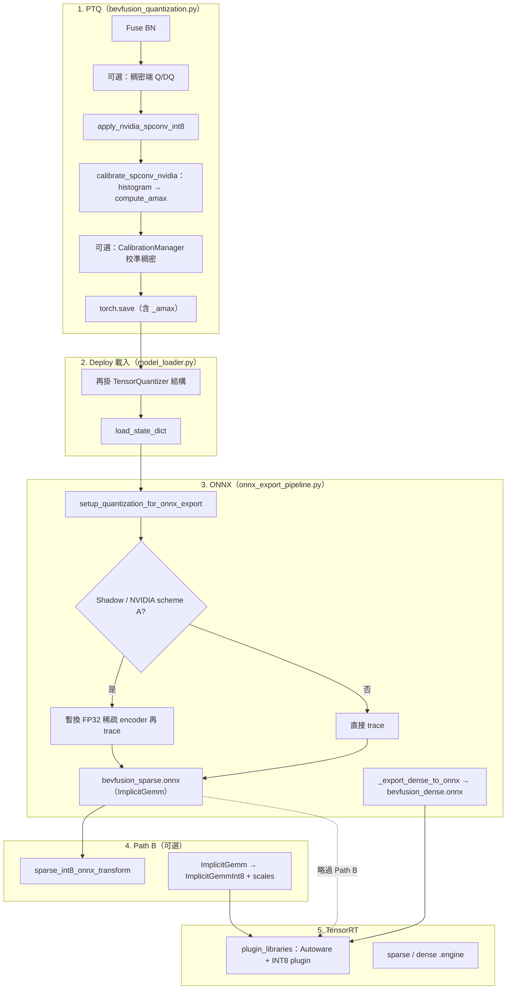

# BEVFusion：PTQ、INT8 Spconv、部署端到端說明

本文件從**校準 → PyTorch 推理 → ONNX → TensorRT**串起 AWML 內 BEVFusion **稀疏塔 INT8** 的實作方式，並與 **upstream spconv**、**NVIDIA CUDA-BEVFusion（Lidar AI Solution）** 做系統性對照。細部公式與 Path B plugin 見 `11_int8_pathb_autoware_plugin.md`、`12_int8_sparse_pipeline_ptq_onnx_trt.md`；**TensorRT epilogue / `output_scale` 修復**見 `cpp/int8_plugin/README.md`。

---

## 1. 讀完你應能回答的問題

| 問題 | 簡答（細節在後文） |
|------|-------------------|
| PTQ 在 AWML 裡實際做了什麼？ | 對 `SparseConvolution` 掛 `pytorch_quantization.TensorQuantizer`，用 histogram + MSE 寫入 `_amax`，存進 `.pth`。 |
| PyTorch 上「INT8 spconv」是什麼？ | **Fake quantization**：前向仍多為浮點運算，但動態範圍由 `_amax` 固定，與真 INT8 kernel 的尺度一致。 |
| ONNX 裡稀疏卷積長什麼樣？ | 多為 **`autoware::ImplicitGemm`**（FP16 I/O 的 custom op），由 spconv ONNX symbolic 註冊；可選經 **FP32 shadow** 去掉外層 Q/DQ。 |
| TRT 上何時才算「真的跑 INT8 GEMM」？ | **Path B**：`ImplicitGemmInt8` + `libimplicit_gemm_int8_plugin.so`，內部呼叫 `ConvGemmOps::implicit_gemm` 的 INT8 路徑。僅 FP16 `ImplicitGemm` 時，TRT 仍是 FP16 sparse conv。 |
| 和 CUDA-BEVFusion 最大差在哪？ | CUDA-BEVFusion 稀疏段走 **libspconv 獨立 engine + 自訂 ONNX**；AWML 走 **標準 `torch.onnx.export` + Autoware TRT plugin**（可選 INT8 plugin）。 |
| 和 spconv 官方 repo 差在哪？ | 官方文件主推 **FX + QAT/PTQ + `implicit_gemm` scale 公式**；AWML 採 **NVIDIA TensorQuantizer** 對齊產業範例，並用 **Autoware 生態的 TRT plugin** 承接，而非完全複製 spconv 文件裡的 FX 整圖路徑。 |
| 聽說 spconv INT8 用「sparse histogram」，AWML 為何改掛 TensorQuantizer？ | **並未取代 histogram**。兩邊都是在 **稀疏塔真實 forward** 上對 **tensor 數值**統計；AWML 用 `QuantDescriptor(calib_method="histogram")` + `calibrate_spconv_nvidia`，見 **§3.4**。 |

---

## 2. 端到端資料流（總覽）



---

## 3. 階段一：PTQ（後訓練量化）

### 3.1 入口與設定

- **腳本**：`deployment/quantization/bevfusion_quantization.py` 子命令 `ptq`。
- **部署設定**：`--deploy-cfg` 指向例如 `deploy_config_split_int8.py` / `deploy_config_int8.py`，內含 `quantization.spconv_int8`、`quant_backbone` 等開關。
- **僅稀疏塔**：`--sparse-int8-only` 可跳過稠密 Q/DQ，便於隔離 **稀疏 INT8** 對 mAP 的影響。

### 3.2 主流程（與主線 log 對齊）

1. **載入** MMEngine config + FP32 checkpoint → 完整 `BEVFusion`（含 `pts_middle_encoder`）。
2. **Fuse BN**：稠密與稀疏端盡量 Conv-BN fusion，利於量化與部署鍵一致。
3. **稠密 Q/DQ（可選）**：若 `quant_backbone` / `quant_neck` / `quant_head` 任一為 True，插入 `pytorch_quantization` 的 Q/DQ；`sparse-int8-only` 時整段跳過。
4. **Dataloader**：通常用驗證集；可調 batch、shuffle、seed。
5. **稀疏 INT8 校準**（核心）：見下節 `_calibrate_spconv`。
6. **稠密校準（可選）**：`CalibrationManager` 跑 forward、`compute_amax`。  
   **順序設計**：稀疏校準在稠密之前完成，避免「稀疏仍 FP32」時去校準稠密導致 BEV 分佈錯配、mAP 崩潰。
7. **存檔**：`torch.save({"state_dict": ...})`；可另存 `.calib` cache。

### 3.3 稀疏塔：NVIDIA / CUDA-BEVFusion 風格（非舊版整圖 FX）

實作於 `_calibrate_spconv`（`bevfusion_quantization.py`）與 `deployment/projects/bevfusion/quantization/spconv_int8.py`：

1. **收集校準樣本**：從 dataloader 取點雲 → `pts_voxel_layer` 得到 **完整 voxel**（與 Lidar AI Solution 一類流程對齊，不隨意裁 voxel 數）。
2. **`apply_nvidia_spconv_int8(sparse_encoder, exclude_conv_out=True)`**  
   在每個 `SparseConvolution`（可排除最後 `conv_out`）上掛：
   - `_input_quantizer`（啟動 fake quant）
   - `_weight_quantizer`（權重 per-channel）
3. **`calibrate_spconv_nvidia`**  
   用上述 voxel 特徵跑稀疏 encoder forward，收集 **histogram**，再以 **MSE** 等 `compute_amax` 寫入各 quantizer 的 **`_amax`**。
4. **checkpoint 鍵名** 形如：  
   `pts_middle_encoder...._input_quantizer._amax`、`_weight_quantizer._amax`。

**語意**：PyTorch 前向仍是浮點與 fake quant 的組合，但 **`_amax` 已固定**，後續 deploy 與 ONNX 後處理可依同一尺度還原 INT8 語意。

### 3.4 「Sparse histogram」與 TensorQuantizer：不是二選一

常見誤解是：spconv INT8 依賴某種 **「sparse histogram」**，而 AWML 改成對 **weight／activation 掛 quantizer** 就等於 **不用 histogram**。實際上兩者描述的是不同層次：

1. **「Sparse」指的是資料從哪裡來**  
   校準時跑的是 **稀疏塔**（voxel → `SparseConvTensor`），啟動的體素由 indices 決定。Activation 在實作上仍是 **`features` 的稠密矩陣 `[N_active, C]`**（加上稀疏索引），histogram／amax 統計的都是 **這些浮點元素**，不是另一種獨立於數值的「稀疏直方圖資料結構」。

2. **AWML 仍然有 histogram**  
   在 `spconv_int8.py` 的 `apply_nvidia_spconv_int8` 裡，`TensorQuantizer` 使用  
   `QuantDescriptor(num_bits=8, calib_method="histogram")`，並對 `HistogramCalibrator` 設 `_torch_hist = True`。  
   `calibrate_spconv_nvidia` 的流程是：**`enable_calib()` → 用校準 voxel 跑完整 encoder forward（收集 histogram）→ `load_calib_amax(..., method="mse")` 寫入 `_amax` → 再切回 fake quant**。  
   因此 **`_amax` 來自 histogram + MSE**，不是「只掛 Q/DQ、不校準」。

3. **與 spconv 官方文件路線的差別在「掛載方式」，不在「要不要統計分佈」**  
   官方 `INT8_GUIDE.md` 多從 **torch.fx、`prepare_fx`、整圖 observer** 講起；AWML 則在 **每個 `SparseConvolution` 上**用 `_nvidia_quantized_forward` 包一層，對 **`input.features`** 與 **`weight`** 做 `TensorQuantizer`。校準時同樣是 **真實 sparse forward** 上的數值分佈，只是 API 與圖結構不同（模組級 vs FX 整圖）。

4. **為何日常只看到「quant weight / activation」？**  
   校準結束後，推理與 checkpoint 裡顯眼的是 **`_input_quantizer` / `_weight_quantizer` 的 fake quant** 與 **`_amax` buffer**，容易忽略 **`_amax` 前面那一步就是 histogram 收集**。沒有該步驟，scale 沒有依據。

**實作索引**：`deployment/projects/bevfusion/quantization/spconv_int8.py`（`apply_nvidia_spconv_int8`、`calibrate_spconv_nvidia`）。

### 3.5 與 spconv 官方 INT8 文件的關係

- **spconv `docs/INT8_GUIDE.md`**：以 **torch.fx** 可追蹤圖、`prepare_fx` / `convert_fx`、Residual 融合等為前提，並說明 **channel % 32** 等 INT8 kernel 限制。
- **AWML 預設主路徑**：**不依賴**整塔 FX 替換來做稀疏校準，而是 **NVIDIA `TensorQuantizer`**（與 CUDA-BEVFusion / CenterPoint 範例一致），避免舊 FX 路徑上已知問題（例如 peak clipping 導致 mAP≈0，見 `spconv_int8.py` 檔頭說明）。
- **FX 路徑**：仍保留為 legacy／特殊情境，需與 `spconv_ptq_basicblock_fx`、`GraphModule` 鍵對齊；`deploy_config_split_int8.py` 內有 **Preset C / spconv_ptq_basicblock_fx** 註解。

---

## 4. 階段二：Deploy 載入（評測與匯出前）

- **檔案**：`deployment/projects/bevfusion/io/model_loader.py`。
- 當 `quantization.ptq_checkpoint=True` 且 `spconv_int8=True`：
  1. 與 PTQ 相同順序：fuse →（可選）稠密 Q/DQ。
  2. **`_prepare_encoder_for_nvidia_int8`**：再次 `apply_nvidia_spconv_int8`，使模組樹與 checkpoint **鍵一致**。
  3. **`load_state_dict`**：載回權重與 **`_amax`**。

若偵測到已是 `GraphModule` 或已有 NVIDIA quantizer，runner 會**跳過**另一套 `prepare_fx + calibrate`，避免重複校準。

**環境**：評測 PyTorch INT8 路徑需 **`pytorch_quantization`**（Docker 內常需 `pip install pytorch-quantization`，見 `deploy_config_int8.py` / `deploy_config_split_int8.py` 註解）。

---

## 5. 階段三：ONNX 匯出（Split：sparse + dense）

- **檔案**：`deployment/projects/bevfusion/export/onnx_export_pipeline.py`。
- **Split**：先 `_export_to_onnx(..., wrapper="sparse")` → `bevfusion_sparse.onnx`（voxel → `lidar_bev`），再 `_export_dense_to_onnx` → `bevfusion_dense.onnx`。

### 5.1 量化與 exporter 行為

- **`setup_quantization_for_onnx_export()`**  
  讓 `TensorQuantizer` 在 `torch.onnx.export` 時輸出 **`QuantizeLinear` / `DequantizeLinear`**（若該路徑仍帶 quantizer），避免碎算子。

### 5.2 FP32 shadow / NVIDIA scheme A

- **問題**：FX `convert_fx` 後的 `GraphModule` 含 `aten::_empty_affine_quantized` 等，**標準 ONNX 無法直接 export**。
- **作法**：若偵測到 **FX GraphModule** 或 **NVIDIA TensorQuantizer + shadow 屬性／cfg 可補齊**（scheme A），匯出前**暫時**以 **`build_float_sparse_encoder_shadow`** 產生的純浮點 `BEVFusionSparseEncoder` 替換，trace 完還原。
- **結果**：稀疏 ONNX 常為 **純浮點 `ImplicitGemm` 子圖**（無外層 Q/DQ 或僅輔助節點），與「圖上畫了 QDQ」的 QAT 網路在 TRT 內的融合行為不同（見 spconv `TENSORRT_INT8_GUIDE.md`：**custom plugin 不會自動 fuse QDQ**）。

### 5.3 Custom op 名稱

- 稀疏卷積在 ONNX 中為 **`autoware::ImplicitGemm`**（Autoware TensorRT plugin 與 spconv ONNX 註冊銜接），不是 CUDA-BEVFusion 那套 **`SparseConvolution` + libspconv 專用 parser** 的 node type。

---

## 6. 階段四（可選）：Path B — `sparse_int8_onnx_transform`

- **檔案**：`deployment/projects/bevfusion/export/sparse_int8_onnx_transform.py`。
- **輸入**：FP16 稀疏 ONNX + PTQ `.pth`（含 `_amax`）。
- **動作**：將匹配的 `autoware::ImplicitGemm` 改為 **`autoware::ImplicitGemmInt8`**，並寫入 `input_scale` / `output_scale` / `channel_scale` / `bias_scaled`（公式見 `11_int8_pathb_autoware_plugin.md`，與 spconv 文件中的 `scale_for_spconv_implicit_gemm` 一致）。
- **輸出**：給 **`libimplicit_gemm_int8_plugin.so`** 使用的 ONNX。

若稀疏圖上仍有 Q/DQ，transform **多數情況仍可匹配**；plugin 端收的是 **DQ 後 FP16**，再在 `enqueue` 內做 INT8 量化（與 `_amax` 一致時可與 PyTorch 對齊）。

---

## 7. 階段五：TensorRT 建 engine

- **檔案**：`deployment/projects/bevfusion/export/tensorrt_export_pipeline.py`（由 CLI / `ExportOrchestrator` 觸發）。
- **`tensorrt_config.plugin_libraries`**（例：`deploy_config_split_int8.py`）：
  - **`libautoware_tensorrt_plugins.so`**：`ImplicitGemm`（FP16 kernel）。
  - **`libimplicit_gemm_int8_plugin.so`**：`ImplicitGemmInt8`（內部 INT8 `implicit_gemm` + FP16 輸出）。

**為何維持 FP16 I/O**：TensorRT 對 **custom plugin 的 INT8 tensor 維度**有限制（spconv `TENSORRT_INT8_GUIDE.md`：例如需 ≥3D）；稀疏特徵為 **`[N, C]`**，故 plugin 對外 FP16、對內 INT8 是務實設計。

### 7.1 與 spconv `TENSORRT_INT8_GUIDE.md` 的對齊與差異

- **對齊**：傳入 `implicit_gemm` 的 **`channel_scale` / `bias_scaled` / `output_scale`** 關係與官方範例相同（`scale = (input_scale * w_per_channel_scales) / output_scale`，`bias_scaled = bias / output_scale`）。
- **AWML 實作細節**：Autoware plugin 在 CUDA 內先做 **FP16→INT8 feature/weight**，再呼叫 **cumm `ConvGemmOps::implicit_gemm`**；曾發現 **Turing `Int8Inference` epilogue 未套用 `alpha`（`output_scale`）**，已在 plugin 內以 **預先融合 `output_scale` 到 scale/bias** 並對 `implicit_gemm` 傳 **`output_scale=1.0f`** 修正（詳見 `cpp/int8_plugin/README.md`）。  
  **Upstream spconv/cumm 原始註解**仍寫 `alpha = output scale`，與實際 epilogue 行為不完全一致；若你在**其他專案**直接抄官方 C++ 範例，需確認目標架構 epilogue 是否真會乘上 `alpha`。

---

## 8. 階段六：Runtime 與評測

- **PyTorch**：`deployment/projects/bevfusion/pipelines/pytorch.py` 等，載入含 quantizer 的模型做 fake-quant 推理。
- **TensorRT**：`pipelines/tensorrt.py`，載入 split engine、相同 `evaluation` 設定對照數值與 mAP。

**重要概念**：  
- **PyTorch INT8（PTQ）** 與 **TRT FP16 `ImplicitGemm`** 在數值與效能上**不必定等價**（見 `10_int8_trt_gap_analysis.md`）。  
- 若要在 TRT 上對齊「稀疏 INT8」語意，應走 **Path B + INT8 plugin**（並使用修正後的 plugin）。

---

## 9. 與 upstream spconv repository 的差異（整理表）

| 維度 | spconv 官方 repo（文件與範例） | AWML BEVFusion |
|------|-------------------------------|----------------|
| **校準／量化 API** | `INT8_GUIDE.md`：FX、`prepare_fx`、QAT/PTQ、`convert_fx` 等 | 預設 **NVIDIA `TensorQuantizer` + histogram/MSE**，對齊 CUDA-BEVFusion 風格 |
| **PyTorch 推理** | Fake quant 或 quantized module | 同樣 fake quant + `_amax`；可選稠密 Q/DQ |
| **ONNX** | 依專案而定；文件強調 QDQ 與 TRT explicit 量化的限制 | **`torch.onnx.export`** + **Autoware `ImplicitGemm`**；shadow 去除 affine quant 算子 |
| **TRT 稀疏卷積** | 文件以 **自管 plugin + `implicit_gemm`** 說明 scale | **Autoware plugin** + 可選 **INT8 變體**；scale 由 `sparse_int8_onnx_transform` 從 `_amax` 填入 |
| **Kernel / 函式庫** | 開源 **cumm** + spconv Python | 同樣依賴 **cumm**（INT8 kernel）；與 **TensorRT** 深度整合 |
| **已知坑** | TRT 不 fuse custom op 的 QDQ；INT8 維度限制 | 已實測 epilogue **`output_scale` 未套用**並在 plugin 側 workaround |

---

## 10. 與 CUDA-BEVFusion（Lidar AI Solution）的差異（整理表）

**CUDA-BEVFusion** 路徑可對照 `Lidar_AI_Solution/CUDA-BEVFusion/`（如 `qat/lean/quantize.py`、`exptool.py`、`export-scn.py`、`src/bevfusion/lidar-scn*.cpp`）。AWML 文件 `10_int8_trt_gap_analysis.md` 亦有專節說明。

| 維度 | CUDA-BEVFusion | AWML BEVFusion |
|------|----------------|----------------|
| **稀疏推理 runtime** | **libspconv** 獨立 engine（常與 TRT dense **分離**） | **單一 TRT graph**（或多顆 engine 但皆為 TRT），稀疏段為 **plugin** |
| **稀疏 ONNX 格式** | **自訂** `SparseConvolution` node + `precision`、`input_dynamic_range`、`weight_dynamic_ranges` 等 | **標準 ONNX** + **`autoware::ImplicitGemm`** |
| **ONNX 產生方式** | **`exptool.py`** 等 monkey-patch / 自訂 trace，**非**單純 `torch.onnx.export` | **`torch.onnx.export`** + shadow encoder |
| **Parser** | **C++ libspconv ONNX parser**（`lidar-scn-onnx-parser.cpp`） | **TensorRT ONNX Parser** + plugin creator |
| **INT8 kernel** | libspconv 內建（與 cumm 同源系） | **開源 spconv/cumm** 經 **`ConvGemmOps::implicit_gemm`**（Path B） |
| **與 dense 銜接** | BEV 張量邊界銜接 TRT FP16 | `lidar_bev` tensor 在 **dense ONNX/TRT** 繼續 |
| **PTQ 刻度來源** | dynamic range 對應 `_amax` 類概念 | 同樣可由 **`_input_quantizer._amax` / `_weight_quantizer._amax`** 映射（Path B transform） |

**相同哲學**：兩邊都希望 **稀疏中段 INT8、首尾 FP16**，並用 **校準得到的動態範圍** 驅動真 INT8 GEMM；差別主要在 **誰負責 parse、誰包一層 engine**。

---

## 11. Path A（libspconv）與 Path B（開源 plugin）對照

摘自 `11_int8_pathb_autoware_plugin.md` 精神，與 `10_int8_trt_gap_analysis.md` 資產描述一致：

| 項目 | Path A（NVIDIA libspconv） | Path B（AWML INT8 plugin） |
|------|---------------------------|----------------------------|
| Kernel 來源 | 預編譯 **libspconv.so** | **開源 spconv + cumm**（可自行編譯） |
| 維護／除錯 | 黑盒比例高 | 可讀 C++/CUDA、可對照 cumm |
| ONNX / 執行鏈 | 自訂 sparse ONNX + libspconv runtime | 標準 TRT + `ImplicitGemmInt8` |
| 依賴 | Lidar AI Solution 發行物 | pip/自編譯 spconv、cumm |

AWML 倉庫內另可見 **`libspconv_onnx_exporter.py`**（適配 CUDA-BEVFusion `exptool` 思路至 spconv v2），屬 **Path A 向** 的實驗／橋接，與目前主線 **split + Autoware TRT + Path B** 可並存為不同部署選項。

---

## 12. 設定與指令速查

- **Split INT8 範例設定**：`deployment/projects/bevfusion/config/deploy_config_split_int8.py`（`components`、`tensorrt_config.plugin_libraries`、`quantization` preset）。
- **完整指令鏈**：見 `12_int8_sparse_pipeline_ptq_onnx_trt.md` 第 8 節。

---

## 13. 除錯模式：需設定的環境變數

在執行 **eval / CLI** 的 shell 內 `export`（或 Docker `-e`）下列變數。**布林值**在 Python 側通常視為真：字串 **`1`、`true`、`yes`**（大小寫不敏感，見 `tensorrt.py` 的 `_env_truthy`）；`sparse_encoder_hooks.py` 另接受 **`y`、`t`**。

### 13.1 TensorRT 管線（`pipelines/tensorrt.py`）

| 變數 | 真／數值 | 作用 |
|------|-----------|------|
| `BEVFUSION_TRT_DEBUG_SPLIT` | `1` / `true` / `yes` | Split 兩顆 engine 時額外除錯（含階段銜接相關輸出）。 |
| `BEVFUSION_TRT_DEBUG_SPLIT_FRAMES` | 整數，預設 **2** | 上述 split debug 作用在**前 N 個** frame。 |
| `BEVFUSION_TRT_LOG_IO` | `1` / `true` / `yes` | 列印每顆 engine 的 **I/O 名稱、shape、dtype**（`[trt-io]`）。 |
| `BEVFUSION_TRT_TENSOR_LOG_FRAMES` | 整數，預設 **2** | 前 N 個 frame 將 **voxel / lidar_bev** 等關鍵 tensor 的 **numpy 統計**印到 stdout（前綴 `[BEVFUSION][TensorRT][tensors]`），便於與 PyTorch 對照。 |

### 13.2 Path B：`ImplicitGemmInt8` C++ plugin（`implicit_gemm_int8_plugin.cpp`）

需使用 **有編進 debug 的** `libimplicit_gemm_int8_plugin.so`。輸出至 **stderr**。

| 變數 | 真／數值 | 作用 |
|------|-----------|------|
| `BEVFUSION_INT8_GEMM_DEBUG` | 首字元 **`1`、`y`、`Y`、`t`、`T`** 為開 | 每層 `enqueue` 後對 **FP16 輸出**做 D2H 與 min/max 等統計（標籤 `[BEVFUSION_INT8_GEMM_DEBUG]`）。 |
| `BEVFUSION_INT8_GEMM_DEBUG_MAX` | 正整數，預設 **60** | 最多 dump 的層次數（避免 log 爆炸）。 |

### 13.3 PyTorch：稀疏卷積對齊 TRT（`debug/sparse_encoder_hooks.py`）

| 變數 | 真／數值 | 作用 |
|------|-----------|------|
| `BEVFUSION_SPARSE_ENCODER_HOOK_DEBUG` | `1` / `true` / `yes` / `y` / `t` | 在 `SubMConv3d` / `SparseConv3d` 上掛 forward hook，印 **`features`** 統計（前綴 `[BEVFUSION][PyTorch][sparse-conv-hook]`）。 |
| `BEVFUSION_SPARSE_ENCODER_HOOK_MAX_PASSES` | 整數，預設 **2** | 最多完整跑幾次 `pts_middle_encoder` forward 收集 hook。 |

**語意提醒**：hook 看到的是 **單層 conv 輸出**；TRT `ImplicitGemmInt8` 常對應 **融合後 epilogue** 的 FP16，與 PyTorch 圖上「BN 前／後」可能不一致，比對時需讀 `sparse_encoder_hooks.py` 檔頭說明。

### 13.4 後處理 / NMS 除錯（`pipelines/bevfusion_pipeline.py`）

| 變數 | 真／數值 | 作用 |
|------|-----------|------|
| `BEVFUSION_DEBUG_POSTPROCESS` | `1` / `true` / `yes` | 啟用 postprocess 除錯輸出。 |
| `BEVFUSION_DEBUG_POSTPROCESS_FRAMES` | 整數，預設 **2** | 僅前 N 個 frame 印除錯資訊。 |

### 13.5 ONNX 匯出（`export/onnx_export_pipeline.py`）

| 變數 | 取值 | 作用 |
|------|------|------|
| `BEVFUSION_ONNX_TRACE_DEVICE` | 例如 `cpu`、`cuda:0`、`auto` | 覆寫／補齊 ONNX trace 裝置（未設時依 config；詳見 `deploy_config_int8.py` 註解）。 |

### 13.6 PyTorch 管線「固定」tensor log（無環境變數）

`pipelines/pytorch.py` 內 **前 2 個 frame** 會**固定** `print` voxel → sparse → backbone → neck → head 的統計（前綴 `[BEVFUSION][PyTorch][tensors]`），**不需** export 任何變數。若要關閉需改程式或擴充為 env 開關。

### 13.7 範例（bash）

```bash
# TensorRT：tensor 統計 + engine I/O schema + INT8 每層 stderr
export BEVFUSION_TRT_TENSOR_LOG_FRAMES=3
export BEVFUSION_TRT_LOG_IO=1
export BEVFUSION_INT8_GEMM_DEBUG=1
export BEVFUSION_INT8_GEMM_DEBUG_MAX=40

# PyTorch：稀疏層 hook（與上列對照）
export BEVFUSION_SPARSE_ENCODER_HOOK_DEBUG=1
export BEVFUSION_SPARSE_ENCODER_HOOK_MAX_PASSES=2

python -m deployment.cli.main bevfusion \
  deployment/projects/bevfusion/config/deploy_config_split_int8.py \
  /path/to/mmconfig.py --module main_body
```

**更多情境**（例如 split mAP=0 時的管線對照）：`14_trt_split_map_zero_debug.md`。

---

## 14. 延伸閱讀（AWML 內）

| 文件 | 內容 |
|------|------|
| `9_nvidia_spconv_int8_fix.md` | TensorQuantizer、histogram、eval 修復 |
| `10_int8_trt_gap_analysis.md` | TRT 與 PyTorch INT8 鴻溝、CUDA-BEVFusion 架構、libspconv |
| `11_int8_pathb_autoware_plugin.md` | Path B plugin、I/O、scale 公式 |
| `12_int8_sparse_pipeline_ptq_onnx_trt.md` | 分階段流程圖與表格 |
| `14_trt_split_map_zero_debug.md` | Split TRT mAP=0、`BEVFUSION_TRT_*` 除錯脈絡 |
| `cpp/int8_plugin/README.md` | **`output_scale` / epilogue 除錯與修復** |
| `spconv/docs/TENSORRT_INT8_GUIDE.md` | 官方 TRT + `implicit_gemm` scale 與 QDQ 限制 |
| `spconv/docs/INT8_GUIDE.md` | 官方 FX、通道倍數與 QAT 注意事項 |

---

*文件反映 AWML `deployment/projects/bevfusion` 目錄下實作與文件現狀；CUDA-BEVFusion 路徑以 NVIDIA **Lidar AI Solution** 公開樹為準，若上游更新請以官方 repo 為準。*
