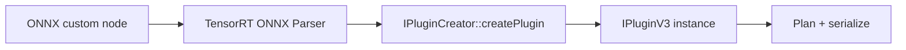

# Sparse Convolution TensorRT Plugins（Autoware / AWML Path B）

本文說明 **稀疏卷積在 ONNX → TensorRT 推論鏈**裡，各個 custom plugin **做什麼**、`PluginCreator` **扮演什麼角色**、與 **spconv（libspconv / ConvGemmOps）**的關係，以及若要 **新增一類 plugin** 時需要對齊的介面。

適用對象：已熟悉 BEVFusion 稀疏塔匯出（`autoware::ImplicitGemm*`、`GetIndicePairsImplicitGemm`）與 Path B ONNX 後處理（`sparse_int8_onnx_transform.py`）的開發者。

---

## 1. 為什麼會有這些 Plugin？

標準 TensorRT **沒有**內建「3D 稀疏卷積 + voxel 規則」算子。  
PyTorch 端透過 **spconv** 做 forward；匯出 ONNX 時會把稀疏卷拆成：

1. **`GetIndicePairsImplicitGemm`**：依 **輸入 voxel 網格、kernel、stride、subm …** 預先算出 **規則表（indices / pairs / masks）**。  
2. **`ImplicitGemm`** 或 **`ImplicitGemmInt8`**：依規則表對 **活化特徵 `features`** 與 **卷積核 `filters`** 做類 GEMM 的稀疏卷。

因此 TRT **必須載入對應的 `.so`**（見 deploy config 里的 `tensorrt_config.plugin_libraries`），讓 ONNX parser 能把這些 **domain / op_type** 對應到 **C++ Plugin**。

---

## 2. ONNX 裡的典型子圖（語意順序）

以 `pts_middle_encoder` 為例，單個 **SubM** 區塊常見順序為：

```
voxel_features → Cast → …
GetIndicePairsImplicitGemm( voxel_indices / spatial meta … )
    → output_0 … output_4 等多個張量

ImplicitGemm 或 ImplicitGemmInt8(
    features,
    weight,
    pair_fwd,
    pair_mask_fwd,
    mask_argsort_fwd
    [, channel_scale, bias_scaled ]   ← 僅 ImplicitGemmInt8
)
Add(bias) → … → Relu …
下一層再依賴上一層 GetIndicePairs 的 metadata 連到新的 GetIndicePairsImplicitGemm
```

- **規則表生成**與 **卷積本體**是分開的兩顆 plugin；數值張量沿邊往下傳，**INT32 規則張量**由 `GetIndicePairs*` 餵給下一顆 `ImplicitGemm*`。

---

## 3. 各個 Plugin 在做什麼？

### 3.1 `GetIndicePairsImplicitGemm`（Autoware，`libautoware_tensorrt_plugins.so`）

| 項目 | 說明 |
|------|------|
| **职责** | 對當前 **稀疏結構**（活化 voxel、空間尺寸、kernel、stride、padding、subm …）呼叫 **spconv / SpconvOps** 一路徑，算出 **`ImplicitGemm*` 所需的 pair / mask / argsort** 等索引張量。 |
| **輸入** | 例如 **坐標／索引相關**張量（與 ONNX 匯出一致；詳見插件 `configurePlugin`）。 |
| **輸出** | **多個 INT32（及 metadata）**，供後續 **`ImplicitGemm` / `ImplicitGemmInt8`** 的 `pair_fwd`、`pair_mask_fwd`、`mask_argsort_fwd` 等使用。 |
| **重要屬性** | `subm`、`stride`、`spatial_shape`、`do_sort` 等。其中 **`do_sort`** 控制是否做 pair-mask 的 argsort；INT8 路線可與 FP16 不同（見 `get_indices_pairs_implicit_gemm_plugin.hpp` 註解）。 |

**程式入口**：`autoware.universe/perception/autoware_tensorrt_plugins/src/get_indices_pairs_implicit_gemm_plugin.cpp`  
內部會用到 **`SpconvOps`**、`InferenceOps` 等 **spconvlib** 標頭（與訓練時 spconv 邏輯對齊）。

---

### 3.2 `ImplicitGemm`（Autoware，FP16 / FP32 稀疏卷）

| 項目 | 說明 |
|------|------|
| **职责** | **純浮點**稀疏卷：`features` 與 `filters` 同為 **FLOAT 或 HALF**，呼叫 **`ConvGemmOps::implicit_gemm`**（見 `implicit_gemm_plugin.cpp` `enqueue`）。 |
| **輸入（5）** | `features`、`filters`、`pair_fwd`、`pair_mask_fwd_splits`、`mask_argsort_fwd_splits`（型別組合由 `supportsFormatCombination` 約束）。 |
| **輸出** | 與輸入特徵同 dtype 的 **`out_features`**。 |
| **bias** | ONNX 裡常見 **後接 `Add`**（因 symbolic 路徑 `bias=None`）；與 INT8 版「在 kernel 內融合 bias」不同。 |

**程式入口**：`autoware.universe/.../implicit_gemm_plugin.cpp`

---

### 3.3 `ImplicitGemmInt8`（AWML `libimplicit_gemm_int8_plugin.so`，Path B）

| 項目 | 說明 |
|------|------|
| **职责** | **對外 I/O 仍是 FP16**；在 **`enqueue` 內**把 features（與權重）**量化為 INT8**，用 **`ConvGemmOps::implicit_gemm`** 做 INT8 GEMM，再輸出 **FP16**（見 `implicit_gemm_int8_plugin.hpp` 文件註解）。 |
| **輸入（7）** | 前 5 個與 `ImplicitGemm` 相同；另加 **`channel_scale`**、**`bias_scaled`**（FP32 向量，長度 `C_out`），語意與 Path B ONNX 變換腳本寫入的 PTQ 公式一致。 |
| **屬性** | `input_scale`、`output_scale`、`is_subm`、`act_*` 等；由 **`ImplicitGemmInt8PluginCreator`** 從 ONNX node attribute 解析後傳入 `ImplicitGemmInt8Parameters`。 |

**程式入口**：`AWML/deployment/projects/bevfusion/cpp/int8_plugin/implicit_gemm_int8_plugin.cpp`

---

## 4. `Plugin` 與 `PluginCreator` 的關係

TensorRT 的載入流程可以簡化成：



- **`IPluginCreator`（例如 `ImplicitGemmInt8PluginCreator`）**  
  - 向 TensorRT **註冊** plugin 的 **名稱、版本、namespace**（需與 ONNX 里 `op_type` / domain 解析結果一致）。  
  - 實作 **`createPlugin`**：讀取 ONNX 節點上的 **`PluginFieldCollection`**（對應 node **attributes**），填入 **Parameters 結構**，`new` 出真正的 **`ImplicitGemmInt8Plugin`**。  
  - 使用 **`REGISTER_TENSORRT_PLUGIN(ImplicitGemmInt8PluginCreator)`**（見 `implicit_gemm_int8_plugin_creator.cpp`）讓 **靜態初始化** 時向全域 registry 註冊。

- **`IPluginV3`（例如 `ImplicitGemmInt8Plugin`）**  
  - 承載 **執行期邏輯**：`configurePlugin`、`supportsFormatCombination`、`getOutputShapes`、`enqueue` 等。  
  - **序列化**：`getFieldsToSerialize` 等，讓 engine 存檔後可還原。

**一句話**：**Creator = 工廠（依 ONNX 屬性造出 Plugin）**；**Plugin = 實際在 GPU 上跑的算子實作**。

AWML 專案中 **`plugin_registration.cpp`** 僅 `#include` creator 標頭，目的是 **強制連結單元**執行 `REGISTER_TENSORRT_PLUGIN` 的靜態註冊（見 `deployment/projects/bevfusion/cpp/int8_plugin/plugin_registration.cpp`）。

---

## 5. 想自己寫一個 TensorRT Plugin（與本專案對齊時）

最低限度需要：

1. **與 ONNX 一致**  
   - `op_type`、`domain`、**輸入輸出個數與 dtype** 與 `supportsFormatCombination` / `getOutputDataTypes` 一致。  
   - Node **attribute 名稱**與 Creator 里解析的 **字串完全一致**（例如 Path B 使用 `input_scale`、`output_scale`）。

2. **實作 `IPluginV3` 各介面**  
   - **Build**：形狀與型別推斷（`getOutputShapes`、`configurePlugin`）。  
   - **Runtime**：`enqueue` 內完成實際計算。

3. **實作對應 `IPluginCreator`**  
   - `createPlugin` 里把 ONNX fields 映射到 **Parameters**。  
   - **`REGISTER_TENSORRT_PLUGIN(...)`** 註冊。

4. **編成共享庫**並在部署 config 的 **`plugin_libraries`** 中載入；建 engine 時需與 **TensorRT 版本**匹配。

更完整的 API 說明請以 **NVIDIA TensorRT Developer Guide → Plugin** 為準（版本差異以你環境的 TRT 為準）。

---

## 6. spconv / spconvlib 在這裡到底做什麼？

「spconv」在推理側並不是再跑一整個 Python 模組，而是 **連結到與訓練相同的 C++/CUDA 核心**（專案中透過 **`spconvlib/...`** 標頭引用）：

| 概念 | 說明 |
|------|------|
| **稀疏資料** | 僅在非空體素上有 **特徵向量**；需 **索引** 對應回 3D 格點。 |
| **GetIndicePairs** | 依卷積幾何算出 **誰與誰要做乘加**，產生 **pair、mask、排序** 等，供後續 GEMM 型 kernel 使用。 |
| **`ConvGemmOps::implicit_gemm`** | 把稀疏卷實作成 **規則表驅動的 GEMM**（特徵、權重、索引表在一起）；FP16 版與 INT8 版走同一抽象，差在 **tensor dtype 與 scale/bias**。 |

因此：**Plugin 層是 TensorRT 與 ONNX 的「膠水」**；**數學與效能核心仍來自 spconv 訓練栈同款 CUDA 實作**。

---

## 7. 原始碼對照（方便跳讀）

| 內容 | 路徑（依你工作區） |
|------|------------------|
| INT8 ImplicitGemm + Creator + 註冊 | `AWML/deployment/projects/bevfusion/cpp/int8_plugin/` |
| FP16 ImplicitGemm + GetIndicePairs | `autoware.universe/perception/autoware_tensorrt_plugins/` |
| ONNX 替換為 `ImplicitGemmInt8`、寫入 scale | `AWML/deployment/projects/bevfusion/export/sparse_int8_onnx_transform.py` |
| Path B 公式與插件欄位 | `AWML/deployment/projects/bevfusion/docs/11_int8_pathb_autoware_plugin.md` |

---

## 8. 除錯提示

- **INT8 各層 FP16 輸出統計**（stderr）：環境變數 **`BEVFUSION_INT8_GEMM_DEBUG=1`**（見 `implicit_gemm_int8_plugin.hpp`）。  
- **`[ImplicitGemmInt8] ... input_scale= ...`**：來自 Creator 在建 engine 時列印（`implicit_gemm_int8_plugin_creator.cpp`）。

若 **同一套 PTQ** 在 PyTorch 正常、TRT 僅在 **FP16 `ImplicitGemm` → `ImplicitGemmInt8` 邊界**異常，多半是 **兩顆 plugin 與 TRT 構圖互動**問題，而非單一公式；需結合 **層輸出對照**與 **ONNX 結構**排查（見專案內其他 Path B 討論文檔）。
