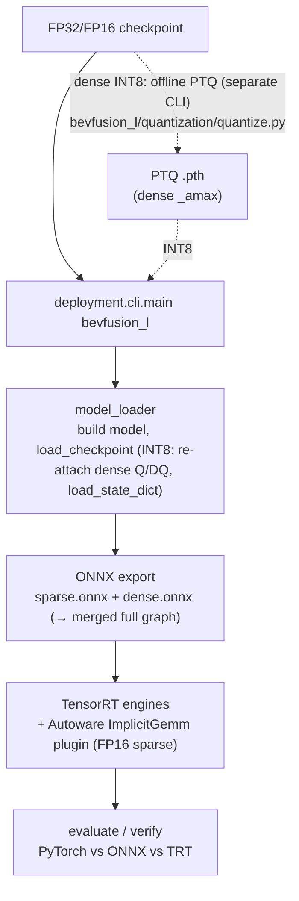

# BEVFusion Deployment & Quantization — Architecture Guide

> Orientation doc for engineers and agents working on BEVFusion deployment. It explains
> **how the BEVFusion project bundle is wired** and **how the shared quantization framework
> plugs into it** (PTQ → INT8 sparse conv → ONNX → TensorRT). Deep-dive notes (numbered,
> newest last) live in [`docs/`](docs/README.md); this file is the map, not the manual.

For the framework-wide mental model, read [`deployment/docs/architecture.md`](../../docs/architecture.md)
first — BEVFusion is one *project bundle* that implements the stage contract described there.

---

## 1. Two things this doc covers

| Piece | Where it lives | What it owns |
| --- | --- | --- |
| **Shared quantization framework** | [`deployment/quantization/`](../../quantization/) | Model-agnostic PTQ/QAT on NVIDIA `pytorch-quantization`: Q/DQ module replacement, BN fusion, calibration, sensitivity. Used by **both** CenterPoint and BEVFusion. |
| **BEVFusion project bundle** | [`deployment/projects/bevfusion_l/`](.) | BEVFusion-specific export/inference/eval, the FP16 sparse encoder (spconv `ImplicitGemm`), and the split (sparse+dense) topology. |

The dividing line matters: the **dense** tower (backbone/neck/head) is quantized by the
*shared* framework (standard `QuantConv2d` Q/DQ, TensorRT-native INT8). The **sparse** tower
(`pts_middle_encoder`, spconv) deploys in **FP16** — it is *not* quantized. The only structural step
it needs is SparseConv+BN folding ([`quantization/sparse/fusion.py`](../../quantization/sparse/fusion.py)),
composed by BEVFusion's `SpconvBnFuseScheme`. The two towers sit behind **one uniform interface** — see
[§ Quantization scheme architecture](#quantization-scheme-architecture), which is the seam every
deployment stage uses instead of touching quantization internals directly.

---

## 2. End-to-end flow



Two **distinct** entry points — do not confuse them:

- **PTQ (offline, produces a dense-INT8 checkpoint):**
  `python -m deployment.projects.bevfusion_l.quantization.quantize ptq --config ... --checkpoint ... --deploy-cfg ... --output ptq.pth`
- **Deploy (consumes the PTQ checkpoint, exports + evaluates):**
  `python -m deployment.cli.main bevfusion_l <deploy_cfg.py> <model_cfg.py>`

---

## 3. Shared quantization framework (`deployment/quantization/`)

Public API is re-exported from [`__init__.py`](../../quantization/__init__.py). The PTQ workflow
([`ptq.py:quantize_ptq`](../../quantization/ptq.py)) is 5 steps:

1. **Fuse BN** → [`fusion/bn_fusion.py:fuse_model_bn`](../../quantization/fusion/bn_fusion.py) folds
   `Conv→BN` into the conv weights (removes a scale transform between Q/DQ boundaries; must run in `eval()`).
2. **Insert Q/DQ** → [`replace.py:quant_model`](../../quantization/replace.py) recursively swaps
   `Conv2d/ConvTranspose2d/Linear` for `QuantConv2d/QuantConvTranspose2d/QuantLinear`
   ([`modules/`](../../quantization/modules/)). `transfer_to_quantization` copies attributes via
   `__new__` to avoid hook conflicts. A `skip_names` list gives per-layer opt-out.
3. **(Optional) residual quantizers** → `attach_quant_add` inserts a shared quantizer on the
   *identity* branch only (Conv path stays FP so TRT can fuse Conv+Add).
4. **Calibrate** → [`calibration/calibrator.py:CalibrationManager.calibrate`](../../quantization/calibration/calibrator.py):
   disable fake-quant → collect histograms → `load_calib_amax(method=...)` (`mse`/`entropy`/`percentile`/`max`) → re-enable quant. Supports an amax cache.
5. **Disable sensitive layers** → names from [`sensitivity.py:build_sensitivity_profile`](../../quantization/sensitivity.py).

TensorRT-friendly design choices baked in: per-**channel** conv weights but per-**tensor**
`ConvTranspose2d` weights (TRT INT8 deconv is fragile per-channel); `QuantAdd` shares one
quantizer across both inputs; ONNX symbolic registered in
[`onnx_symbolic.py`](../../quantization/onnx_symbolic.py). QAT is available via
[`hooks/qat_hook.py:QATHook`](../../quantization/hooks/qat_hook.py) (MMEngine custom hook).

> The framework holds **only generic** quantization code. Model-specific producers live in each
> project: [`quantize.py`](quantization/quantize.py) here and
> [`../centerpoint/quantization/quantize.py`](../centerpoint/quantization/quantize.py). BEVFusion's
> PTQ quantizes the dense tower (pytorch_quantization) and BN-folds the FP16 sparse encoder in one
> run. Run: `python -m deployment.projects.bevfusion_l.quantization.quantize ptq …`.

---

## Quantization scheme architecture

**This is the current design — read this before changing anything quantization-related.** It
replaced the old model where quantization was hand-inlined into every stage (loader/export/runner)
and the PTQ producer re-created the quantized module tree "by convention" (a comment saying it must
match the loader).

### The one idea

A **`QuantizationScheme`** is a strategy object with one structural step, `prepare(model)`. The dense
and sparse towers implement the *same* interface; their internals differ (dense Q/DQ vs. a SparseConv+BN
fold), but the **seam** is uniform:

| Scheme | `prepare(model)` (PTQ **and** deploy) |
| --- | --- |
| Dense (`DenseQDQScheme`) | fuse BN + `Conv2d→QuantConv2d` (calibrated by `CalibrationManager` at PTQ) |
| Sparse (`SpconvBnFuseScheme`) | fuse SparseConv+BN (FP16 deploy — no quantizers) |

A **`QuantizationPlan`** composes schemes for a whole model and fans `prepare` out in order. A
project declares *which* schemes apply (composition); schemes own *how* (algorithm). **Stage code
holds a plan and calls lifecycle methods — it never sees quantization internals.**

Directory split follows NVIDIA's Lidar_AI_Solution convention — **generic quant toolkit is
shared; each model owns its quantization composition + producer**:

```
deployment/quantization/                     # GENERIC toolkit only (no model names)
├── schemes/base.py        # QuantizationScheme (ABC), QuantizationPlan, SchemeManifest
├── schemes/dense_qdq.py   # DenseQDQScheme — reusable by any Conv2d tower
├── sparse/fusion.py       # SparseConv+BN fold (FP16 sparse deploy — no INT8)
├── core/  recipes/  schemes/   # Q/DQ modules, replace, fusion, calibration, descriptors; recipes; seam

deployment/projects/bevfusion_l/quantization/  # BEVFusion's quantization
├── quantize.py     # offline PTQ producer CLI  (python -m ...bevfusion_l.quantization.quantize ptq)
├── schemes.py      # SpconvBnFuseScheme — fuse SparseConv+BN for FP16 sparse deploy
└── plan.py         # build_bevfusion_plan(quant_cfg) → composes dense + sparse schemes

deployment/projects/centerpoint/quantization/  # CenterPoint's quantization
├── quantize.py     # ptq/qat/sensitivity CLI
└── simple_*.py     # VoVNet OSA/eSE submodule QDQ test tooling
```

### Why this kills the old coupling

`build_bevfusion_plan` is the **single** place that reads the deploy `quantization` dict and
composes schemes. Both the deploy loader ([`io/model_loader.py`](io/model_loader.py)) and the PTQ
producer ([`quantization/quantize.py`](quantization/quantize.py)) call it, so
`prepare` builds an **identical** module tree on both sides — the PTQ `state_dict` and the deploy
`load_state_dict` line up *by construction*, not by keeping two code paths in sync.

The loader now only orchestrates *loading* (state_dict prep, weight-layout permutation, device
placement, inference-mode toggles); the structural quantization is one `plan.prepare(model)` call.

### Dependency rule (enforce this)

Deployment stages (loader / export / inference / runner) touch quantization **only through the
scheme/plan interface**. They must **not** import `pytorch_quantization` / `TensorQuantizer`
directly; the structural work belongs inside a scheme's `prepare`, never in stage code.

### Status (verified in the `awml-bevfusion` container)

- ✅ Deploy/load path fully migrated. Eval of
  `deploy_config_split_sparse_fp16_dense_int8_2_8.py` reproduces the pre-refactor baseline
  **exactly** (34 quantizers loaded; dense BN fused 12/2/9; mAP 0.3228 Center-BEV / 0.3931 Plane).
- ✅ PTQ producer dense path migrated to the shared plan (`quantize.run_ptq` steps 2–3). Dead code
  removed: `dense_qdq.py`, `_fuse_dense_bn`, `_insert_dense_qdq`, and the loader's
  `_apply_dense_quantization` / `_fuse_dense_bn` / `_fuse_spconv_bn` / `_prepare_encoder_for_nvidia_int8`.
- ✅ Directory reorg (Lidar_AI_Solution-style): model-specific producers moved out of the framework
  into each project as `quantize.py` (`python -m deployment.projects.bevfusion_l.quantization.quantize`);
  generic spconv-INT8 primitives promoted to framework `deployment/quantization/sparse/`;
  CenterPoint `simple_*` VoVNet test tooling moved to `projects/centerpoint/quantization/`.
  Re-verified: deploy eval reproduces baseline; PTQ smoke runs via the new module path.

### Continuation guide (next steps for future agents)

1. **Self-describing checkpoints:** save the plan recipe into the PTQ `.pth` and rebuild the plan
   from it on load, so deploy no longer needs the `quantization` dict flags to match the PTQ run.
2. **Consolidate config (Goal 2, see [`spec.md`](../../../spec.md)):** collapse the ~13 boolean flags
   into a declarative `default_precision` + `keep_fp16` surface, and move the architecture recipes
   into `build_bevfusion_plan`. Keep one parser, one path.

**Always re-verify with the container** after a change:

```bash
python -m deployment.cli.main bevfusion_l <deploy_cfg.py> <model_cfg.py>

# INT8 (PTQ) example — sparse FP16 + dense INT8, run in the awml-bevfusion container:
docker exec awml-bevfusion bash -lc 'cd /workspace && python -m deployment.cli.main bevfusion_l \
  deployment/projects/bevfusion_l/config/deploy_config_split_sparse_fp16_dense_int8_2_8.py \
  projects/BEVFusion/configs/t4dataset/BEVFusion-L/bevfusion_lidar_voxel_second_secfpn_30e_8xb16_j6gen2_base_120m_t4metric_v2.py'
# expect: "34 quantizers have calibrated amax", mAP 0.3228 (Center BEV) / 0.3931 (Plane)
```

---

## 4. BEVFusion project bundle (`deployment/projects/bevfusion_l/`)

Mirrors the framework stage contract. Wiring: [`entrypoint.py:run`](entrypoint.py) builds config +
data loader + executor + evaluator, then [`runner.py:BEVFusionDeploymentRunner`](runner.py)
(a thin `BaseDeploymentRunner`) drives the shared `OnnxExportPipeline` by injecting BEVFusion's
`BEVFusionSampleExtractor` + `BEVFusionComponentBuilder` (the same seam pattern CenterPoint uses),
and reuses the shared `TensorRTExportPipeline`.

| Stage | Directory | Key modules |
| --- | --- | --- |
| Config | [`config/`](config/) | `deploy_config.py` (split, optimized) + `deploy_config_without_opt.py` (split, no opt) + INT8/PTQ variants (§6) |
| IO | [`io/`](io/) | [`model_loader.py`](io/model_loader.py) (build + `load_checkpoint`, optional sparse BN fuse; INT8: re-attach quantizers + load PTQ), `data_loader.py`, `coors_contract.py` (voxel `[x,y,z]`→graph `[z,y,x]`), `component_utils.py` (split vs merged) |
| Export | [`export/`](export/) | [`sample_extractor.py`](export/sample_extractor.py) (voxelize) + [`component_builder.py`](export/component_builder.py) (split sparse/dense, wires post-transforms) feed the shared `OnnxExportPipeline`; `onnx_models/bevfusion_onnx.py` (sparse/dense wrappers), `transforms.py` (TopK fix, split→merge), `onnx_fuse_implicit_gemm_activation.py` (ImplicitGemm ReLU fuse), `spconv_bn_fusion.py` (SparseConv+BN fold shim) |
| Quantization | [`quantization/`](quantization/) | [`quantize.py`](quantization/quantize.py) (PTQ producer CLI), [`plan.py`](quantization/plan.py) (`build_bevfusion_plan`), [`schemes.py`](quantization/schemes.py) (`SpconvBnFuseScheme`, FP16 sparse). The generic dense scheme lives in the framework (`DenseQDQScheme`); the SparseConv+BN fold in [`quantization/sparse/fusion.py`](../../quantization/sparse/fusion.py). |
| Inference | [`inference/`](inference/) | `pytorch_/onnx_/tensorrt_inference_pipeline.py` (all `preprocess→run→postprocess`) |
| Evaluation | [`evaluation/`](evaluation/) | `executor.py` (pipeline construction + output routing), `evaluator.py` (3D metrics + latency breakdown) |

---

### Sparse vs dense split

BEVFusion (LiDAR) exports as two components so the dense backbone/neck/head can go to plain
TensorRT while the sparse encoder uses the custom FP16 `ImplicitGemm` plugin:

| | Sparse encoder (`pts_middle_encoder`) | Dense backbone/neck/head |
| --- | --- | --- |
| ONNX I/O | `voxels,coors,num_points → lidar_bev` | `lidar_bev → bbox_pred,score,label_pred` |
| ONNX op | `autoware::ImplicitGemm` (custom, FP16) | standard `Conv2d/ReLU/Add` |
| TensorRT | **custom plugin** `ImplicitGemm` (`libautoware_tensorrt_plugins.so`), FP16 | TRT-native (+ INT8) |
| Precision | **FP16** (not quantized) | INT8 via shared framework `QuantConv2d` Q/DQ |
| Accuracy knob | — | `sensitive_layers` (layer names) |

The sparse encoder is traced directly; BN is folded (`fuse_spconv_bn`) into a clean BN-free sparse
ONNX so the exported graph matches the runtime. Graph knobs:

- `fuse_spconv_bn` — fold SparseConv+BN in `pts_middle_encoder` before export.
- `spconv_do_sort` — bake the pair-mask argsort attribute into the exported `ImplicitGemm` nodes.
- `spconv_fuse_implicit_gemm_relu` — fuse trailing Relu into `ImplicitGemm` (see
  [`onnx_fuse_implicit_gemm_activation.py`](export/onnx_fuse_implicit_gemm_activation.py)).

The `ImplicitGemm` TensorRT plugin (with the `do_sort` attribute) is built from an Autoware fork; see
[`projects/BEVFusion/plugins/README.md`](../../../projects/BEVFusion/plugins/README.md) and
[`projects/BEVFusion/Dockerfile`](../../../projects/BEVFusion/Dockerfile).

---

## 5. Sparse encoder precision

The spconv sparse encoder deploys in **FP16** — sparse INT8 was removed (no meaningful mAP/latency
win for the extra complexity of a custom `ImplicitGemmInt8` plugin + ONNX rewrite + sparse
calibration). Only the dense tower is quantized to INT8. The historical sparse-INT8 notes under
[`docs/`](docs/README.md) (e.g. `12_int8_sparse_pipeline_ptq_onnx_trt.md`) are kept as background but
no longer describe the deployed path.

---

## 6. Config variants (how to pick a mode)

All configs are MMEngine files.

| Config | Topology | Precision |
| --- | --- | --- |
| [`deploy_config.py`](config/deploy_config.py) | split sparse+dense (+merge) | FP16 (optimized) |
| `deploy_config_split_sparse_fp16_dense_int8_2_8.py` | split | sparse FP16 + dense INT8 (canonical INT8 config) |

Key `quantization` fields: `enabled`, `ptq_checkpoint` (checkpoint came from PTQ CLI), `fuse_bn`,
`quant_backbone/neck/head`, `quant_add`, `sensitive_layers`. The sparse encoder is always FP16.

**Isolation tip:** keep the same CLI/config/work_dir, just point
`checkpoint_path` at the FP32 `.pth` and set `quantization=dict(enabled=False)`. If mAP is fine, the
split/voxel/eval pipeline is healthy and the regression is in PTQ or quantizer loading.

---

## 7. Where to go next

- Run it today, commands, Docker, error codes → [`docs/3_int8_implementation.md`](docs/3_int8_implementation.md)
- Full sparse INT8 pipeline internals → [`docs/12_int8_sparse_pipeline_ptq_onnx_trt.md`](docs/12_int8_sparse_pipeline_ptq_onnx_trt.md)
- INT8: where is it real vs FP16 → [`docs/README_INT8_WHERE_AND_HOW.md`](docs/README_INT8_WHERE_AND_HOW.md)
- End-to-end PTQ→ONNX→TRT (vs spconv / CUDA-BEVFusion) → [`docs/README_PTQ_INT8_SPCONV_DEPLOYMENT.md`](docs/README_PTQ_INT8_SPCONV_DEPLOYMENT.md)
- TRT-has-predictions-but-mAP=0 debugging → [`docs/14_trt_split_map_zero_debug.md`](docs/14_trt_split_map_zero_debug.md)
- Full numbered doc index → [`docs/README.md`](docs/README.md)
- Shared framework internals → [`deployment/docs/architecture.md`](../../docs/architecture.md), [`deployment/quantization/README_PTQ_ACCURACY_VOV99.md`](../../quantization/README_PTQ_ACCURACY_VOV99.md)

> **Environment note:** PTQ and quantized-checkpoint loading require NVIDIA `pytorch-quantization`
> (install inside Docker: `pip install --index-url https://pypi.nvidia.com --extra-index-url https://pypi.org/simple pytorch-quantization==2.1.3`).
> The FP16 spconv `ImplicitGemm` TensorRT plugin `.so` must be built and present at the path in `tensorrt_config.plugin_libraries`.
