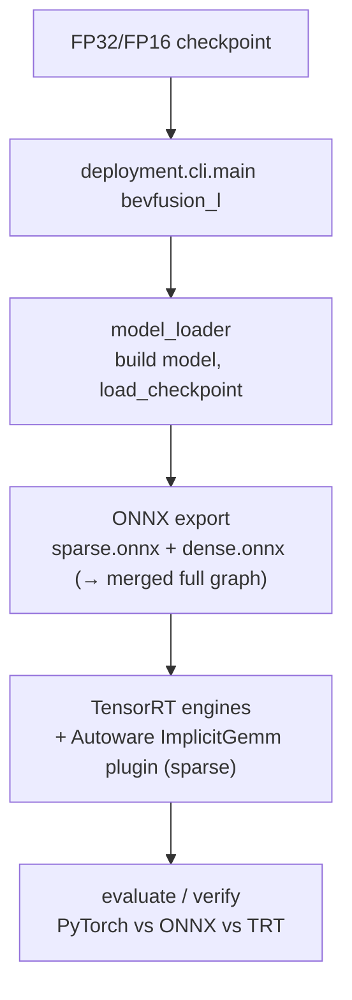

# BEVFusion Deployment — Architecture Guide

> Orientation doc for engineers and agents working on BEVFusion deployment. It explains
> **how the BEVFusion project bundle is wired**: PyTorch checkpoint → ONNX (sparse + dense) →
> TensorRT → evaluation. Deep-dive notes live in [`docs/`](docs/README.md); this file is the map.

For the framework-wide mental model, read [`deployment/docs/architecture.md`](../../docs/architecture.md)
first — BEVFusion is one *project bundle* that implements the stage contract described there.

---

## 1. End-to-end flow



Single entry point:

```bash
python -m deployment.cli.main bevfusion_l <deploy_cfg.py> <model_cfg.py>
```

---

## 2. BEVFusion project bundle (`deployment/projects/bevfusion_l/`)

Mirrors the framework stage contract. Wiring: [`entrypoint.py:run`](entrypoint.py) builds config +
data loader + executor + evaluator, then [`runner.py:BEVFusionDeploymentRunner`](runner.py)
(a thin `BaseDeploymentRunner`) drives the shared `OnnxExportPipeline` by injecting BEVFusion's
`BEVFusionSampleExtractor` + `BEVFusionComponentBuilder` (the same seam pattern CenterPoint uses),
and reuses the shared `TensorRTExportPipeline`.

| Stage | Directory | Key modules |
| --- | --- | --- |
| Config | [`config/`](config/) | `deploy_config.py` (split, optimized) + `deploy_config_without_opt.py` (split, no opt) (§4) |
| IO | [`io/`](io/) | [`model_loader.py`](io/model_loader.py) (build + `load_checkpoint`, optional sparse BN fuse), `data_loader.py`, `coors_contract.py` (voxel `[x,y,z]`→graph `[z,y,x]`), `component_utils.py` (split vs merged) |
| Export | [`export/`](export/) | [`sample_extractor.py`](export/sample_extractor.py) (voxelize) + [`component_builder.py`](export/component_builder.py) (split sparse/dense, wires trace-context + post-transforms) feed the shared `OnnxExportPipeline`; `onnx_models/bevfusion_onnx.py` (sparse/dense wrappers), `transforms.py` (TopK fix, split→merge), `sparse_encoder_float_shadow.py` (FP32 shadow + trace context), `onnx_fuse_implicit_gemm_activation.py` (ImplicitGemm ReLU fuse), `spconv_bn_fusion.py` |
| Inference | [`inference/`](inference/) | `pytorch_/onnx_/tensorrt_inference_pipeline.py` (all `preprocess→run→postprocess`) |
| Evaluation | [`evaluation/`](evaluation/) | `executor.py` (pipeline construction + output routing), `evaluator.py` (3D metrics + latency breakdown) |

---

## 3. Sparse vs dense split

BEVFusion (LiDAR) exports as two components so the dense backbone/neck/head can go to plain
TensorRT while the sparse encoder uses the custom `ImplicitGemm` plugin:

| | Sparse encoder (`pts_middle_encoder`) | Dense backbone/neck/head |
| --- | --- | --- |
| ONNX I/O | `voxels,coors,num_points → lidar_bev` | `lidar_bev → bbox_pred,score,label_pred` |
| ONNX op | `autoware::ImplicitGemm` (custom) | standard `Conv2d/ReLU/Add` |
| TensorRT | **custom plugin** `ImplicitGemm` (`libautoware_tensorrt_plugins.so`) | TRT-native |

The sparse encoder is traced through a **fused FP32 shadow encoder**
([`sparse_encoder_float_shadow.py`](export/sparse_encoder_float_shadow.py)) so BN can be folded
(`fuse_spconv_bn`) into a clean BN-free sparse ONNX without mutating the runtime model. Graph knobs:

- `fuse_spconv_bn` — fold SparseConv+BN in `pts_middle_encoder` before export.
- `spconv_do_sort` — bake the pair-mask argsort attribute into the exported `ImplicitGemm` nodes.
- `spconv_fuse_implicit_gemm_relu` — fuse trailing Relu into `ImplicitGemm` (see
  [`onnx_fuse_implicit_gemm_activation.py`](export/onnx_fuse_implicit_gemm_activation.py)).

The `ImplicitGemm` TensorRT plugin (with the `do_sort` attribute) is built from an Autoware fork;
see [`projects/BEVFusion/plugins/README.md`](../../../projects/BEVFusion/plugins/README.md) and
[`projects/BEVFusion/Dockerfile`](../../../projects/BEVFusion/Dockerfile).

---

## 4. Config variants (how to pick a mode)

All configs are MMEngine files.

| Config | Topology | Precision |
| --- | --- | --- |
| [`deploy_config.py`](config/deploy_config.py) | split sparse+dense (+merge) | FP16 (optimized) |
| [`deploy_config_without_opt.py`](config/deploy_config_without_opt.py) | split sparse+dense (+merge) | FP16 (no opt) |

**Isolation tip:** to check whether the split/voxel/eval pipeline is healthy, keep the same
CLI/config/work_dir and point `checkpoint_path` at the FP32 `.pth`. If mAP is fine, the pipeline is
healthy and any regression is upstream (e.g. the checkpoint or model config).

---

## 5. Where to go next

- BEVFusion `coors` contract + Autoware/eval alignment → [`docs/25_README_AUTOWARE_COORD_CONTRACT_AND_EVAL_ALIGNMENT.md`](docs/25_README_AUTOWARE_COORD_CONTRACT_AND_EVAL_ALIGNMENT.md)
- `ScatterND → SECOND` ONNX trace differences → [`docs/26_README_SCATTERND_TO_SECOND_TRACE_DIFFERENCE.md`](docs/26_README_SCATTERND_TO_SECOND_TRACE_DIFFERENCE.md)
- BEVFusion 2.8.x deployment notes → [`docs/28_README_BEVFUSION_2_8_DEPLOYMENT.md`](docs/28_README_BEVFUSION_2_8_DEPLOYMENT.md)
- Doc index → [`docs/README.md`](docs/README.md)
- Shared framework internals → [`deployment/docs/architecture.md`](../../docs/architecture.md)

> **Environment note:** ONNX/TensorRT export and evaluation run inside the BEVFusion deployment
> Docker image (see [`projects/BEVFusion/Dockerfile`](../../../projects/BEVFusion/Dockerfile)). The
> sparse `ImplicitGemm` TensorRT plugin `.so` must be built and present at the path in
> `tensorrt_config.plugin_libraries`.
