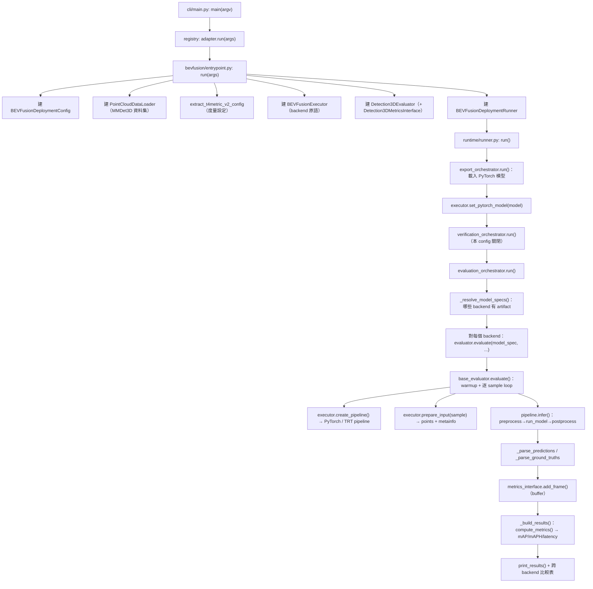

# BEVFusion Deployment Evaluation — 完整逐步導覽

> 這份文件的目標:**把「BEVFusion 在 deployment pipeline 裡是怎麼被完整 evaluate 的」一步一步、
> 一個 function 一個 function、一個檔案一個檔案地講清楚**,並且順帶解釋:
>
> 1. BEVFusion 模型裡的每一個部件(voxel layer / voxel encoder / sparse middle encoder /
>    backbone / neck / bbox_head / bbox_coder)各自在做什麼;
> 2. ONNX 這邊的每一個部件(export pipeline / wrappers / components / 各種 graph transform /
>    merge)各自在做什麼,以及跟 PyTorch 模型如何對應。
>
> 內容全部以「實際原始碼」為準(依 `CLAUDE.md` 的規定:Graphify 當地圖、原始碼與測試是最終真相)。
> 本文件所描述的檔案與行為在撰寫時已逐一讀過。父層架構地圖見 [`../README.md`](deployment/projects/bevfusion_l/README.md)。

---

## 0. 一句話總結

```text
一次 `python -m deployment.cli.main bevfusion_l <deploy_cfg> <model_cfg>` 會跑
Load checkpoint → Export → Verify → Evaluate 四個階段。
Evaluate 階段對「每個啟用的 backend(PyTorch / TensorRT)」各跑一次:
  逐個 sample → 前處理(體素化)→ 跑模型(sparse+dense)→ 後處理(bbox 解碼)
  → 把預測與 GT 丟進 T4MetricV2 相同的度量引擎 → 算出 mAP / mAPH / 延遲。
```

Evaluation 本身完全 **backend 無關**:同一個 evaluation loop、同一套 metric,PyTorch 與 TensorRT
只是換了 pipeline 實作;PyTorch 是「reference / 參考真值」,TensorRT 是「部署後要驗收的對象」。

---

## 1. 角色分工:誰負責什麼

deployment 框架把一次部署切成「階段(stage)」,每個 top-level 目錄是一個階段;`projects/bevfusion_l/`
則是實作同名階段的「專案 bundle」。與 **evaluation** 有關的角色:

| 層 | 檔案 | 職責(evaluation 視角) |
| --- | --- | --- |
| CLI | [`deployment/cli/main.py`](deployment/cli/main.py) | 發現/註冊專案、建 argparser、把 `args` 交給 adapter |
| CLI | [`deployment/cli/args.py`](deployment/cli/args.py) | `deploy_cfg` / `model_cfg` / `--log-level` 參數 + logging |
| 註冊表 | [`deployment/projects/registry.py`](deployment/projects/registry.py) | `bevfusion` 名字 → `run()` 的對照 |
| 入口 | [`deployment/projects/bevfusion_l/entrypoint.py`](deployment/projects/bevfusion_l/entrypoint.py) | **組裝**:config + data_loader + executor + evaluator + runner |
| Runner | [`deployment/projects/bevfusion_l/runner.py`](deployment/projects/bevfusion_l/runner.py) | 載入 PyTorch 模型;把 export/verify/eval 串起來 |
| Runner(共用) | [`deployment/runtime/runner.py`](deployment/runtime/runner.py) | `BaseDeploymentRunner.run()`:Export→Verify→Evaluate |
| 協調器 | [`deployment/runtime/evaluation_orchestrator.py`](deployment/runtime/evaluation_orchestrator.py) | 決定「要對哪些 backend、在哪個 device」跑 eval |
| 協調器 | [`deployment/runtime/export_orchestrator.py`](deployment/runtime/export_orchestrator.py) | 載入 checkpoint、(可選)匯出 ONNX/TRT、解析 artifact 路徑 |
| 資料 | [`deployment/io/point_cloud_data_loader.py`](deployment/io/point_cloud_data_loader.py) | 用 MMDet3D test pipeline 產出 `points` / `metainfo` / `ground_truth` |
| 執行原語 | [`deployment/execution/backend_executor.py`](deployment/execution/backend_executor.py) | 「建 pipeline + 準備 input + 管 device」的抽象 |
| 執行原語 | [`deployment/projects/bevfusion_l/evaluation/executor.py`](deployment/projects/bevfusion_l/evaluation/executor.py) | BEVFusion 版:依 backend 建 PyTorch/TRT pipeline |
| Evaluator | [`deployment/evaluation/base_evaluator.py`](deployment/evaluation/base_evaluator.py) | **核心 evaluation loop**(warmup→逐 sample→累積) |
| Evaluator | [`deployment/evaluation/detection_3d_evaluator.py`](deployment/evaluation/detection_3d_evaluator.py) | 3D 偵測的 pred/GT 解析、結果彙整、列印 |
| Pipeline | [`deployment/projects/bevfusion_l/inference/bevfusion_inference_pipeline.py`](deployment/projects/bevfusion_l/inference/bevfusion_inference_pipeline.py) | 前處理/後處理 + sparse/dense 兩段接縫(base) |
| Pipeline | [`.../inference/pytorch_inference_pipeline.py`](deployment/projects/bevfusion_l/inference/pytorch_inference_pipeline.py) | PyTorch backend 的 sparse/dense 實作 |
| Pipeline | [`.../inference/tensorrt_inference_pipeline.py`](deployment/projects/bevfusion_l/inference/tensorrt_inference_pipeline.py) | TensorRT backend(split 雙引擎 / merged 單引擎) |
| Metrics | [`deployment/metrics/detection_3d_metrics.py`](deployment/metrics/detection_3d_metrics.py) | 把 pred/GT 轉 perception_eval 物件、算 mAP/mAPH |
| Metrics(共用) | [`deployment/metrics/base_metrics_interface.py`](deployment/metrics/base_metrics_interface.py) | frame buffer、evaluator 生命週期、快取 |
| Metrics(共用) | [`deployment/metrics/detection_base.py`](deployment/metrics/detection_base.py) | `MetricsScore` → 扁平 dict / `DetectionSummary` |
| Config | [`.../config/bevfusion_deployment_config.py`](deployment/projects/bevfusion_l/config/bevfusion_deployment_config.py) | BEVFusion 專屬旗標 + 解析最終 component layout |
| Config | [`.../config/component_layout.py`](deployment/projects/bevfusion_l/config/component_layout.py) | split / merged 判斷、衍生 `bevfusion_merged` |

---

## 2. 一次完整 evaluation 的呼叫鏈(bird's-eye)



以下把每一步展開。

---

## 3. Stage 0 — CLI 與組裝

### 3.1 `cli/main.py`(進入點)
- [`main(argv)`](deployment/cli/main.py#L84):建 parser → `parser.parse_args` → `project_registry.get(args._adapter_name)` → `adapter.run(args)`。
- [`build_parser()`](deployment/cli/main.py#L40):
  - [`_discover_project_packages()`](deployment/cli/main.py#L22) 掃描 `deployment/projects/` 下的子套件名(不 import)。
  - [`_import_and_register_project()`](deployment/cli/main.py#L35) `import deployment.projects.bevfusion`,觸發該套件的 **副作用註冊**。
  - 每個成功註冊的專案配一個 subparser,並 `parse_base_args(sub)` 加上 `deploy_cfg` / `model_cfg` / `--log-level`。

### 3.2 註冊是怎麼發生的
- [`deployment/projects/bevfusion_l/__init__.py`](deployment/projects/bevfusion_l/__init__.py) 在 import 時就
  `project_registry.register(ProjectAdapter(name="bevfusion", run=run))`,其中 `run` 就是 entrypoint 的 `run`。
- [`ProjectRegistry`](deployment/projects/registry.py#L35) 只是 `name → run` 的字典;沒有任何 per-project CLI flag——
  **所有會影響產物的東西都寫在 deploy config**,確保可版本控管、可重現。

### 3.3 `entrypoint.py: run(args)` — 把所有零件組起來
[`run()`](deployment/projects/bevfusion_l/entrypoint.py#L18) 依序:

1. `setup_logging` 設 logger。
2. `Config.fromfile(args.deploy_cfg)` 與 `Config.fromfile(args.model_cfg)` 讀兩份 MMEngine config。
3. **`config = BEVFusionDeploymentConfig(deploy_cfg)`**:建構時就把最終 component layout 解析定案(§9)。
4. (可選)`add_deployment_file_logging` 把 log 也寫檔。
5. `PointCloudDataLoader(info_file, model_cfg)`:建資料集(§5)。
6. **`metrics_config = extract_t4metric_v2_config(model_cfg)`**:從 `model_cfg.val_evaluator` 抽出跟訓練期
   T4MetricV2 完全相同的度量設定(§8.1)。
7. `plugin_libraries`:從 `deploy_cfg.tensorrt_config.plugin_libraries` 取 spconv ImplicitGemm plugin 的 `.so` 路徑。
8. **`executor = BEVFusionExecutor(components_cfg, plugin_libraries)`**:一個 executor 實例,evaluator 與 runner 共用。
9. **`evaluator = Detection3DEvaluator(model_cfg, metrics_config, executor)`**。
10. **`runner = BEVFusionDeploymentRunner(data_loader, evaluator, executor, config, model_cfg)`**。
11. `runner.run()`。

> 關鍵:`executor`、`evaluator`、`data_loader` 都是在這裡「一次建好、之後共用」。executor 這時還沒有
> PyTorch 模型(`pytorch_model=None`);模型要等 export 階段載入後,由 runner 回填(§4.2)。

---

## 4. Stage 1–4 — Runner 把四階段串起來

### 4.1 `BEVFusionDeploymentRunner.__init__`
[`runner.py`](deployment/projects/bevfusion_l/runner.py#L51):在呼叫 `super().__init__` **之前** 先建好 ONNX pipeline
(因為 base runner 會把它直接轉交給 ExportOrchestrator,沒有事後注入的位置):

```python
onnx_pipeline = OnnxExportPipeline(
    sample_extractor=BEVFusionSampleExtractor(),          # §10.1
    component_builder=BEVFusionComponentBuilder(config),  # §10.2
    finalize=bevfusion_merge_finalize if config.merge_bevfusion else None,  # §10.6
)
```

然後 `super().__init__()` 進到共用的 [`BaseDeploymentRunner.__init__`](deployment/runtime/runner.py#L51),它建立四個協調器:
- `ArtifactManager(config)`
- `ExportOrchestrator(...)`(拿到上面的 onnx_pipeline + 預設 `TensorRTExportPipeline`)
- `VerificationOrchestrator(config, verifier, data_loader, artifact_manager)`
- **`EvaluationOrchestrator(config, evaluator, data_loader, artifact_manager)`** ← 本文重點

### 4.2 `BaseDeploymentRunner.run()`(evaluation 的觸發點)
[`run()`](deployment/runtime/runner.py#L99) 只有五步:

```python
export_result = self.export_orchestrator.run()          # 1) 載入 PyTorch 模型（見下）
self._executor.set_pytorch_model(export_result.pytorch_model)  # 2) 回填模型給共用 executor
results.verification_results = self.verification_orchestrator.run()  # 3) 交叉驗證（本 config 關閉）
results.evaluation_results = self.evaluation_orchestrator.run()      # 4) ★ evaluation
```

**第 1 步為什麼要「export」才能 evaluate?** 因為即使 `export.mode="none"`(本 deploy_config 就是),
[`ExportOrchestrator.run()`](deployment/runtime/export_orchestrator.py#L84) 仍會 **一定** 先
[`_load_and_register_pytorch_model()`](deployment/runtime/export_orchestrator.py#L136),它呼叫 runner 覆寫的
[`load_pytorch_model()`](deployment/projects/bevfusion_l/runner.py#L83) →
[`build_bevfusion_model()`](deployment/projects/bevfusion_l/io/model_loader.py#L21):
- `build_mmdet3d_model(model_cfg, checkpoint, cuda)` 建圖並 `load_checkpoint`,設 eval 模式;
- `_require_lidar_only_bevfusion(model)` 確認是 LiDAR-only(無 `fusion_layer`/`img_backbone`、有 `pts_middle_encoder`);
- 若 `fuse_spconv_bn=True`,對 `pts_middle_encoder` 做 SparseConv+BN 折疊(§10.4)。

runner 的 `load_pytorch_model` 也在這裡 `set_do_sort(config.spconv_do_sort)`——`do_sort` 是被 spconv 於 ONNX symbolic 與 forward 讀取的 process 全域,只需在匯出/推論前設一次,放在 runner(而非 component builder)是因為它是 deploy 全域設定、不是 per-component 的事。

這顆模型有三個用途:(a) ONNX 匯出的來源;(b) **PyTorch backend 的推論本體**;(c) 所有 backend 後處理都要用它的
`bbox_head.bbox_coder` 解碼、用它的 `pts_voxel_layer` 體素化(§6、§7)。所以 `set_pytorch_model` 之後,
PyTorch / TensorRT 兩個 backend 的前後處理共用同一顆參考模型。

> 在 `deploy_config.py` 裡 `export.mode="none"`,所以這一輪 **不會** 重新產生 ONNX / engine。
> TensorRT 評估用的 engine 由 `evaluation.backends.tensorrt.engine_dir` 指到既有的 `work_dir/tensorrt/`。
> 若要重新匯出,把 `export.mode` 設成 `onnx` / `trt` / `both`(§10 詳述匯出流程)。

---

## 5. 資料從哪來 — `PointCloudDataLoader`

[`point_cloud_data_loader.py`](deployment/io/point_cloud_data_loader.py):CenterPoint 與 BEVFusion 共用同一個
point-cloud loader(BEVFusion 目前以 **LiDAR-only** 部署)。

- `__init__` → [`_build_dataset()`](deployment/io/point_cloud_data_loader.py#L52):
  `init_default_scope("mmdet3d")`,深拷貝 `model_cfg.test_dataloader.dataset`,若 deploy config 有 `runtime_io.info_file`
  就覆寫 `ann_file`,設 `test_mode=True`,再 `DATASETS.build(...)`。這代表 **evaluation 用的資料與前處理完全等同訓練時的 test pipeline**。
- [`load_sample(index)`](deployment/io/point_cloud_data_loader.py#L64):取 `dataset[index]`,回傳一個 `SampleData` TypedDict:
  - `points`:`[N, point_features]` 的點雲張量(CPU);
  - `metainfo`:給後處理用的樣本 metadata;
  - `ground_truth`:來自 `data_samples.eval_ann_info`(含 `gt_bboxes_3d` / `gt_labels_3d` / `num_lidar_pts`)。
- [`num_samples`](deployment/io/point_cloud_data_loader.py#L90):資料集長度;evaluation 若設 `num_samples=-1` 就評估全部。

> `load_sample` 一定要帶 `ground_truth`,否則 evaluation loop 會丟 `KeyError`(見 §7.2)。

---

## 6. BEVFusion 模型的每一個部件在做什麼

在講 evaluation loop 之前,先把「模型本體」拆開,因為 sparse/dense 兩段接縫、ONNX 的切法,全都對應到這些部件。
LiDAR-only BEVFusion 的資料流:

```text
points ──(pts_voxel_layer 體素化)──▶ voxels / coors / num_points_per_voxel
        └── 這一步在 ONNX 圖「之外」,由前處理做

voxels/coors/num_points
  │
  ├─ pts_voxel_encoder ── 每個 voxel 內做 mean-pool + sin/cos Fourier 特徵 ─▶ voxel_features
  │
  └─ pts_middle_encoder (spconv 稀疏卷積塔) ── 把稀疏 voxel 散佈成稠密 BEV ─▶ lidar_bev  [B, C, H, W]
        └── 這兩步合稱「sparse 分支」，對應 ONNX 的 bevfusion_sparse

lidar_bev [B,256,H,W]
  │
  ├─ pts_backbone (SECOND) ─────────▶ 多尺度特徵
  ├─ pts_neck (SECONDFPN) ──────────▶ 融合後 BEV
  ├─ _align_lidar_bev_to_head_grid ─▶ 對齊到 head 的 grid（grid_size // out_size_factor，如 180×180）
  └─ bbox_head (transformer 偵測頭) ─▶ head 輸出 dict（heatmap / query_labels / center / height / dim / rot / vel ...）
        └── 這四步合稱「dense 分支」，對應 ONNX 的 bevfusion_dense
```

各部件職責:

| 部件 | 屬性名 | 做什麼 |
| --- | --- | --- |
| 體素化 | `pts_voxel_layer` | 把點雲切成硬體素(hard voxelization),輸出 `(voxels, coors, num_points_per_voxel)`。**在 ONNX 圖外**,前處理階段呼叫。 |
| Voxel encoder | `pts_voxel_encoder` | 對每個 voxel 內的點做 mean-pool,再加位置的 sin/cos Fourier 特徵,得到每 voxel 的特徵向量。 |
| Sparse middle encoder | `pts_middle_encoder` | spconv 稀疏卷積塔;把稀疏 voxel 特徵散佈/卷積成稠密 BEV 特徵圖 `lidar_bev`。**這是需要 Autoware ImplicitGemm plugin 的部分**。 |
| Backbone | `pts_backbone` | SECOND:2D 卷積 backbone,抽多尺度 BEV 特徵。 |
| Neck | `pts_neck` | SECONDFPN:上採樣/融合多尺度特徵。 |
| Grid 對齊 | `_align_lidar_bev_to_head_grid` | 把 SECOND/FPN 的 BEV 解析度池化到 head 期望的 grid(否則 transformer decoder 的 `key` 與 `key_pos` 長度不合)。 |
| 偵測頭 | `bbox_head` | Transformer 偵測頭;輸出 `heatmap` / `query_labels` / `query_heatmap_score` 及 `center/height/dim/rot/vel` 迴歸,並在圖內做 query 選取(含 TopK)。 |
| 解碼器 | `bbox_head.bbox_coder` | 把 head 的編碼輸出解回公制座標的 3D box(後處理用,見 §7.4)。 |

**head 輸出 → 三個張量的契約**:
[`head_dict_to_detection_outputs()`](deployment/projects/bevfusion_l/io/head_outputs.py#L15) 是 **唯一** 把 head dict
轉成 `(bbox_pred, score, label)` 的地方,PyTorch 與 ONNX 兩邊都呼叫它,確保輸出契約位元級一致:
- `score = sigmoid(heatmap) * query_heatmap_score * one_hot(query_labels)`,再對類別維取 max → `[num_proposals]`;
- `bbox_pred = cat([center, height, dim, rot, vel]) ` → `[10, num_proposals]`;
- `label = query_labels[0]` → `[num_proposals]`。

`bbox_pred` 這 10 維依序是:`(center_x_feat, center_y_feat, z_gravity, dim0_log, dim1_log, dim2_log, sin, cos, vx, vy)`
——注意 center 還在特徵座標、dim 還是 log 尺度,所以 **一定要經過 bbox_coder 解碼**(§7.4)。

---

## 7. Stage 4 詳解 — Evaluation loop 逐步拆解

### 7.1 `EvaluationOrchestrator.run()` — 決定「評誰、在哪」
[`evaluation_orchestrator.py`](deployment/runtime/evaluation_orchestrator.py#L57):

1. 若 `evaluation.enabled=False` 直接跳過。
2. [`_resolve_model_specs()`](deployment/runtime/evaluation_orchestrator.py#L111):走訪 `evaluation.backends` 每個 backend:
   - 只留 `enabled=True` 的;
   - [`_resolve_device_for_backend()`](deployment/runtime/evaluation_orchestrator.py#L144) 決定 device(TensorRT 一定要 CUDA,否則覆寫成預設 CUDA 並警告);
   - [`ArtifactManager.resolve_artifact()`](deployment/runtime/artifact_manager.py#L53) 找 artifact 路徑(先看註冊過的,再看 `evaluation.backends.<b>.model_dir/engine_dir`,再看 fallback);
   - artifact 存在才產生一個 `ModelSpec(backend, device, artifact)`。
3. `num_samples`:`-1` 代表全部(取 `data_loader.num_samples`)。
4. **對每個 `ModelSpec` 呼叫 `self.evaluator.evaluate(...)`**,把結果存進 `all_results[backend]`,並 `print_results`。
   任何 backend 失敗都被 `try/except` 包住(記 `error`),`finally` 一定 `clear_cuda_memory()`。
5. 若不只一個 backend,呼叫 [`_print_cross_backend_comparison()`](deployment/runtime/evaluation_orchestrator.py#L190) 印比較表
   (每個 backend 的 `summarize_for_comparison` 行:mAP/mAPH/latency)。

> 在 `deploy_config.py` 中,`pytorch.enabled=False`、`tensorrt.enabled=True`,所以預設只評 TensorRT。
> 想要 PyTorch↔TensorRT 對照,把 `pytorch.enabled=True`。

### 7.2 `BaseEvaluator.evaluate()` — 核心 loop
[`base_evaluator.py`](deployment/evaluation/base_evaluator.py#L123),對「一個 backend」做:

```python
self._executor.ensure_model_on_device(model.device)   # 參考模型搬到目標 device
pipeline = self._executor.create_pipeline(model, model.device)  # 建這個 backend 的 pipeline
self.metrics_interface.reset()                          # 清空 metric buffer

self._run_warmup(pipeline, data_loader, model, num_warmup, verbose)  # 熱身（丟棄結果）

for idx in range(actual_samples):                       # actual = min(num_samples, dataset)
    sample = data_loader.load_sample(idx)
    inference_input = self._executor.prepare_input(sample, data_loader, model.device)
    ground_truths = self._parse_ground_truths(sample["ground_truth"])   # ★ 3D 版見 §7.3
    infer_result = pipeline.infer(inference_input.data, metadata=inference_input.metadata)  # ★ §7.4
    latencies.append(infer_result.latency_ms)
    predictions = self._parse_predictions(infer_result.output)          # 直接就是 list[dict]
    self._add_to_interface(predictions, ground_truths)                  # → metrics.add_frame
    pipeline.periodic_cleanup(idx)                       # TRT 每 10 個 sample 清 CUDA cache
# finally: pipeline.cleanup()（釋放 engine/context/buffer）
return self._build_results(latencies, latency_breakdowns, actual_samples)  # ★ §7.5
```

重點:
- **warmup**([`_run_warmup`](deployment/evaluation/base_evaluator.py#L191))重用前幾個 sample 跑推論但 **丟棄** 輸出/延遲/metric,只為了暖 GPU/CUDA/TRT 狀態,不影響 `num_samples` 統計。
- `prepare_input` 由 [`PointCloudBackendExecutor.prepare_input`](deployment/execution/point_cloud_backend_executor.py#L24) 實作:
  只是把 `sample["points"]` + `sample["metainfo"]` 包成 `InferenceInput`(BEVFusion 的 device/資料搬移在 pipeline 內做)。
- 延遲統計:[`compute_latency_stats`](deployment/evaluation/base_evaluator.py#L219) 算 mean/std/min/max/median;
  若 pipeline 回傳 per-stage `breakdown`,[`_compute_latency_breakdown`](deployment/evaluation/base_evaluator.py#L240) 逐 stage 彙整。

### 7.3 GT 解析 — `Detection3DEvaluator._parse_ground_truths`
[`detection_3d_evaluator.py`](deployment/evaluation/detection_3d_evaluator.py#L60):把 `gt_bboxes_3d` / `gt_labels_3d`
轉成 `[{ "bbox_3d": [...7 或 9 維...], "label": int }, ...]`。`_parse_predictions` 則因為 pipeline 已經輸出好 list[dict],
直接原樣回傳。

### 7.4 `pipeline.infer()` — 前處理 / 跑模型 / 後處理
所有 backend 共用 [`BaseInferencePipeline.infer()`](deployment/inference/base_inference_pipeline.py#L138) 的三段式骨架,
每段計時後寫進 `InferenceResult.breakdown`:

```text
infer(input) = preprocess(input) → run_model(x) → postprocess(y, metadata)
               記 preprocessing_ms / model_ms(+sub-stage) / postprocessing_ms
```

BEVFusion 的三段實作在 [`BEVFusionInferencePipeline`](deployment/projects/bevfusion_l/inference/bevfusion_inference_pipeline.py):

**(a) preprocess — 體素化**
[`preprocess()`](deployment/projects/bevfusion_l/inference/bevfusion_inference_pipeline.py#L70):用 **參考模型的 `pts_voxel_layer`**
把 `points` 變成 `voxels / coors / num_points_per_voxel`。這一步刻意 **放在 ONNX 圖外**——所以不論 PyTorch 或 TRT,
體素化都用同一段 PyTorch code,消除 backend 差異。只支援 hard voxelization(輸出必須是 3-tuple)。

**(b) run_model — sparse + dense 兩段接縫**
[`run_model()`](deployment/projects/bevfusion_l/inference/bevfusion_inference_pipeline.py#L104) 把模型切成兩個「接縫」,各自計時:
- `run_sparse_encoder(voxels, coors, num_points)` → `lidar_bev`(對應 ONNX `bevfusion_sparse`),記 `sparse_ms`;
- `run_dense(lidar_bev)` → `[bbox_pred, score, label_pred]`(對應 ONNX `bevfusion_dense`),記 `dense_ms`。

這兩個接縫是 **抽象方法**,由各 backend 實作:

| backend | `run_sparse_encoder` | `run_dense` |
| --- | --- | --- |
| PyTorch [`pytorch_inference_pipeline.py`](deployment/projects/bevfusion_l/inference/pytorch_inference_pipeline.py) | 直接跑 `pts_voxel_encoder` + `pts_middle_encoder`(補上 batch 欄) | 跑 `pts_backbone`→`pts_neck`→`_align_lidar_bev_to_head_grid`→`bbox_head`,再 `head_dict_to_detection_outputs` |
| TensorRT split [`tensorrt_inference_pipeline.py`](deployment/projects/bevfusion_l/inference/tensorrt_inference_pipeline.py#L197) | 餵 sparse **引擎**(voxels/coors/num_points → `lidar_bev`),CUDA-event 計時 | 餵 dense **引擎**(`lidar_bev` → 三張量) |
| TensorRT merged | (不切)`_run_merged`:單一全圖引擎跑一次,回報單一 `model_ms` | 同左 |

TensorRT 版覆寫 `run_model`:split 佈局回報純 GPU 的 `sparse_ms`/`dense_ms`(由 CUDA event 量,見
[`run_trt_engine`](deployment/inference/tensorrt_runner.py#L112));merged 佈局回報單一 `model_ms`。
PyTorch 版是 wall-clock 計時,作為參考。

**(c) postprocess — bbox 解碼**
[`postprocess()`](deployment/projects/bevfusion_l/inference/bevfusion_inference_pipeline.py#L148) 對三張量做:
1. 形狀正規化到 `bbox_pred=[10, num_proposals]`、`score`/`label_pred=[num_proposals]`;
2. 取參考模型的 `bbox_head.bbox_coder`,把 `center/height/dim/rot/vel` **解碼回公制座標**
   (`decode(...)` 內部處理 log-dim、特徵座標→世界座標、sin/cos→yaw);
3. 過濾掉 score < 1e-6 的框;
4. 輸出 `[{ "bbox_3d": [cx,cy,z,dx,dy,dz,yaw,vx,vy], "score": float, "label": int }, ...]`。

> 為什麼 ONNX 已經有 query 選取還要解碼?因為 ONNX 圖只做到 head 編碼輸出(方便 TRT),
> **座標/尺度的最終解碼刻意留在 PyTorch 後處理**,讓 PyTorch↔ONNX 的比較是在同一個「編碼空間」進行,
> 避免解碼慣例漂移;同時所有 backend 用同一顆 `bbox_coder`,結果可比。

### 7.5 累積與計分 — `_add_to_interface` → `_build_results`
- [`_add_to_interface()`](deployment/evaluation/detection_3d_evaluator.py#L82) → `metrics_interface.add_frame(pred, gt)`(§8)。
- 全部 sample 跑完後,[`_build_results()`](deployment/evaluation/detection_3d_evaluator.py#L87):
  - `compute_latency_stats(latencies)`;
  - `metrics_interface.compute_metrics()`(觸發真正計分)+ `metrics_interface.summary.to_dict()`;
  - 組出 `EvalResultDict`:`mAP_by_mode` / `mAPH_by_mode` / `per_class_ap_by_mode` / `detailed_metrics` /
    `latency` /(可選)`latency_breakdown` / `num_samples`。
- [`print_results()`](deployment/evaluation/detection_3d_evaluator.py#L159):印度量報表、延遲統計、以及 stage-wise 分解
  (`preprocessing_ms` / `model_ms`(或 `sparse_ms`+`dense_ms`)/ `postprocessing_ms`)。

---

## 8. 度量是怎麼算的 — T4MetricV2 / perception_eval

evaluation 用的度量跟 **訓練期 T4MetricV2 完全同源**(`autoware_perception_evaluation`),確保「部署後的 mAP」與
「訓練時的 mAP」可直接對照。

### 8.1 度量設定的來源
[`extract_t4metric_v2_config(model_cfg)`](deployment/metrics/detection_3d_metrics.py#L143):從 `model_cfg.val_evaluator`
(必須是 `T4MetricV2`)抽出 `evaluation_config_dict`(距離門檻、matching 門檻、`min/max_distance` 等)、`frame_id`、
`critical_object_filter_config`、`frame_pass_fail_config`,包成 `Detection3DMetricsConfig`。度量設定 **來自模型 config,而非模型架構**,所以所有 3D 偵測專案共用這支函式。

### 8.2 `Detection3DMetricsInterface`(3D 版)
[`detection_3d_metrics.py`](deployment/metrics/detection_3d_metrics.py#L203):
- 建構時依 `min_distance`/`max_distance`(可為 list)展開成 **多個距離範圍 evaluator**
  ([`_resolve_distance_ranges`](deployment/metrics/detection_3d_metrics.py#L234) / [`_create_evaluator_specs`](deployment/metrics/detection_3d_metrics.py#L265)),
  每個範圍一個 spec,key 前綴 `bev_center_<min>-<max>`。
- [`add_frame(pred, gt)`](deployment/metrics/detection_3d_metrics.py#L362):把 pred / gt dict 透過
  [`_to_dynamic_objects_3d`](deployment/metrics/detection_3d_metrics.py#L292) 轉成 perception_eval 的 `DynamicObject`
  (`bbox_3d`→position/orientation(yaw→Quaternion)/shape(length,width,height)/velocity;GT 的 score 固定 1.0,並讀 `num_lidar_pts`),
  再 `_buffer_frame` **只 buffer,不立即計分**。非有限值(NaN/inf)的框會被跳過。

### 8.3 共用計分流程(`BaseMetricsInterface`)
[`base_metrics_interface.py`](deployment/metrics/base_metrics_interface.py):Template Method。
- [`compute_metrics()`](deployment/metrics/base_metrics_interface.py#L181):對每個 evaluator spec **當場建 `PerceptionEvaluationManager`
  → 重播所有 buffered frame(`add_frame_result`)→ `get_scene_result()` → 立即釋放**。這樣峰值記憶體與「距離範圍數量」無關。
  結果扁平化後快取(下次 `add_frame`/`reset` 才失效)。
- [`detection_base.py`](deployment/metrics/detection_base.py):把 perception_eval 的 `MetricsScore`
  ([`_extract_scores`](deployment/metrics/detection_base.py#L79))轉成:
  - 扁平 metric dict(`{label}_AP_{mode}_{thr}`、`mAP_{mode}`、以及 3D 才有的 `APH`/`mAPH`);
  - 結構化 `DetectionSummary`(`mAP_by_mode` / `mAPH_by_mode` / `per_class_ap_by_mode`)。
- summary 取「最後(最寬)距離桶」的分數([`_select_summary_score`](deployment/metrics/detection_3d_metrics.py#L412))。

> `mode`(matching mode)例如 center-distance-bev、plane-distance 等;`by_mode` 就是「同一組預測用不同 matching 準則」各算一份 mAP。

---

## 9. Config 如何驅動 evaluation 的 backend 與佈局

以 [`deploy_config.py`](deployment/projects/bevfusion_l/config/deploy_config.py) 為例:

- `evaluation`:`enabled` / `num_samples` / `num_warmup` / `verbose` / `backends`;
  `backends.tensorrt.engine_dir` 指向 `work_dir/tensorrt/`(評估時去那裡找 `.engine`)。
- `components`:宣告 `bevfusion_sparse`(voxels/coors/num_points → `lidar_bev`)與
  `bevfusion_dense`(`lidar_bev` → bbox_pred/score/label_pred),各自的 dtype、`dynamic_axes`、`tensorrt_profile`。
  **這些 I/O 名稱就是 ONNX/engine 綁定的名稱**——執行期靠名字餵資料/取輸出,不靠位置猜。
- `bevfusion_merge`:`enabled=True` 時,`BEVFusionDeploymentConfig` 會 **衍生** 一個 `bevfusion_merged` component。

Config 解析:
- [`BaseDeploymentConfig`](deployment/config/base.py#L34) 解析 devices / components / onnx / export / tensorrt /
  evaluation / verification,並在 config 階段就驗證 CUDA(若任何階段用到 TRT)。
- [`BEVFusionDeploymentConfig`](deployment/projects/bevfusion_l/config/bevfusion_deployment_config.py) 加上 4 個旗標
  (`fuse_spconv_bn` / `spconv_do_sort` / `spconv_fuse_implicit_gemm_relu` / `merge_bevfusion`),並在建構時
  用 [`add_merged_component`](deployment/projects/bevfusion_l/config/component_layout.py#L48) 把
  merged 全圖從 split pair 衍生出來(sparse 的 inputs + dense 的 outputs),最後 `_validate_components`。
- [`component_layout.py`](deployment/projects/bevfusion_l/config/component_layout.py):`is_split_components`(有無 sparse+dense)、
  `has_component`、`merge_requested`。

**三種佈局如何決定 evaluation 走哪條路**([`BEVFusionExecutor`](deployment/projects/bevfusion_l/evaluation/executor.py) +
[`BEVFusionTensorRTInferencePipeline.__init__`](deployment/projects/bevfusion_l/inference/tensorrt_inference_pipeline.py#L55)):

| 佈局 | components | evaluation 執行 |
| --- | --- | --- |
| split | sparse + dense(無 merged) | TRT 載 **兩個引擎**,分兩段跑,回報 `sparse_ms`+`dense_ms` |
| split + merge(本 config) | sparse + dense + merged | 若磁碟上有 merged engine → 載 **單一全圖引擎**,回報單一 `model_ms`;否則退回 split |
| merged only | merged | 單一全圖引擎 |

`BEVFusionExecutor.get_supported_backends` 明講 **只支援 PyTorch 與 TensorRT**;
ONNXRuntime 不能跑 sparse 圖(需要 TensorRT-only 的 Autoware plugin),所以 ONNX 只用於匯出、不用於推論。

---

## 10. ONNX 這一側:每個部件在做什麼

雖然本文主題是 evaluation,但 evaluation 用的 TensorRT engine 是從 ONNX 來的,而且使用者想理解「ONNX 每個部分」。
以下拆解匯出流程(當 `export.mode` 含 `onnx` 時由 `ExportOrchestrator._export_onnx` 觸發)。

### 10.0 匯出的骨架 — 共用 `OnnxExportPipeline`
[`onnx_export_pipeline.py`](deployment/export/pipelines/onnx_export_pipeline.py):model-agnostic,**一個 component 一個 ONNX 檔**。
`export()` 流程:
1. `sample_extractor.extract_sample(...)` 取一個 tracing 樣本;
2. `component_builder.build_components(model, sample)` 把模型切成 1 或 2 個 component;
3. 對每個 component:`get_onnx_settings(name)` 取 I/O 名稱/dynamic_axes/opset → `ONNXExporter.export`(§10.7)→
   若有 `post_transforms` 就對匯出的 `.onnx` 依序套用(§10.5);
4. 若有 `finalize` hook,全部匯完後執行(§10.6)。

BEVFusion 透過幾個「注入點」表達自己的特性,而 **不 fork 整條 pipeline**(見專案的 export-seam 慣例):
`sample_extractor` + `component_builder` +(component 級的)`post_transforms` +(pipeline 級的)`finalize`。

### 10.1 tracing 樣本 — `BEVFusionSampleExtractor`
[`sample_extractor.py`](deployment/projects/bevfusion_l/export/sample_extractor.py)(使用者剛剛打開的檔案):
載入一個點雲樣本 → `model.pts_voxel_layer(points)` 體素化 → 把 coors 從體素層的 `[x,y,z]`
**flip 成 ONNX graph-input 的 `[z,y,x]`**([`voxel_indices_xyz_to_graph_input_zyx`](deployment/projects/bevfusion_l/io/voxel_inputs.py#L65))→
回傳 typed 的 [`BEVFusionVoxelSample`](deployment/projects/bevfusion_l/io/sample_types.py)(voxels / coors[int32] / num_points)。
這個樣本只是 **決定 tracing 時的 shape/型別**。

### 10.2 切圖 — `BEVFusionComponentBuilder`
[`component_builder.py`](deployment/projects/bevfusion_l/export/component_builder.py) 是一個 **純**「model + 已就緒 sample → components」的步驟:device/dtype/座標由 extractor 負責(§10.1)、`spconv_do_sort` 由 runner 在 load 時設定(§4.2),所以 builder 自己不碰 device/dtype、也沒有全域副作用。
- split 佈局 → 產出兩個 `ExportableComponent`:
  - `bevfusion_sparse`:module = [`BEVFusionSparseWrapper`](deployment/projects/bevfusion_l/export/onnx_models/bevfusion_onnx.py#L42);
    若 `spconv_fuse_implicit_gemm_relu` 為真,post_transform = ImplicitGemm+ReLU 融合(§10.5b);
  - `bevfusion_dense`:先用 `_run_sparse_encoder` 在樣本上跑一次得到 `lidar_bev` 當 tracing 輸入,module =
    [`BEVFusionDenseWrapper`](deployment/projects/bevfusion_l/export/onnx_models/bevfusion_onnx.py#L64),post_transform = TopK 常數化(§10.5a);
- merged 佈局 → 單一 `bevfusion_merged` 全圖**不由 builder 直接匯出**,而是由 [`transforms.py`](deployment/projects/bevfusion_l/export/transforms.py) 的 merge finalize hook 把 split 的 sparse+dense ONNX 組合而成(見下方 split→merge);
- 三個元件走同一個 `_component()` 樣板:tracing 輸入直接取自 typed sample(`_voxel_inputs(sample)` = `sample.voxels/coors/num_points_per_voxel`,不再 `.to(device)`/`.to(int32)`);`name` 取自 `components_cfg.get_component("<key>").name`(與 CenterPoint 同一個 pattern,順帶驗證 component 存在);
- TopK 的常數 K 由 `_num_proposals(model)` 取自**單一來源** `model.bbox_head.num_proposals`;
- LiDAR-only 前提在 model load 時由 `_require_lidar_only_bevfusion` 一次檢查(§4.2),builder 不再重複驗證。

> 註:sparse 匯出時 spconv 會印一行良性的 advanced-indexing `UserWarning`,屬正常現象、不影響結果。

### 10.3 ONNX wrappers — 把子模組包成固定 I/O 簽名
[`onnx_models/bevfusion_onnx.py`](deployment/projects/bevfusion_l/export/onnx_models/bevfusion_onnx.py):
- [`normalize_sparse_coors_for_autoware`](deployment/projects/bevfusion_l/export/onnx_models/bevfusion_onnx.py#L22):
  圖 **輸入** 契約是 `[z,y,x]`(無 batch);wrapper 內把 coors flip 回 `[x,y,z]`、補上 batch 欄、確保 int32
  (符合舊 Autoware ONNX 契約)。座標契約細節見 [`voxel_inputs.py`](deployment/projects/bevfusion_l/io/voxel_inputs.py) 與 doc 25。
- `BEVFusionSparseWrapper.forward(voxels, coors, num_points)` → `mod.extract_pts_feat(...)` → `lidar_bev`(sparse 分支)。
- `BEVFusionDenseWrapper.forward(lidar_bev)` → backbone→neck→grid 對齊→bbox_head → `head_dict_to_detection_outputs`(dense 分支)。
- 全圖 `bevfusion_merged` 沒有對應的 module wrapper:它是 sparse ONNX + dense ONNX 由 merge finalize hook 事後組合而成(§split→merge),而非單獨 trace。
- 兩個 wrapper 都用同一支 `head_dict_to_detection_outputs`(§6),所以 ONNX 的輸出契約與 PyTorch 完全一致。

### 10.4 SparseConv+BN 折疊(匯出前的圖優化)
[`spconv_bn_fusion.py`](deployment/projects/bevfusion_l/export/spconv_bn_fusion.py):在 **模型載入時**(`build_bevfusion_model(fuse_spconv_bn=True)`)
就把 `pts_middle_encoder` 裡每對 `SparseConvolution + BatchNorm1d` 用 spconv 的 eval-mode Conv-BN fold 合併
(BN 換成 `Identity`)。這 **不是量化**,只是圖優化,讓匯出的 sparse ONNX 是 BN-free、與 runtime 圖一致。
因為在 load 時就折好,runtime sparse encoder 可直接被 trace,不需要另外建 FP32 shadow encoder。

### 10.5 匯出後的 ONNX graph transforms(`post_transforms`)
共用 pipeline 的 [`_apply_post_transforms`](deployment/export/pipelines/onnx_export_pipeline.py#L189) 會 load `.onnx` →
依序套 transform → save 回去。BEVFusion 用兩個:

**(a) TopK 常數化** — [`fix_topk_constant_k`](deployment/projects/bevfusion_l/export/transforms.py#L31):
`torch.onnx.export` 可能產生動態的 TopK `K`,但 TensorRT 要求 `K` 是常數。這個 transform 把(唯一的)TopK 節點的
`K` 換成常數 `num_proposals`,並修好輸出 shape。只在 dense 套(merged 全圖由 dense ONNX 帶入這個修正)。

**(b) ImplicitGemm + ReLU 融合** — [`fuse_autoware_implicit_gemm_trailing_relu`](deployment/projects/bevfusion_l/export/onnx_fuse_implicit_gemm_activation.py#L85):
TensorRT 不會自動把標準 ONNX `Relu` 融進自訂 op,所以手動把 `autoware.ImplicitGemm → Relu` 的 pattern 折成
「帶 activation 的 ImplicitGemm」(設 `act_type=kReLU` 並刪掉獨立的 `Relu` 節點)。只在 sparse 且 `spconv_fuse_implicit_gemm_relu=True` 時套。

### 10.6 split → merged 的合併(pipeline 級 `finalize`)
[`bevfusion_merge_finalize`](deployment/projects/bevfusion_l/export/transforms.py#L173) →
[`merge_split_sparse_dense_onnx`](deployment/projects/bevfusion_l/export/transforms.py#L68):用 `onnx.compose` 把
`sparse.onnx` + `dense.onnx` 接成單一 `bevfusion_merged` ONNX(統一 IR/opset、加前綴、用 `io_map` 把
`sparse/lidar_bev` 接到 `dense/lidar_bev`、把外部 I/O 名稱改回 config 宣告的名字)。當 `merge_bevfusion=True` 才啟用。

### 10.7 真正的 `torch.onnx.export` — `ONNXExporter`
[`onnx_exporter.py`](deployment/export/exporters/onnx_exporter.py):`export()` = `_prepare_for_onnx`(套 wrapper、`eval()`)→
`_do_onnx_export`(在 **私有 staging 目錄** 呼叫 `torch.onnx.export`,含 `opset_version` / `do_constant_folding` /
`input_names` / `output_names` / `dynamic_axes`,再原子性 publish,避免半成品或外部權重檔錯位)→ 可選 `onnxsim` 簡化。
I/O 名稱與 dynamic_axes 全來自 deploy config 的 `components.<name>.io`([`get_onnx_settings`](deployment/config/base.py#L156))。

### 10.8 為什麼要 split(sparse / dense)?
| | sparse(`pts_middle_encoder`) | dense(backbone/neck/head) |
| --- | --- | --- |
| ONNX I/O | `voxels,coors,num_points → lidar_bev` | `lidar_bev → bbox_pred,score,label_pred` |
| 主要 op | `autoware::ImplicitGemm`(自訂) | 標準 `Conv/ReLU/Add/TopK/Gather...` |
| TensorRT | **需要自訂 plugin**(`libautoware_tensorrt_plugins.so`) | TRT 原生 |

split 讓 dense 塔可以走純 TensorRT,只有 sparse 塔需要 Autoware ImplicitGemm plugin;merge 再把兩者接回單圖方便部署。

---

## 11. TensorRT 執行細節(evaluation 實際餵資料的地方)

[`tensorrt_inference_pipeline.py`](deployment/projects/bevfusion_l/inference/tensorrt_inference_pipeline.py) +
共用 runner [`tensorrt_runner.py`](deployment/inference/tensorrt_runner.py):

- `__init__` 先 `load_tensorrt_plugin_libraries`(dlopen spconv plugin)、`init_libnvinfer_plugins`,再依佈局載引擎。
- **餵 voxel 輸入**:[`_prepare_voxel_inputs`](deployment/projects/bevfusion_l/inference/tensorrt_inference_pipeline.py#L151)
  把 voxels→float32、coors→`[z,y,x]` int32(`voxel_indices_xyz_to_graph_input_zyx`)、num_points→int32 且 `max(_,1)`(避免 mean-pool 除以 0 造成 NaN BEV)。
  [`map_voxel_inputs`](deployment/projects/bevfusion_l/io/voxel_inputs.py#L31) 依引擎宣告的輸入名綁定三個陣列(名稱不符會直接報錯)。
- **執行 + 計時**:[`run_trt_engine`](deployment/inference/tensorrt_runner.py#L112) 處理所有 dtype/buffer 細節
  (輸入依 binding dtype cast——FP16 引擎關鍵)、用 CUDA event 只框住 `execute_async_v3` → 得到 **純 GPU 時間**。
- **輸出排序**:[`order_outputs_by_config`](deployment/inference/base_inference_pipeline.py#L65) 依 config 宣告順序回傳
  (ONNX/TRT 回報順序可能任意),確保 `[bbox_pred, score, label_pred]` 對得上後處理。
- **資源管理**:`GPUResourceMixin` 保證 `cleanup()` 只跑一次;`periodic_cleanup` 每 10 個 sample 清一次 CUDA cache。

---

## 12. 從輸入到 mAP 的資料型別流(一頁速查)

```text
dataset[idx]
  → SampleData{ points[N,F], metainfo, ground_truth{gt_bboxes_3d, gt_labels_3d, num_lidar_pts} }
                                     │
prepare_input ─────────────────────▶ InferenceInput{ data=points, metadata=metainfo }
                                     │
preprocess (pts_voxel_layer) ──────▶ { voxels[M,P,C], coors[M,3](x,y,z), num_points[M] }
                                     │
run_sparse_encoder ────────────────▶ lidar_bev [B, 256, H, W]     （sparse 引擎 / PyTorch spconv）
run_dense ─────────────────────────▶ [ bbox_pred[10,Q], score[Q], label_pred[Q] ]（編碼空間）
                                     │
postprocess (bbox_coder.decode) ───▶ [ {bbox_3d:[cx,cy,z,dx,dy,dz,yaw,vx,vy], score, label}, ... ]（公制）
                                     │
_parse_predictions + _parse_ground_truths
                                     │
metrics.add_frame → DynamicObject（buffer）
                                     │
compute_metrics（每個距離範圍建 evaluator、重播、算分、釋放）
                                     │
EvalResultDict{ mAP_by_mode, mAPH_by_mode, per_class_ap_by_mode, latency(, latency_breakdown), num_samples }
```

---

## 13. 常見疑問(對照原始碼)

- **Q:為什麼 evaluation 之前一定要 export?** A:即使 `export.mode="none"`,`ExportOrchestrator.run()` 仍會載入
  PyTorch 模型並回填給 executor;PyTorch/TRT 的前處理(體素化)與後處理(解碼)都需要這顆參考模型。
- **Q:TensorRT 評估時報單一 `model_ms` 還是 `sparse_ms`+`dense_ms`?** A:看磁碟上是否有 merged engine。有 → 單引擎單 `model_ms`;沒有 → split 雙引擎兩段計時。見
  [`BEVFusionTensorRTInferencePipeline.__init__`](deployment/projects/bevfusion_l/inference/tensorrt_inference_pipeline.py#L69)。
- **Q:為什麼不用 ONNXRuntime 評估?** A:sparse 圖用 `autoware::ImplicitGemm` 自訂 op,只有 TensorRT plugin 有實作,
  ORT 沒有。ONNX 只是 PyTorch→TensorRT 的橋。見 [`get_supported_backends`](deployment/projects/bevfusion_l/evaluation/executor.py#L46)。
- **Q:部署 mAP 為什麼能跟訓練 mAP 對照?** A:度量設定直接抽自 `model_cfg.val_evaluator`(T4MetricV2),且用同一個
  `autoware_perception_evaluation` 引擎與同樣的距離範圍。見 §8。
- **Q:coors 的座標順序?** A:體素層輸出 `[x,y,z]`;ONNX/TRT 圖輸入契約是 `[z,y,x]`(無 batch),wrapper 內再 flip 回
  `[x,y,z]` 並補 batch。PyTorch 評估直接用 `[batch,x,y,z]`。見 [`voxel_inputs.py`](deployment/projects/bevfusion_l/io/voxel_inputs.py) 與 doc 25。

---

## 14. 延伸閱讀
- 專案架構地圖:[`../README.md`](deployment/projects/bevfusion_l/README.md)
- 框架整體:[`../../docs/architecture.md`](deployment/docs/architecture.md)
- coors 契約 / Autoware 對齊:[`25_README_AUTOWARE_COORD_CONTRACT_AND_EVAL_ALIGNMENT.md`](deployment/projects/bevfusion_l/docs/25_README_AUTOWARE_COORD_CONTRACT_AND_EVAL_ALIGNMENT.md)
- ScatterND→SECOND trace 差異:[`26_README_SCATTERND_TO_SECOND_TRACE_DIFFERENCE.md`](deployment/projects/bevfusion_l/docs/26_README_SCATTERND_TO_SECOND_TRACE_DIFFERENCE.md)
- 2.8.x 部署:[`28_README_BEVFUSION_2_8_DEPLOYMENT.md`](deployment/projects/bevfusion_l/docs/28_README_BEVFUSION_2_8_DEPLOYMENT.md)
- ONNX 節點數對齊:[`29_README_ONNX_NODE_COUNT_ALIGNMENT.md`](deployment/projects/bevfusion_l/docs/29_README_ONNX_NODE_COUNT_ALIGNMENT.md)

> **環境提醒**:ONNX/TensorRT 匯出與評估都在 BEVFusion 部署 Docker 內執行;sparse 的 ImplicitGemm plugin `.so`
> 必須先 build 好、並存在於 `tensorrt_config.plugin_libraries` 指定的路徑。
