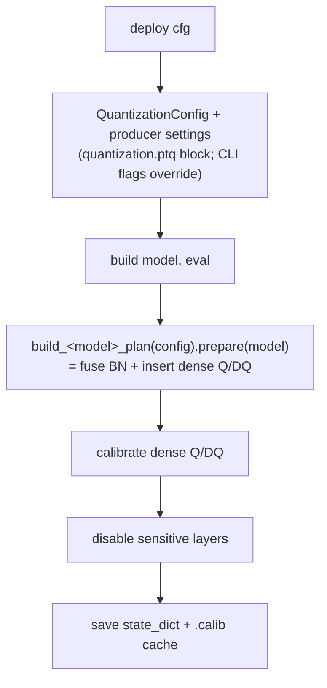
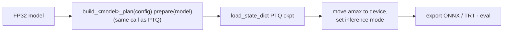

# AWML Quantization Framework

INT8 PTQ/QAT quantization for AWML deployment models (CenterPoint, BEVFusion-L), built on top of
NVIDIA's [`pytorch-quantization`](https://github.com/NVIDIA/TensorRT/tree/main/tools/pytorch-quantization)
toolkit. Dense Conv/Linear towers deploy in INT8; the BEVFusion spconv sparse encoder deploys in
**FP16** (SparseConv+BN folded only — no sparse INT8).

The framework is split into a **model-agnostic engine** (`deployment/quantization/`) and
**per-project composition** (`deployment/projects/<model>/quantization/`). The engine knows *how* to
quantize a Conv/Linear/SparseConv tower; each project declares *which* submodules get quantized and
*how the towers compose* into one `QuantizationPlan`.

## The one thing to remember

> **Every stage that touches quantization builds the module tree by calling the same
> `build_<model>_plan(config).prepare(model)`.**

PTQ producer, deploy loader, and (for CenterPoint) the QAT hook all go through that single call, so
the calibrated PTQ `state_dict` and the deploy-time `load_state_dict` line up **by construction** —
not by a "keep these two code paths in sync" comment. If you read one thing before touching this
code, read [`schemes/base.py`](schemes/base.py).

---

## 1. Layering

The typed `QuantizationConfig` lives in the deployment config layer
([`deployment/config/schema.py`](../config/schema.py)) alongside the other deploy-config sections —
not in the engine — so config parsing has one home.

```
deployment/quantization/                      # model-agnostic engine
├── core/                                      # the Q/DQ engine
│   ├── descriptors.py                         #   single source of the INT8 descriptor choices
│   ├── modules/                               #   QuantConv2d / QuantConvTranspose2d / QuantLinear
│   ├── replace.py                             #   nn.Conv2d -> QuantConv2d module swap
│   ├── fusion.py                              #   Conv+BN fusion (dense)
│   ├── calibration.py                         #   CalibrationManager (histogram + amax)
│   ├── utils.py                               #   disable_quantization(+_in) / TensorQuantizer
│   │                                          #   deploy-load helpers (amax→device, fb_fake_quant,
│   │                                          #   get_tensor_quantizer_cls) / status / counts
│   └── availability.py                        #   pytorch-quantization import guard (leaf)
├── recipes/                                   # architecture-specific Q/DQ *placement*
│   ├── forward_hooks.py                       #   per-block forward reimplementations
│   └── attach.py                              #   walk model + install hooks/quantizers
├── schemes/                                   # the "seam" between deploy stages and quantization
│   ├── base.py                                #   QuantizationScheme (ABC) + QuantizationPlan
│   └── dense_qdq.py                           #   generic DenseQDQScheme
├── producer.py                                # shared PTQ/QAT-producer plumbing (calib dataloader
│                                              #   seed/shuffle, ckpt+.calib save, run_qat_training,
│                                              #   save_qat_checkpoint, logging init)
├── qat_hook.py                                # QATHookBase — shared mmengine QAT hook body
│                                              #   (projects register thin subclasses)
└── sparse/                                    # spconv sparse-encoder helpers (FP16 deploy)
    └── fusion.py                              #   fuse_spconv_bn_in_encoder (SparseConv+BN fold)

deployment/projects/centerpoint/quantization/ # CenterPoint composition
├── quant_model.py                             #   applies engine+recipes to CP's named submodules
├── schemes.py                                 #   CenterPointDenseScheme (wraps quant_model)
├── plan.py                                    #   build_centerpoint_plan(config) -> QuantizationPlan
├── qat_hook.py                                #   QATHook = QATHookBase + build_centerpoint_plan
└── quantize.py                                #   PTQ + QAT producer CLI

deployment/projects/bevfusion_l/quantization/ # BEVFusion composition
├── schemes.py                                 #   SpconvBnFuseScheme (sparse tower: FP16, BN fold only)
├── plan.py                                    #   build_bevfusion_plan(config) -> QuantizationPlan
├── calibration.py                             #   voxel-dtype-normalizing calibration forward
├── qat_hook.py                                #   BEVFusionQATHook = QATHookBase + plan + calib fwd
└── quantize.py                                #   PTQ + QAT producer CLI
```

**Dependency direction:** `projects/* → deployment.quantization`. The engine never imports a project.
Cross-cutting knowledge both a project's export path and the engine need (e.g. SparseConv+BN folding
in `sparse/fusion.py`) lives in the engine so neither project has to import the other.

---

## 2. Core concepts

### 2.1 `QuantizationConfig` (`deployment/config/schema.py`)
The deploy config carries a `quantization = dict(...)` block. `QuantizationConfig` (in the shared
config schema, next to `ExportConfig` / `ComponentsConfig` / …) is the **single** typed view of it:
`QuantizationConfig.from_dict(dict)` (from an in-memory dict, e.g. in a loader) or
`load_quantization_config(path)` (from a deploy-config file, e.g. in a CLI). Defaults live in exactly
one place, so the insert side and the load side cannot drift. Precision placement is declarative:
`default_precision="int8"` quantizes everything the plan reaches, and `keep_fp16=[globs]` lists subtrees
to leave in FP16 (expanded against the model by `expand_keep_fp16`, `core/replace.py`);
`disable_recipes=[...]` opts a config out of an always-on recipe. `with_overrides()` supports the CLIs.

### 2.2 Quantized modules (`core/modules/`) + descriptors (`core/descriptors.py`)
`QuantConv2d`, `QuantConvTranspose2d`, `QuantLinear` subclass their `nn.*` counterparts and add
`_input_quantizer` / `_weight_quantizer`. Their default descriptors (per-channel INT8 Conv2d weights,
**per-tensor** ConvTranspose2d weights — TRT INT8 transposed conv is fragile per-channel — per-row
Linear weights, histogram activations) come from `core/descriptors.py`, the one place those choices
are defined. During ONNX export the fake-quant emits `QuantizeLinear` / `DequantizeLinear` nodes.

### 2.3 Module replacement (`core/replace.py`)
`quant_conv_module` / `quant_linear_module` recursively swap `nn.Conv2d/ConvTranspose2d/Linear` for
their quantized subclasses, honoring a `skip_names` set (full dotted paths). `expand_keep_fp16(model,
patterns)` resolves the config's `keep_fp16` globs into that `skip_names` set — each pattern matches
`named_modules()` (fnmatch) and expands to the matched modules **plus their descendants**, so a bare
tower name (e.g. `"pts_voxel_encoder"`) keeps the whole subtree in FP16. It logs per-pattern match
counts and **warns on zero matches** (catches `keep_fp16` typos — the one guard both references lacked).

### 2.4 BN fusion
`fuse_model_bn` (dense) folds adjacent Conv→BN pairs into the conv and replaces the BN with
`nn.Identity`. `fuse_spconv_bn_in_encoder` (`sparse/fusion.py`) does the same for SECOND-style
spconv encoders. Fusion changes `state_dict` keys, so **PTQ and deploy must fuse the exact same
set** — which the shared plan guarantees.

### 2.5 Calibration (`core/calibration.py`)
`CalibrationManager` runs the PTQ dance: enable calib mode → run N batches collecting histograms →
`compute_amax(method="mse"|...)` → re-enable fake-quant. Amax can be saved/loaded as a `.calib` cache.

### 2.6 Recipes (`recipes/`)
Residual blocks and attention modules need Q/DQ placed at TensorRT-friendly spots (quantize only the
identity branch so TRT fuses Conv+Add; single-Q fan-out at a block input; for VoVNet `eSEModule`, **one**
Q at the eSE input feeds both `Mul` operands — the reformat-minimizing INT8 path). `forward_hooks.py`
reimplements each block's `forward`; `attach.py` walks the model, attaches the needed quantizers, and
installs the hooks. Covered: ResNet `BasicBlock`, `SparseBasicBlock`, `ConvNeXtBlock`, VoVNet
`_OSA_module` / `eSEModule`, MaxPool. Recipes are **always attached and class-gated** (a no-op where the
architecture lacks the module), so there is no per-recipe config flag — a config opts one out via
`disable_recipes` (e.g. BEVFusion ships `["add"]`).

### 2.7 Schemes & Plan (`schemes/`) — the seam
A `QuantizationScheme` is a strategy with one structural step, `prepare(model)`, that fuses BN /
inserts quantizers **in place**. A `QuantizationPlan` is an ordered list of schemes. Each project
ships a `build_<model>_plan(config)` that composes its schemes:

| Model | Plan builder | Schemes composed |
|-------|--------------|------------------|
| CenterPoint | `build_centerpoint_plan(config)` | `CenterPointDenseScheme` (Conv/Linear + eSE/MaxPool/residual recipes) |
| BEVFusion | `build_bevfusion_plan(config)` | `DenseQDQScheme` + `SpconvBnFuseScheme` |

### 2.8 Sparse encoder (`sparse/`) — FP16
The spconv sparse encoder deploys in **FP16** (TRT's ImplicitGemm plugin); it is not quantized to
INT8. The only structural step it needs is SparseConv+BN folding (`sparse/fusion.py`), applied so the
PTQ and deploy module trees — and the exported sparse ONNX — are BN-free and identical. BEVFusion's
`SpconvBnFuseScheme` wraps that fold behind the uniform scheme lifecycle.

---

## 3. Flows

### 3.1 PTQ (offline producer)



- **CenterPoint:** `python -m deployment.projects.centerpoint.quantization.quantize ptq ...`
- **BEVFusion:** `python -m deployment.projects.bevfusion_l.quantization.quantize ptq ...`

For BEVFusion the sparse encoder stays FP16 (only SparseConv+BN is folded); PTQ calibrates the dense
Q/DQ against the FP16 sparse BEV distribution the deploy path also produces. Full copy-paste
command sequences (produce → deploy) are in **§3.5**.

### 3.2 Deploy load (PTQ checkpoint)
The loader rebuilds the **identical** tree via the same plan *before* `load_state_dict`, so the
calibrated `_amax` keys land on the right modules.



The sparse tower's SparseConv+BN fold is part of `build_bevfusion_plan` (gated only on `fuse_bn`), so the
PTQ producer and the deploy loader call the plan with **identical arguments** — the quantized tree is
identical by construction, not reconciled by a separate fold step (no `include_sparse` parameter).

### 3.3 Deploy load (FP32 checkpoint)
`load_state_dict` first, **then** the plan inserts uncalibrated dense Q/DQ (needs runtime calibration).

### 3.4 QAT (CenterPoint + BEVFusion)
QAT is a **frozen-amax STE fine-tune**: calibrated scales stay fixed buffers and only the weights
train — the production method in both references (modelopt deprecated `learn_amax`;
CUDA-CenterPoint never had it). See `spec_qat.md` §0/§2 for the evidence.

One shared hook body (`deployment/quantization/qat_hook.py`, `QATHookBase`); each project registers
a thin subclass supplying its plan (+ optionally a calibration forward): CenterPoint `QATHook`,
BEVFusion `BEVFusionQATHook`. Flow: `before_train` → `build_<model>_plan(config).prepare(model)`
(**the same tree as PTQ/deploy** — verified by `deployment/tests/test_qat_tree_parity.py`);
`before_train_epoch` (epoch 0) → calibrate once (or load a `.calib` cache), disable `keep_fp16`
quantizers; normal mmengine training fine-tunes the fake-quantized model. For BEVFusion the sparse
encoder carries no fake-quant (FP16 deploy) but its weights still fine-tune.

Calibration runs on the **clean val (test-pipeline) dataloader**, not the augmented train loader —
so the QAT amax matches the proven-good PTQ amax and train augmentation can't feed degenerate
inputs that poison a histogram into NaN. **Best practice: reuse the PTQ `.calib` cache**
(`--ptq-calib-cache <model>_ptq.calib`) so QAT starts from the exact amax the PTQ deploy validated.
After calibration the hook runs an amax health check: it clamps genuinely-dead (all-zero) channels
to a tiny epsilon and **raises with layer names** on any NaN/Inf/uncalibrated amax, instead of
letting the model NaN deep inside the loss.

The producer CLI (`quantize.py qat`, both projects) drives everything through the shared
`run_qat_training` (`producer.py`): AMP is **always forced off** (both references run QAT in fp32),
EMA hooks are stripped, resume is refused (v1), and single-GPU only (the hook refuses multi-rank —
the tree mutation happens after the DDP wrap). The run ends with `save_qat_checkpoint`: the packaged
artifact is the same `{"state_dict"}` + sibling `.calib` shape PTQ emits, so **a QAT checkpoint
deploys exactly like a PTQ one** (the loader never branches on `mode`).

Reference recipe (spec_qat.md §2): epochs ≈ **10%** of the original training, **lr = 1e-4**,
**400** calibration samples, histogram + MSE amax (the engine defaults). Full command sequences
below (§3.5).

### 3.5 End-to-end usage (produce → deploy)

The workflow is always two steps: a **producer** run emits the quantized checkpoint
(`{"state_dict"}` + sibling `.calib`), then the **unified CLI** deploys it (export / verify / eval).
PTQ and QAT checkpoints are the same artifact shape, so **step 2 is identical for both** — only the
`checkpoint_path` in the deploy config changes.

Every command is **config-driven the same way**: the deploy config is the artifact's manifest —
its top-level `model_cfg` / `checkpoint_path` name what the artifact is, the `quantization.ptq` /
`quantization.qat` block records how it is produced, and the export/evaluation sections say how it
deploys. Producer CLI flags override block values; `--output` defaults to `checkpoint_path`; the
deploy CLI's `model_cfg` positional is now an optional override of the config's `model_cfg`.
One file, one path per command, both steps.

**BEVFusion — PTQ:**

```bash
# 1. Produce the PTQ checkpoint (dense INT8, sparse FP16; settings from the config's ptq block,
#    any CLI flag overrides — e.g. add --calib-seed 1 to sweep seeds)
python -m deployment.projects.bevfusion_l.quantization.quantize ptq \
    --deploy-cfg deployment/projects/bevfusion_l/config/deploy_config_split_sparse_fp16_dense_int8_2_8.py

# 2. Deploy (export / verify / eval) — model_cfg + checkpoint_path both come from the config
python -m deployment.cli.main bevfusion_l \
    deployment/projects/bevfusion_l/config/deploy_config_split_sparse_fp16_dense_int8_2_8.py
```

**BEVFusion — QAT** (same two steps; the producer fine-tunes instead of only calibrating —
single GPU, AMP forced off). Shown CLI-driven; a `mode="qat"` config with a `qat` block reduces
step 1 to `--deploy-cfg` alone, like the CenterPoint QAT example below:

```bash
# 1. QAT fine-tune from the FP checkpoint → packaged best_epoch_25_qat.pth (+ .calib)
python -m deployment.projects.bevfusion_l.quantization.quantize qat \
    --config projects/BEVFusion/configs/t4dataset/BEVFusion-L/bevfusion_lidar_voxel_second_secfpn_30e_8xb16_j6gen2_base_120m_t4metric_v2.py \
    --checkpoint work_dirs/bevfusion/bevfusion_2_8/best_epoch_25.pth \
    --deploy-cfg deployment/projects/bevfusion_l/config/deploy_config_split_sparse_fp16_dense_int8_2_8.py \
    --epochs 3 --lr 1e-4 --calibrate-samples 400 --batch-size 1 \
    --ptq-calib-cache work_dirs/bevfusion/bevfusion_2_8/best_epoch_25_ptq.calib \
    --output work_dirs/bevfusion/bevfusion_2_8/best_epoch_25_qat.pth
# --ptq-calib-cache reuses the proven-good PTQ amax (recommended). Omit it to calibrate fresh on
# the clean val dataloader instead.

# 2. Point the deploy config at the QAT artifact, then deploy EXACTLY like PTQ
#    (edit checkpoint_path = ".../best_epoch_25_qat.pth"; ptq_checkpoint=True stays as-is)
python -m deployment.cli.main bevfusion_l \
    deployment/projects/bevfusion_l/config/deploy_config_split_sparse_fp16_dense_int8_2_8.py
```

**CenterPoint — QAT:** `deploy_config_int8_second_qat.py` carries the whole run in its
`quantization.qat` block (train_cfg, FP checkpoint, epochs, lr, …):

```bash
# 1. QAT fine-tune (settings from the config's qat block; any CLI flag overrides)
python -m deployment.projects.centerpoint.quantization.quantize qat \
    --deploy-cfg deployment/projects/centerpoint/config/deploy_config_int8_second_qat.py

# 2. Deploy — same config; model_cfg + the packaged _qat.pth both come from it
python -m deployment.cli.main centerpoint \
    deployment/projects/centerpoint/config/deploy_config_int8_second_qat.py
```

**CenterPoint — PTQ:** `deploy_config_int8_second_2_6_quant_release.py` names the model
(top-level `model_cfg`) and carries the release calibration recipe in its `quantization.ptq` block
(FP checkpoint, 400 samples @ bs=1, seed 0):

```bash
# 1. Produce the PTQ checkpoint (dense INT8; voxel encoder / sensitive stages kept FP16 via keep_fp16)
python -m deployment.projects.centerpoint.quantization.quantize ptq \
    --deploy-cfg deployment/projects/centerpoint/config/deploy_config_int8_second_2_6_quant_release.py

# 2. Deploy — same config; model_cfg + the produced _ptq.pth both come from it
python -m deployment.cli.main centerpoint \
    deployment/projects/centerpoint/config/deploy_config_int8_second_2_6_quant_release.py
```

---

## 4. Configuration reference

All settings live under `quantization = dict(...)` in the deploy config and are parsed into
`QuantizationConfig` ([`deployment/config/schema.py`](../config/schema.py)).

| Key | Applies to | Meaning |
|-----|-----------|---------|
| `enabled` | both | Master switch for the quantized load path. |
| `mode` | both | `"ptq"` or `"qat"`. |
| `fuse_bn` | both | Fuse Conv/SparseConv + BN before quantizing (default `True`). |
| `default_precision` | both | Precision for everything the plan reaches (currently `"int8"`). |
| `keep_fp16` | both | Glob patterns (subtree match) to leave in FP16. Absorbs the old `quant_backbone`/`neck`/`head`/`voxel_encoder`, `skip_backbone_*` / `skip_vovnet_stages`, and `sensitive_layers`. |
| `disable_recipes` | both | Always-on recipes to opt out of: `"add"` / `"ese"` / `"maxpool"`. |
| `ptq_checkpoint` | both | The checkpoint carries calibrated `_amax` (rebuild tree before load). |
| `calib_cache_path` | both | Load amax from a `.calib` cache instead of calibrating. |
| `ptq` | both | PTQ producer block (only with `mode="ptq"`): `checkpoint` (FP input), `calibrate_samples` (required — the calibration recipe knob), `batch_size` (default 1), `calib_seed`, `calib_shuffle`. The model config is NOT here — calibration uses the deploy config's top-level `model_cfg` (the artifact's canonical pairing). Parsed into `PTQConfig`; producer CLI flags override. Deploy-load behavior never branches on it. A `mode="qat"` config inheriting one via `_base_` drops it with `ptq=None`. |
| `qat` | both | QAT training block (only with `mode="qat"`): `train_cfg`, `checkpoint` (FP init), `epochs` + `lr` (required — reference: ~10% of training, 1e-4), `calibrate_samples` (default 400), `calib_cache`, `work_dir`. Parsed into `QATConfig`; producer CLI flags override. Deploy-load behavior never branches on it. |

Example (CenterPoint VoVNet):

```python
quantization = dict(
    enabled=True, mode="ptq", fuse_bn=True,
    default_precision="int8",
    keep_fp16=["pts_voxel_encoder", "pts_backbone.stem", "pts_backbone.stage2"],
    # disable_recipes=["add"],   # e.g. SECOND / BEVFusion keep residual-add in FP16
)
```

> The BEVFusion spconv sparse encoder always deploys in FP16 — there is no sparse-INT8 config key.

---

## 5. Requirements
- `pytorch-quantization` (`pip install pytorch-quantization --extra-index-url https://pypi.ngc.nvidia.com`)
- `spconv` (SparseConv+BN fold), for the BEVFusion sparse encoder.
- Runs inside the AWML deployment Docker image (host Python lacks torch/spconv).

See `deployment/quantization/docs/` for BN-fusion, eSE INT8, and VoV-99 PTQ-accuracy notes.
