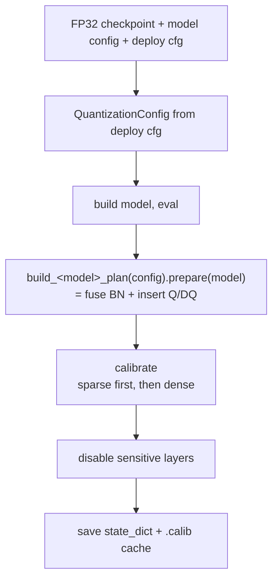
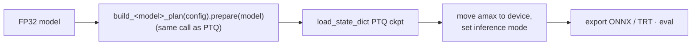

# AWML Quantization Framework

INT8 PTQ/QAT quantization for AWML deployment models (CenterPoint, BEVFusion-L), built on top of
NVIDIA's [`pytorch-quantization`](https://github.com/NVIDIA/TensorRT/tree/main/tools/pytorch-quantization)
toolkit and spconv's INT8 path.

The framework is split into a **model-agnostic engine** (`deployment/quantization/`) and
**per-project composition** (`deployment/projects/<model>/quantization/`). The engine knows *how* to
quantize a Conv/Linear/SparseConv tower; each project declares *which* submodules get quantized and
*how the towers compose* into one `QuantizationPlan`.

## The one thing to remember

> **Every stage that touches quantization builds the module tree by calling the same
> `build_<model>_plan(config).prepare(model)`.**

PTQ producer, deploy loader, and (for CenterPoint) the QAT hook all go through that single call, so
the calibrated PTQ `state_dict` and the deploy-time `load_state_dict` line up **by construction** —
not by a "keep these two code paths in sync" comment. If you read one thing before touching this
code, read [`schemes/base.py`](schemes/base.py).

---

## 1. Layering

The typed `QuantizationConfig` lives in the deployment config layer
([`deployment/config/schema.py`](../config/schema.py)) alongside the other deploy-config sections —
not in the engine — so config parsing has one home.

```
deployment/quantization/                      # model-agnostic engine
├── core/                                      # the Q/DQ engine
│   ├── descriptors.py                         #   single source of the INT8 descriptor choices
│   ├── modules/                               #   QuantConv2d / QuantConvTranspose2d / QuantLinear
│   ├── replace.py                             #   nn.Conv2d -> QuantConv2d module swap
│   ├── fusion.py                              #   Conv+BN fusion (dense)
│   ├── calibration.py                         #   CalibrationManager (histogram + amax)
│   ├── utils.py                               #   disable_quantization / status / counts
│   └── availability.py                        #   pytorch-quantization import guard (leaf)
├── recipes/                                   # architecture-specific Q/DQ *placement*
│   ├── forward_hooks.py                       #   per-block forward reimplementations
│   └── attach.py                              #   walk model + install hooks/quantizers
├── schemes/                                   # the "seam" between deploy stages and quantization
│   ├── base.py                                #   QuantizationScheme (ABC) + QuantizationPlan
│   └── dense_qdq.py                           #   generic DenseQDQScheme
└── sparse/                                    # spconv INT8 subsystem
    ├── spconv_int8.py                         #   fuse_spconv_bn_in_encoder + NVIDIA TensorQuantizer path
    ├── spconv_add_patch.py                    #   runtime monkeypatches for spconv quant ops
    └── naming.py                              #   forward-order sort of sparse conv stems

deployment/projects/centerpoint/quantization/ # CenterPoint composition
├── quant_model.py                             #   applies engine+recipes to CP's named submodules
├── schemes.py                                 #   CenterPointDenseScheme (wraps quant_model)
├── plan.py                                    #   build_centerpoint_plan(config) -> QuantizationPlan
├── qat_hook.py                                #   MMEngine QATHook
└── quantize.py                                #   PTQ + QAT producer CLI

deployment/projects/bevfusion_l/quantization/ # BEVFusion composition
├── schemes.py                                 #   SpconvInt8Scheme (sparse tower)
├── plan.py                                    #   build_bevfusion_plan(config, include_sparse) -> QuantizationPlan
└── quantize.py                                #   PTQ producer CLI
```

**Dependency direction:** `projects/* → deployment.quantization`. The engine never imports a project.
Cross-cutting knowledge both a project's export path and the engine need (e.g. sparse stem ordering
in `sparse/naming.py`, or SparseConv+BN folding in `sparse/spconv_int8.py`) lives in the engine so
neither project has to import the other.

---

## 2. Core concepts

### 2.1 `QuantizationConfig` (`deployment/config/schema.py`)
The deploy config carries a `quantization = dict(...)` block. `QuantizationConfig` (in the shared
config schema, next to `ExportConfig` / `ComponentsConfig` / …) is the **single** typed view of it:
`QuantizationConfig.from_dict(dict)` (from an in-memory dict, e.g. in a loader) or
`load_quantization_config(path)` (from a deploy-config file, e.g. in a CLI — it also folds a
top-level `spconv_int8_fp16_layers` in). Defaults live in exactly one place, so the insert side and
the load side cannot drift. `resolved_sensitive_layers()` expands the convenience skip-flags into
concrete dotted module names; `dense_quant_enabled()` and `with_overrides()` support the CLIs.

### 2.2 Quantized modules (`core/modules/`) + descriptors (`core/descriptors.py`)
`QuantConv2d`, `QuantConvTranspose2d`, `QuantLinear` subclass their `nn.*` counterparts and add
`_input_quantizer` / `_weight_quantizer`. Their default descriptors (per-channel INT8 Conv2d weights,
**per-tensor** ConvTranspose2d weights — TRT INT8 transposed conv is fragile per-channel — per-row
Linear weights, histogram activations) come from `core/descriptors.py`, the one place those choices
are defined. During ONNX export the fake-quant emits `QuantizeLinear` / `DequantizeLinear` nodes.

### 2.3 Module replacement (`core/replace.py`)
`quant_conv_module` / `quant_linear_module` recursively swap `nn.Conv2d/ConvTranspose2d/Linear` for
their quantized subclasses, honoring a `skip_names` set (full dotted paths).

### 2.4 BN fusion
`fuse_model_bn` (dense) folds adjacent Conv→BN pairs into the conv and replaces the BN with
`nn.Identity`. `fuse_spconv_bn_in_encoder` (`sparse/spconv_int8.py`) does the same for SECOND-style
spconv encoders. Fusion changes `state_dict` keys, so **PTQ and deploy must fuse the exact same
set** — which the shared plan guarantees.

### 2.5 Calibration (`core/calibration.py`)
`CalibrationManager` runs the PTQ dance: enable calib mode → run N batches collecting histograms →
`compute_amax(method="mse"|...)` → re-enable fake-quant. Amax can be saved/loaded as a `.calib` cache.

### 2.6 Recipes (`recipes/`)
Residual blocks and attention modules need Q/DQ placed at TensorRT-friendly spots (quantize only the
identity branch so TRT fuses Conv+Add; single-Q fan-out at a block input). `forward_hooks.py`
reimplements each block's `forward`; `attach.py` walks the model, attaches the needed quantizers, and
installs the hooks. Covered: ResNet `BasicBlock`, `SparseBasicBlock`, `ConvNeXtBlock`, VoVNet
`_OSA_module` / `eSEModule`, MaxPool.

### 2.7 Schemes & Plan (`schemes/`) — the seam
A `QuantizationScheme` is a strategy with one structural step, `prepare(model)`, that fuses BN /
inserts quantizers **in place**. A `QuantizationPlan` is an ordered list of schemes. Each project
ships a `build_<model>_plan(config)` that composes its schemes:

| Model | Plan builder | Schemes composed |
|-------|--------------|------------------|
| CenterPoint | `build_centerpoint_plan(config)` | `CenterPointDenseScheme` (Conv/Linear + eSE/MaxPool/residual recipes) |
| BEVFusion | `build_bevfusion_plan(config, include_sparse)` | `DenseQDQScheme` + (optional) `SpconvInt8Scheme` |

### 2.8 Sparse INT8 (`sparse/`)
The spconv sparse encoder can't use TRT-native INT8; it needs a custom `ImplicitGemmInt8` plugin plus
a post-export ONNX rewrite (in the BEVFusion export path). This subsystem attaches `TensorQuantizer`
to every `SparseConvolution`, calibrates with histogram+MSE, and records two terminal-scale buffers
(`_sparse_tail_absmax`, `_last_int8_conv_output_absmax`) the ONNX transform later reads.

---

## 3. Flows

### 3.1 PTQ (offline producer)



- **CenterPoint:** `python -m deployment.projects.centerpoint.quantization.quantize ptq ...`
- **BEVFusion:** `python -m deployment.projects.bevfusion_l.quantization.quantize ptq ...`

For BEVFusion, sparse INT8 is calibrated **before** dense so the dense quantizers see the true
(INT8-sparse) BEV distribution; otherwise dense amax matches the wrong distribution and mAP collapses.

### 3.2 Deploy load (PTQ checkpoint)
The loader rebuilds the **identical** tree via the same plan *before* `load_state_dict`, so the
calibrated `_amax` keys land on the right modules.



BEVFusion passes `include_sparse=True` here (rebuild the sparse tower too); the PTQ producer passes
`include_sparse=False` (sparse handled separately during calibration).

### 3.3 Deploy load (FP32 checkpoint)
`load_state_dict` first, **then** the plan inserts uncalibrated dense Q/DQ (needs runtime calibration).

### 3.4 QAT (CenterPoint only)
`QATHook` (MMEngine `Hook`): `before_train` calls `build_centerpoint_plan(config).prepare(model)`
(same tree as PTQ/deploy), then `before_train_epoch` calibrates once (or loads a `.calib` cache), and
training fine-tunes the fake-quantized model.

---

## 4. Configuration reference

All settings live under `quantization = dict(...)` in the deploy config and are parsed into
`QuantizationConfig` ([`deployment/config/schema.py`](../config/schema.py)).

| Key | Applies to | Meaning |
|-----|-----------|---------|
| `enabled` | both | Master switch for the quantized load path. |
| `fuse_bn` | both | Fuse Conv/SparseConv + BN before quantizing (default `True`). |
| `quant_backbone` / `quant_neck` / `quant_head` | both | Quantize the dense towers. |
| `quant_voxel_encoder` | CenterPoint | Quantize `pts_voxel_encoder` Linear layers. |
| `quant_add` | both | Attach residual-add quantizers (ResNet/Sparse residual blocks). |
| `quant_linear_backbone` | CenterPoint | Quantize Linear layers inside `pts_backbone` (ConvNeXt). |
| `quant_ese_mul_identity` / `quant_ese_pool_input` / `quant_maxpool_input` | CenterPoint | VoVNet eSE / MaxPool Q/DQ placement. |
| `sensitive_layers` | both | Dotted module paths left in FP. |
| `skip_backbone_first_stages` / `skip_backbone_stages` / `skip_vovnet_stages` | CenterPoint | Convenience expansions into `sensitive_layers`. |
| `spconv_int8` | BEVFusion | Attach NVIDIA quantizers to the sparse encoder. |
| `spconv_int8_fp16_layers` | BEVFusion | Substrings of sparse-conv names kept FP16. |
| `ptq_checkpoint` | both | The checkpoint carries calibrated `_amax` (rebuild tree before load). |
| `calib_cache_path` | both | Load amax from a `.calib` cache instead of calibrating. |

---

## 5. Requirements
- `pytorch-quantization` (`pip install pytorch-quantization --extra-index-url https://pypi.ngc.nvidia.com`)
- `spconv` with the quantization utils, for the BEVFusion sparse path.
- Runs inside the AWML deployment Docker image (host Python lacks torch/spconv).

See `deployment/quantization/docs/` for BN-fusion, eSE INT8, and VoV-99 PTQ-accuracy notes.
