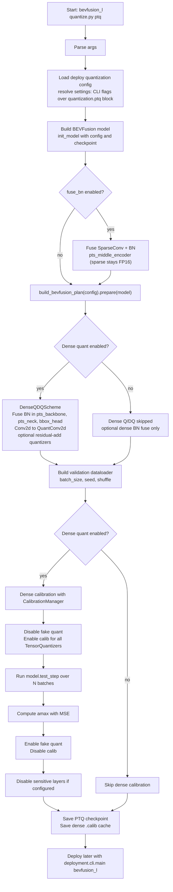
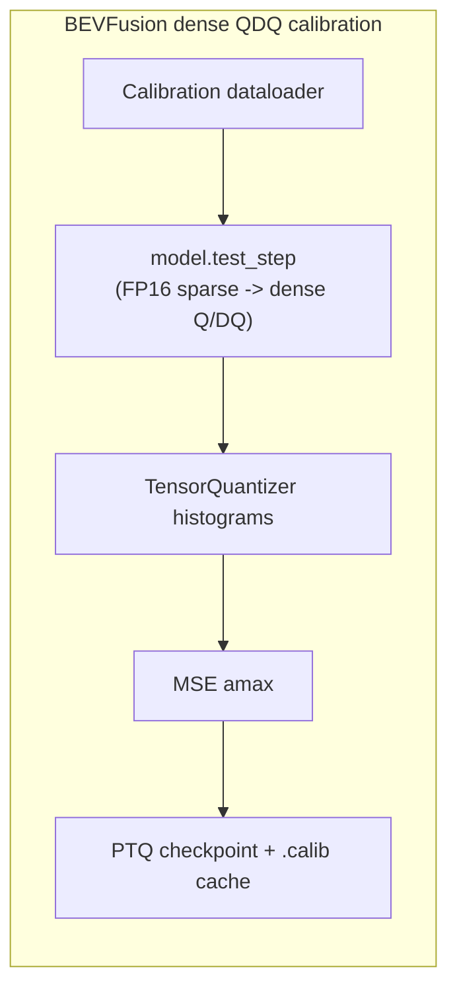
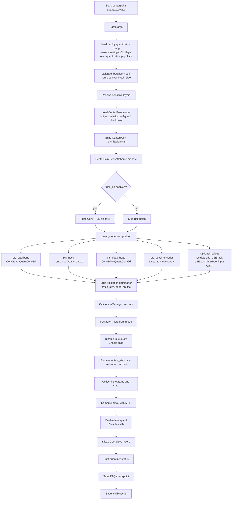
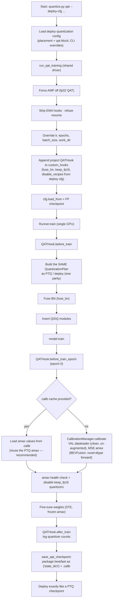

# AWML Quantization Pipeline

This note sketches the AWML quantization flows for BEVFusion and CenterPoint.
The diagrams focus on PTQ/QAT preparation and calibration, and point to the
main implementation files in this repository.

## BEVFusion PTQ Pipeline

Entry point:
`deployment/projects/bevfusion_l/quantization/quantize.py`

Shared plan:
`deployment/projects/bevfusion_l/quantization/plan.py`

Key detail: the BEVFusion sparse encoder deploys in **FP16** — PTQ only folds its SparseConv+BN
(so the module tree matches deploy) and never quantizes it. Dense Q/DQ is calibrated against the BEV
distribution produced by the FP16 sparse encoder, which is exactly what the deploy path also runs.

## BEVFusion Calibration Detail

Sparse BN fold:
`deployment/quantization/sparse/fusion.py`

Dense calibration implementation:
`deployment/quantization/core/calibration.py`

## CenterPoint PTQ Pipeline

Entry point:
`deployment/projects/centerpoint/quantization/quantize.py`

Shared plan:
`deployment/projects/centerpoint/quantization/plan.py`

CenterPoint is currently a dense Q/DQ path in this AWML pipeline. The named
components are quantized by `quant_model.py`, while the actual calibration state
machine is shared through `CalibrationManager`.

## QAT Pipeline (CenterPoint + BEVFusion)

QAT is a **frozen-amax STE fine-tune** (calibrated scales stay fixed; only weights train — see
`spec_qat.md` §0/§2 for why this is the production method in both CUDA-CenterPoint and modelopt).
One shared hook body + one shared training driver serve both projects:

Entry points (identical shape; settings come from the deploy config's `quantization.qat` block,
CLI flags override):
`deployment/projects/centerpoint/quantization/quantize.py qat` and
`deployment/projects/bevfusion_l/quantization/quantize.py qat`

Shared machinery:
`deployment/quantization/qat_hook.py` (`QATHookBase`) and
`deployment/quantization/producer.py` (`run_qat_training`, `save_qat_checkpoint`).
Project subclasses supply only the plan (+ BEVFusion's calibration forward):
`centerpoint/quantization/qat_hook.py` (`QATHook`),
`bevfusion_l/quantization/qat_hook.py` (`BEVFusionQATHook`).

The packaged QAT artifact is byte-shape-identical to a PTQ one, so the deploy loaders need no
`mode` branch; `deployment/tests/test_qat_tree_parity.py` pins the tree parity between the hook
path and the plan path.

## Implementation Map

| Area | File |
| --- | --- |
| BEVFusion PTQ/QAT CLI | `deployment/projects/bevfusion_l/quantization/quantize.py` |
| BEVFusion shared quantization plan | `deployment/projects/bevfusion_l/quantization/plan.py` |
| BEVFusion sparse BN-fuse scheme (FP16) | `deployment/projects/bevfusion_l/quantization/schemes.py` |
| BEVFusion calibration forward (voxel dtype) | `deployment/projects/bevfusion_l/quantization/calibration.py` |
| BEVFusion QAT hook | `deployment/projects/bevfusion_l/quantization/qat_hook.py` |
| SparseConv+BN fold | `deployment/quantization/sparse/fusion.py` |
| Generic dense Q/DQ scheme | `deployment/quantization/schemes/dense_qdq.py` |
| CenterPoint PTQ/QAT CLI | `deployment/projects/centerpoint/quantization/quantize.py` |
| CenterPoint shared quantization plan | `deployment/projects/centerpoint/quantization/plan.py` |
| CenterPoint quant module composition | `deployment/projects/centerpoint/quantization/quant_model.py` |
| CenterPoint QAT hook | `deployment/projects/centerpoint/quantization/qat_hook.py` |
| Shared QAT hook body | `deployment/quantization/qat_hook.py` |
| Shared QAT training driver + packaging | `deployment/quantization/producer.py` |
| Shared calibration manager | `deployment/quantization/core/calibration.py` |
| QAT ↔ PTQ tree-parity test | `deployment/tests/test_qat_tree_parity.py` |
