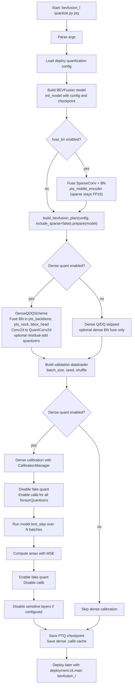
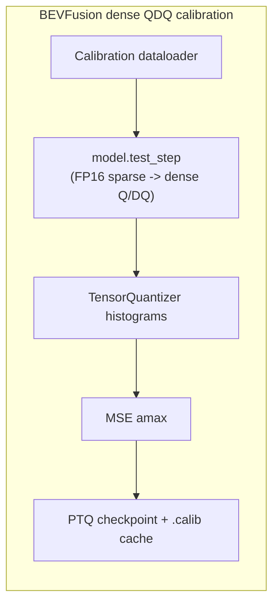
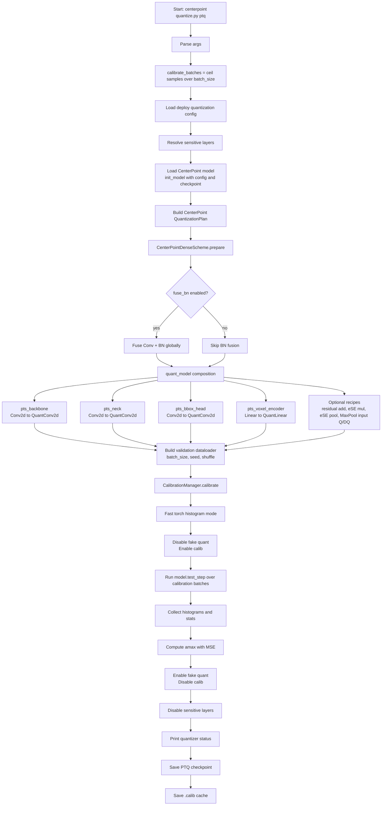
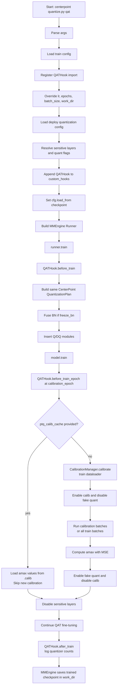

# AWML Quantization Pipeline

This note sketches the AWML quantization flows for BEVFusion and CenterPoint.
The diagrams focus on PTQ/QAT preparation and calibration, and point to the
main implementation files in this repository.

## BEVFusion PTQ Pipeline

Entry point:
`deployment/projects/bevfusion_l/quantization/quantize.py`

Shared plan:
`deployment/projects/bevfusion_l/quantization/plan.py`

Key detail: the BEVFusion sparse encoder deploys in **FP16** — PTQ only folds its SparseConv+BN
(so the module tree matches deploy) and never quantizes it. Dense Q/DQ is calibrated against the BEV
distribution produced by the FP16 sparse encoder, which is exactly what the deploy path also runs.

## BEVFusion Calibration Detail

Sparse BN fold:
`deployment/quantization/sparse/fusion.py`

Dense calibration implementation:
`deployment/quantization/core/calibration.py`

## CenterPoint PTQ Pipeline

Entry point:
`deployment/projects/centerpoint/quantization/quantize.py`

Shared plan:
`deployment/projects/centerpoint/quantization/plan.py`

CenterPoint is currently a dense Q/DQ path in this AWML pipeline. The named
components are quantized by `quant_model.py`, while the actual calibration state
machine is shared through `CalibrationManager`.

## CenterPoint QAT Pipeline

Entry point:
`deployment/projects/centerpoint/quantization/quantize.py qat`

Hook:
`deployment/projects/centerpoint/quantization/qat_hook.py`

## Implementation Map

| Area | File |
| --- | --- |
| BEVFusion PTQ CLI | `deployment/projects/bevfusion_l/quantization/quantize.py` |
| BEVFusion shared quantization plan | `deployment/projects/bevfusion_l/quantization/plan.py` |
| BEVFusion sparse BN-fuse scheme (FP16) | `deployment/projects/bevfusion_l/quantization/schemes.py` |
| SparseConv+BN fold | `deployment/quantization/sparse/fusion.py` |
| Generic dense Q/DQ scheme | `deployment/quantization/schemes/dense_qdq.py` |
| CenterPoint PTQ/QAT CLI | `deployment/projects/centerpoint/quantization/quantize.py` |
| CenterPoint shared quantization plan | `deployment/projects/centerpoint/quantization/plan.py` |
| CenterPoint quant module composition | `deployment/projects/centerpoint/quantization/quant_model.py` |
| CenterPoint QAT hook | `deployment/projects/centerpoint/quantization/qat_hook.py` |
| Shared calibration manager | `deployment/quantization/core/calibration.py` |
