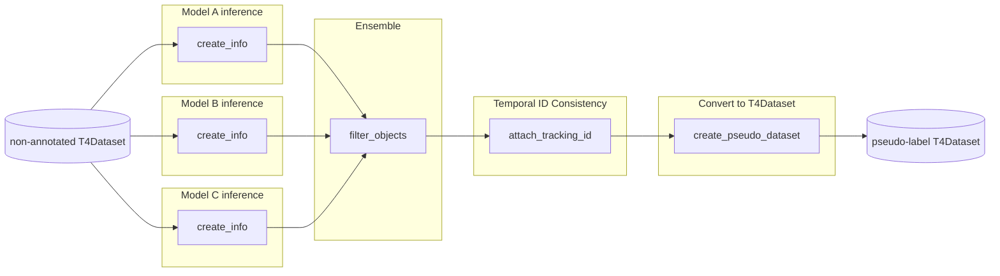

# auto_labeling_3d

The pipeline of auto labeling for 3D detection.

- [Support priority](https://github.com/tier4/AWML/blob/main/docs/design/autoware_ml_design.md#support-priority): Tier S




## 1. Setup Environment

- Please follow the [installation tutorial](/docs/tutorial/tutorial_detection_3d.md) to set up the environment.
- In addition, please follow the below setting up procedure.

### Build docker image

- Build docker image.
  - If you build `AWML` image locally, please add `--build-arg BASE_IMAGE=autoware-ml` or `--build-arg BASE_IMAGE=autoware-ml-ros2` to build script.

```sh
DOCKER_BUILDKIT=1 docker build -t auto_labeling_3d -f tools/auto_labeling_3d/Dockerfile .
```

- Run docker container.

```sh
docker run -it --gpus '"device=0"' --name auto_labeling_3d --shm-size=64g -d -v {path to autoware-ml}:/workspace -v {path to data}:/workspace/data auto_labeling_3d bash
```

- Please follow the setting up procedure in README of the model used for auto labeling.
  - For example, if you want to use BEVFusion, please follow [setting environemnt for BEVFusion](/projects/BEVFusion/README.md#1-setup).

## 2. Prepare Dataset

Prepare your non-annotated T4dataset in the following structure:

```
- data/t4dataset/
  - pseudo_xx1/
    - scene_0/
      - annotation/
        - ..
      - data/
        - LIDAR_CONCAT/
        - CAM_*/
        - ..
      - ...
    - scene_1/
      - ..
```

## 3. Run Auto Labeling Pipeline

You have two options to run the pipeline:

### Option A: Quick Start with launch.py

**For most users, use `launch.py` to run the entire pipeline in one command:**

```bash
python tools/auto_labeling_3d/entrypoint/launch.py tools/auto_labeling_3d/entrypoint/configs/example.yaml
```

This executes all steps automatically:
1. Download model checkpoints from Model Zoo
2. Run inference and create info files with pseudo labels
3. Ensemble/filter results from multiple models
4. Attach consistent tracking IDs across frames
5. Generate final pseudo-labeled T4Dataset
6. Restructure directory format

See [example.yaml](entrypoint/configs/example.yaml) and update paths for your workspace.

### Option B: Run Individual Modules

For advanced users who need granular control or want to customize the pipeline, you can run each step separately:

<details>
<summary>Step 3.1: Create info file from non-annotated T4dataset</summary>

#### Step 3.1: Create info file from non-annotated T4dataset

Run inference with a 3D detection model to generate info files:

```sh
python tools/auto_labeling_3d/create_info_data/create_info_data.py --root-path {path to directory of non-annotated T4dataset} --out-dir {path to output} --config {model config file to use auto labeling} --ckpt {checkpoint file}
```

- For example, run the following command

```sh
python tools/auto_labeling_3d/create_info_data/create_info_data.py --root-path ./data/t4dataset/pseudo_xx1 --out-dir ./data/t4dataset/info --config projects/BEVFusion/configs/t4dataset/bevfusion_lidar_voxel_second_secfpn_1xb1_t4offline.py --ckpt ./work_dirs/bevfusion_offline/epoch_20.pth
```

- If you want to ensemble for auto labeling, you should create info files for each model.
- As a result, the data is as below

```
- data/t4dataset/
  - pseudo_xx1/
    - scene_0/
      - annotation/
        - ..
      - data/
      - ...
    - scene_1/
      - ..
  - info/
    - pseudo_infos_raw_centerpoint.pkl
    - pseudo_infos_raw_bevfusion.pkl
```

</details>

<details>
<summary>Step 3.2: Filter and ensemble results</summary>

#### Step 3.2: Filter and ensemble results

##### Filter

- Set a config to decide what you want to filter
  - Set threshold to filter objects with low confidence

```py
centerpoint_pipeline = [
    dict(
        type="ThresholdFilter",
        confidence_thresholds={
            "car": 0.35,
            "truck": 0.35,
            "bus": 0.35,
            "bicycle": 0.35,
            "pedestrian": 0.35,
        },
        use_label=["car", "truck", "bus", "bicycle", "pedestrian"],
    ),
]

filter_pipelines = dict(
  type="Filter",
  input=dict(
          name="centerpoint",
          info_path="./data/t4dataset/info/pseudo_infos_raw_centerpoint.pkl",
          filter_pipeline=centerpoint_pipeline,
  ),
)
```

- Make the info file to filter the objects which do not use for pseudo T4dataset

```sh
python tools/auto_labeling_3d/filter_objects/filter_objects.py --config {config_file} --work-dir {path to output}
```

##### Ensemble

- If you want to ensemble model, you set a config as below.

```py
centerpoint_pipeline = [
    dict(
        type="ThresholdFilter",
        confidence_thresholds={
            "car": 0.35,
            "truck": 0.35,
            "bus": 0.35,
            "bicycle": 0.35,
            "pedestrian": 0.35,
        },
        use_label=["car", "truck", "bus", "bicycle", "pedestrian"],
    ),
]

bevfusion_pipeline = [
    dict(
        type="ThresholdFilter",
        confidence_thresholds={
            "bicycle": 0.35,
            "pedestrian": 0.35,
        },
        use_label=["bicycle", "pedestrian"],
    ),
]

filter_pipelines = dict(
    type="Ensemble",
    config=dict(
        type="NMSEnsembleModel",
        ensemble_setting=dict(
            weights=[1.0, 1.0],
            iou_threshold=0.55,
        ),
    ),
    inputs=[
        dict(
            name="centerpoint",
            info_path="./data/t4dataset/info/pseudo_infos_raw_centerpoint.pkl",
            filter_pipeline=centerpoint_pipeline,
        ),
        dict(
            name="bevfusion",
            info_path="./data/t4dataset/info/pseudo_infos_raw_bevfusion.pkl",
            filter_pipeline=bevfusion_pipeline,
        ),
    ],
)
```

- Make the info file to filter the objects which do not use for pseudo T4dataset and ensemble filtered results.

```sh
python tools/auto_labeling_3d/filter_objects/ensemble_infos.py --config {config_file} --work-dir {path to output}
```

- As a result, the data is as below

```
- data/t4dataset/
  - pseudo_xx1/
    - scene_0/
      - annotation/
        - ..
      - data/
      - ...
    - scene_1/
      - ..
  - info/
    - pseudo_infos_raw_centerpoint.pkl
    - pseudo_infos_raw_bevfusion.pkl
    - pseudo_infos_filtered.pkl
```

</details>

<details>
<summary>Step 3.3: Attach tracking IDs</summary>

#### Step 3.3: Attach tracking IDs

- Attach tracking IDs to maintain temporal consistency:
  - If you do not use for target annotation, you can skip this section.

```sh
python tools/auto_labeling_3d/attach_tracking_id/attach_tracking_id.py --input {info file} --output {info_file}
```

- As a result, an info file is made as below.

```
- data/t4dataset/
  - pseudo_xx1/
    - scene_0/
      - annotation/
        - ..
      - data/
      - ...
    - scene_1/
      - ..
  - info/
    - pseudo_infos_raw_centerpoint.pkl
    - pseudo_infos_raw_bevfusion.pkl
    - pseudo_infos_filtered.pkl
    - pseudo_infos_tracked.pkl
```

</details>

<details>
<summary>Step 3.4: Create pseudo T4dataset</summary>

#### Step 3.4: Create pseudo T4dataset

Generate the pseudo-labeled T4Dataset:

```sh
python tools/auto_labeling_3d/create_pseudo_t4dataset/create_pseudo_t4dataset.py {yaml config file about T4dataset data} --root-path {path to directory of non-annotated T4dataset} --input {path to pkl file}
```

- As a result, pseudo-label T4dataset is made as below.

```
- data/t4dataset/
  - pseudo_xx1/
    - scene_0/
      - annotation/
        - sample.json
        - ..
    - scene_1/
      - ..
    - ..
```

</details>

### 4. Use for training

#### Verify the Pseudo-T4dataset

Before using the Pseudo-T4dataset for training, you can visualize and verify the generated labels using [t4-devkit](https://github.com/tier4/t4-devkit).

Please refer to [t4-devkit render tutorial](https://tier4.github.io/t4-devkit/develop/tutorials/render/) for visualization instructions.

#### Upload to WebAuto

Please upload Pseudo-T4dataset to WebAuto to share easily for other users.

Please check [Web.Auto document](https://docs.web.auto/en/user-manuals/vehicle-data-search/quick-start#register-t4-datasets) for the detail.

#### Use in local PC

To align T4dataset directory structure, you run the script as following.

```sh
python tools/auto_labeling_3d/change_directory_structure/change_directory_structure.py --dataset_dir data/t4dataset/pseudo_xx1/
```

The result of the structure of Pseudo-T4dataset is following.

```
- data/t4dataset/
  - pseudo_xx1/
    - scene_0/
      - 0/
        - annotation/
          - sample.json
          - ..
    - scene_1/
      - 0/
        - ..
    - ..
```
