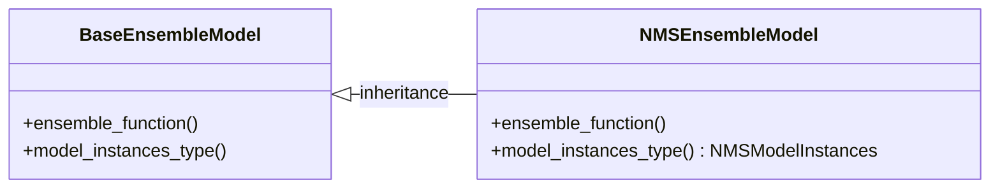
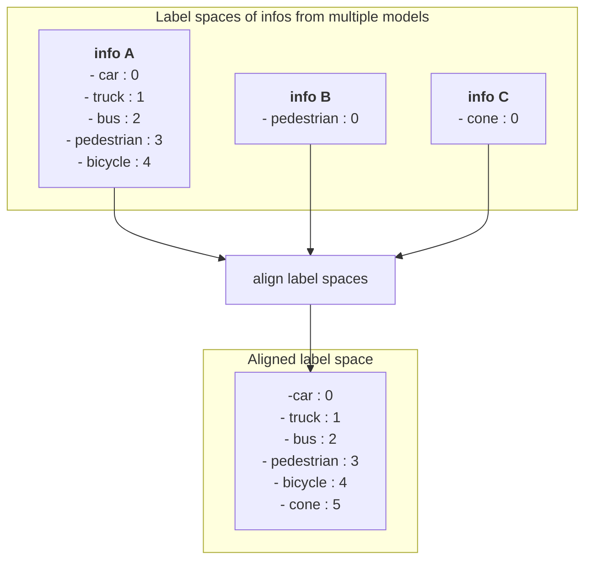

# filter_objects

## ensemble_infos

### Design

- To add a new ensemble model, implement `EnsembleModel` and `ModelInstances` as described in [How to add new ensemble model](#how-to-add-new-ensemble-model).
- Label spaces are aligned to handle multiple outputs from different models. For details, refer to [The way to align label space](#the-way-to-align-label-space).
- Ensemble operations are executed per label group. For label group configuration, see [ensemble_label_groups](#ensemble_label_groups).

### How to add new ensemble model

- Implement `EnsembleModel`
  - Inherit from `BaseEnsembleModel`
  - Implement `ensemble_function()`
- Implement `ModelInstances`
  - Inherit from `BaseModelInstances`



#### ensemble_function

- Function containing the ensemble logic
- Implement as a pure function for better testability

#### ModelInstances

- Class managing inference results (instances) from each model
  - Handles pre-ensemble processing such as applying weights to confidence scores and filtering instances based on label groups
  - Manages instances per model to support model-specific weights
- Model-specific instance processing should be implemented as `ModelInstances` member functions and called from `ensemble_function()`
  - Example: Applying model-specific weights to instance confidence scores

```python
# Example usage of ModelInstances
def _nms_ensemble(
    model_instances_list: List[NMSModelInstances],
    target_label_names: List[str],
    iou_threshold: float,
) -> List[Dict]:
    ...

    for model_instances in model_instances_list:
        # Apply weights to scores and filter instances based on label group
        instances, boxes, scores = model_instances.filter_and_weight_instances(target_label_names=target_label_names)

    ...

    return keep_instances
```

### How to set label group

- Objects in the same label group may be merged by the ensemble algorithm

#### example 1

- With the label group configuration outlined below, 'car', 'truck', and 'bus' are ensembled into one group, while 'pedestrian' and 'bicycle' form another.
- If an object is detected with three distinct bounding boxes—for example, one for 'car', one for 'truck', and one for 'bus'—and the ensemble algorithm determines these should be merged, they are consolidated into a single bounding box.
- 'Car' and 'bicycle' belong to different label groups and are therefore not merged.

```python
ensemble_label_groups = [
    ["car", "truck", "bus"],
    ["pedestrian", "bicycle"],
]
```

#### example 2

- With the label group configuration outlined below, 'car', 'truck', 'bus', 'pedestrian', and 'bicycle' are each ensembled separately.
- 'Car' and 'truck' belong to different label groups and are therefore not merged.

```python
ensemble_label_groups=[
    ["car"],
    ["truck"],
    ["bus"],
    ["pedestrian"],
    ["bicycle"],
]
```

### The way to align label space

- Each model's output follows its own label space
  - For example, in model A, ID 0 might represent car but in model B, ID 0 might represent pedestrian
  - Therefore, we need to align outputs from multiple models to a common label space
- Label space alignment follows these steps:
  - Step 1: Merge metainfo from all models to create a common label space
  - Step 2: Convert each model's output to conform to the common label space
    - Example: Change pedestrian ID from 0 to 3 in model B's output
    - Example: Change cone ID from 0 to 5 in model C's output


