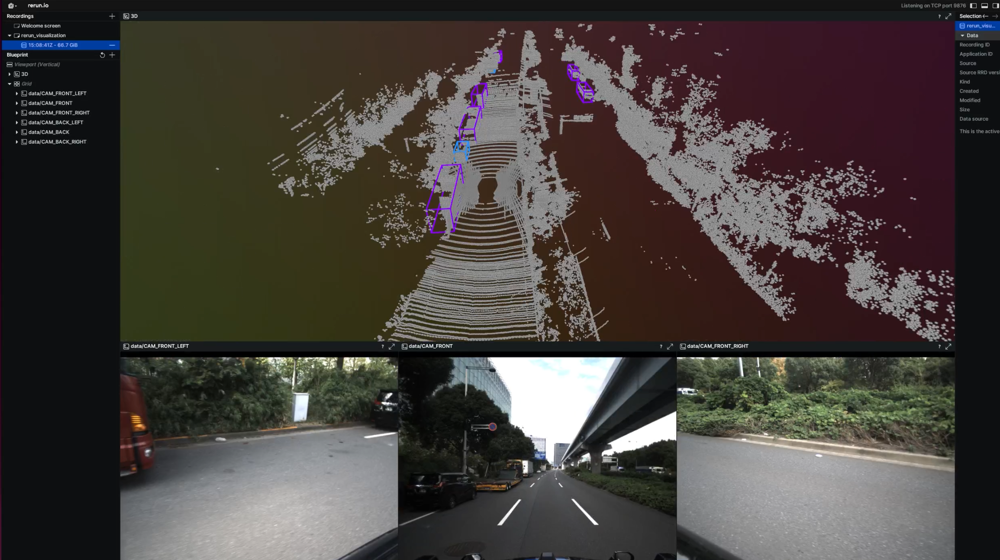

# tools/rerun_visualization

Visualize with T4dataset.

- [Support priority](https://github.com/tier4/autoware-ml/blob/main/docs/design/autoware_ml_design.md#support-priority): Tier S
- Supported feature
  - [x] T4dataset 3D ground truth visualization
  - [x] T4dataset 3D inference visualization
  - [ ] T4dataset 2D ground truth visualization
  - [ ] T4dataset 2D inference visualization
  - [ ] T4dataset 3D ground truth analysis
  - [ ] T4dataset 3D inference analysis
- Other supported feature
  - [ ] Add unit test

## Install

- Install on native environment

```sh
pip install rerun-sdk==0.17.0
```

## 3D Visualization

Visualize 3D detection with T4dataset.



- Run docker

```sh
docker run -it --rm --gpus 'all,"capabilities=compute,utility,graphics"' --shm-size=64g --name awml -v $PWD/:/workspace -v $HOME/local/dataset:/workspace/data --net host -v /tmp/.X11-unix:/tmp/.X11-unix -e DISPLAY autoware-ml
```

- Stand another terminal and Run on your native environment

```sh
rerun
```

- Run visualization scripts in docker environment

```sh
python tools/rerun_visualization/visualize_3d.py \
{config_file} \
{product_config} \
--checkpoint {checkpoint_file} \
--fix-rotation --split test --bbox-score 0.4 --objects prediction --image-num 6
```

- For XX1 with TransFusion-L

```sh
python tools/rerun_visualization/visualize_3d.py \
work_dirs/pretrain/transfusion/transfusion_lidar_pillar_second_secfpn_1xb1_90m-768grid-t4xx1.py \
autoware_ml/configs/detection3d/dataset/t4dataset/xx1.py \
--checkpoint work_dirs/pretrain/transfusion/epoch_50.pth \
--fix-rotation --split test --bbox-score 0.1 --objects prediction --image-num 6
```

## 3D analysis

- Analysis for dataset

```
TBD
```

- Analysis for inference results

```
TBD
```

## 2D visualization

TBD

## Reference

- https://rerun.io/
- https://github.com/rerun-io/rerun
- https://github.com/rerun-io/rerun/tree/main/examples/python/nuscenes_dataset
- https://github.com/scepter914/mmcarrot/tree/main/tools/rerun_visualization
