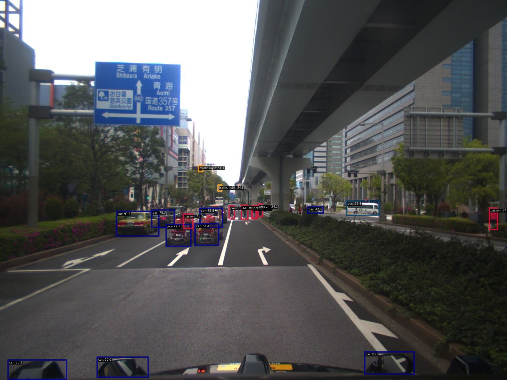
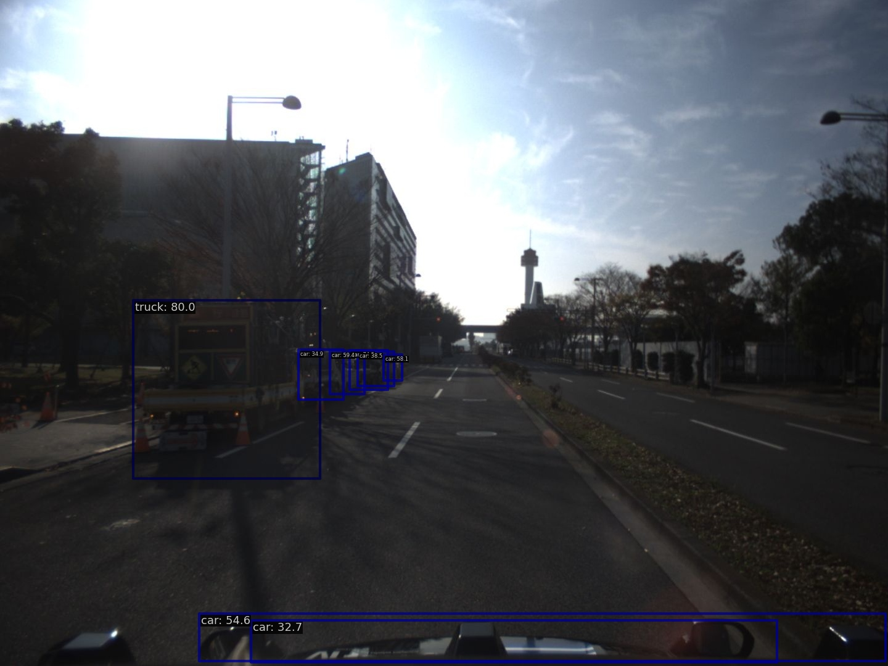
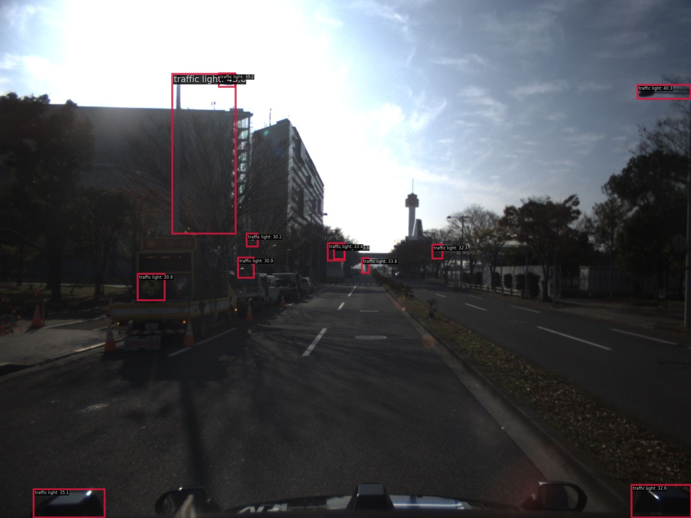

# Select scene for traffic light

- We use YOLOX-L for filtering traffic light.

## Example result

## Try and error
### GLIP

GLIP fail to detect with traffic signals and poles.

- from T4dataset data

