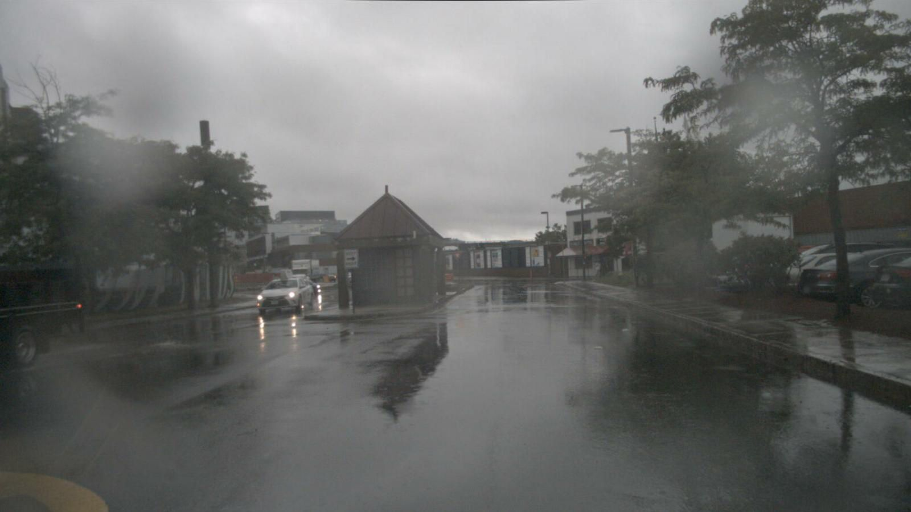

# Select scene for weather

- We use BLIP-2 for filtering the condition of weather

## Example result

- Rain for with Nuscenes data



```
{'question': 'how is the weather', 'pred_answer': 'rain'}
```

- Snow for with [DAWN dataset](https://ar5iv.labs.arxiv.org/html/2008.05402)


```
{'question': 'how is the weather', 'pred_answer': 'snow'}
```

- Fog for with [DAWN dataset](https://ar5iv.labs.arxiv.org/html/2008.05402)


```
{'question': 'how is the weather', 'pred_answer': 'fog'}
```
